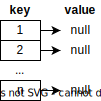
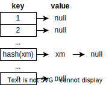
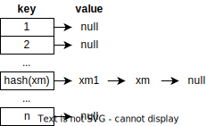
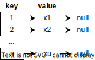
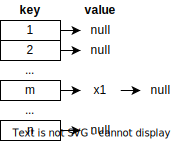
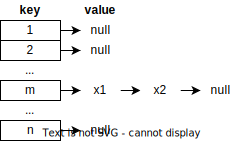
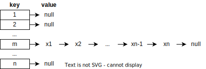

# 雜湊函數設計不良導致 $O(n^2)$ 時間複雜度

最近在看 Effective Java, 3rd 一書的 [Item 11](../../../java/effective-java/011.md) 討論 `hashCode` 的實作，說到糟糕的 `hashCode` 實作將導致程式的時間複雜度從 $O(n)$ 變成 $O(n^2)$。

書中並沒有詳細說明情境。而在我的理解，hash 的時間複雜不就是 $O(1)$ 嗎？那麼 $O(n)$ 跟 $O(n^2)$ 是怎麼回事？ 所以我就自己**腦補**一個情境來解釋書中沒有描述的情境。

<!-- more -->

## 情境

程式要維護一個 Set，插入 $n$ ($x_1$, $x_2$, ..., $x_n$) 個不相同的元素到 Set 的時間複雜度為何？

假設我們宣告一個長度為 $n$ 的 hash table。

我們要將元素 $x_m$ 存到 hash table 中，首先我們要計算 $hash(x_m)$ 他會是一個介於 $1~n$ 的值，決定 $x_m$ 存在 hash table 的哪個位置。

當 hash table 的某個位置已經有元素了，就用 linked list 的方式串接起來。

不過，這個 hash table 是為了實現 Set。當算出來的 hash 位址已經有元素存在，我們需要檢查待新增的元素是否已經在該 hash 位址的 linked list 中存在。如果存在，就不加入，否則加入。

## 最佳情況

$x_1$, $x_2$, ..., $x_n$ 的 hash 值都不相同，這樣每個元素都可以直接存在 hash table 的某個位址。

時間複雜度:

$O(1) + O(1) + ... + O(1) = \sum_{1}^n O(1) = O(n)$

## 最糟情況

$x_1$, $x_2$, ..., $x_n$ 的 hash 值全相同 (假設為 $m$)，這樣會導致每次加入元素時，都必須檢查 hash table 的所有元素。

插入 $x_1$ 時，沒有需要檢查任何元素，時間複雜度為 $O(1)$。

插入 $x_2$，與 $m$ 位址的元素相比，確認 $m$ 位址沒有出現 $x_2$ 再進行插入，時間複雜度為 $O(2)$。($O(1)$ 為計算 hash，$O(1)$ 為與一個元素比較)

插入 $x_n$。與 $m$ 位址的元素相比，確認 $m$ 位址沒有出現 $x_n$ 再進行插入，時間複雜度為 $O(n)$。($O(1)$ 為計算 hash，$O(n-1)$ 為與 $n-1$ 個元素比較)

因此，整體的時間複雜度為:

$O(1) + O(2) + ... + O(n) = O(1 + 2 + ... + n) = O(\frac{n(n+1)}{2}) = O(\frac{n^2+n}{2}) = O(\frac{n^2}{2} + \frac{n}{2}) = O(n^2)$

## 結論

以上最佳的情境與最糟的情境所記算出來的時間複雜度，與書中所說的 $O(n)$ 與 $O(n^2)$ 是相符的。應該可以搭配這個範例來理解書中的描述。
