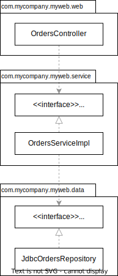
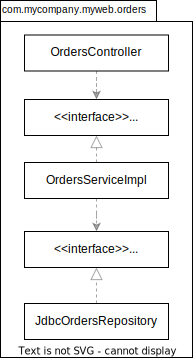
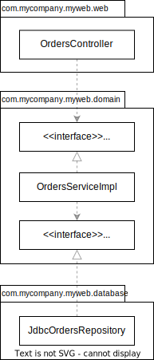
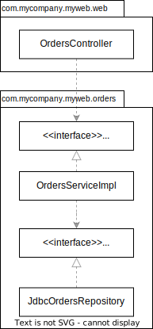
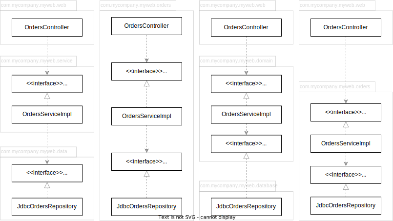
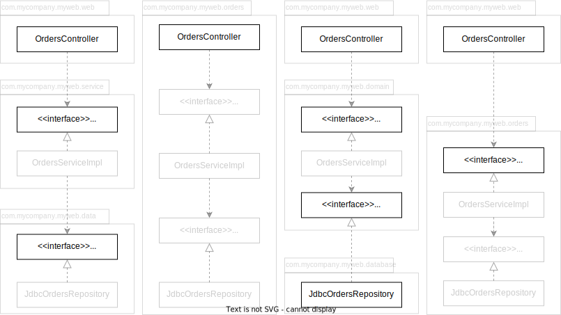

# The Missing Chapter

=== "Package by layer"

    

=== "Package by feature"

    

=== "Ports and Adapters"

    

=== "Package by component"

    

## 不是所有 class 都是 `public`

所有 class 都是 `public`，無論 package 怎麼安排，都僅僅是組織程式碼的方式，而非封裝。`public` class 可以被任何地方的程式碼使用，完全沒有存取控管的約束力。

應將 package 內部實作的 class (灰色的部分) 宣告成 package-protected 阻止 package 外的 class 存取。

相依的部分，透過 dependency injection 解決。
