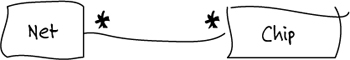
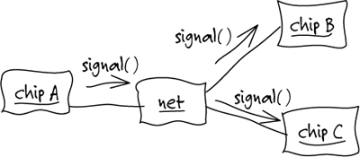
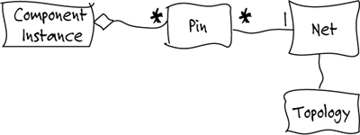
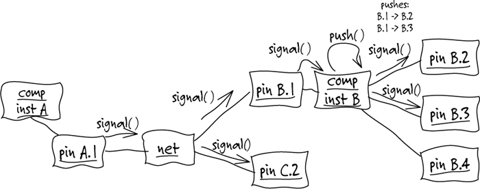
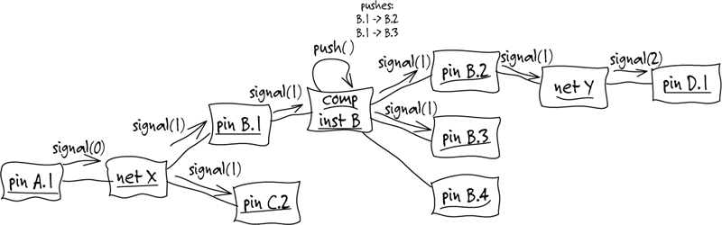
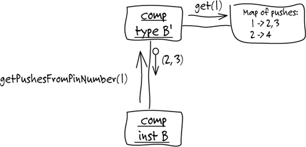
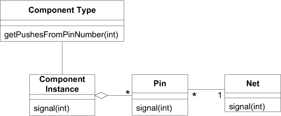
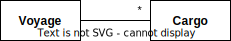
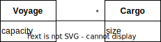
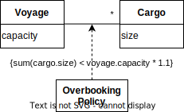

# Ch 1: Crunching Knowledge


十八世紀，中國繪製的世界地圖。

- model 是一種簡化，把與問題相關的方面抽象出來，並且忽略無關的細節。
    - _it is a rigorously organized and selective abstraction of that knowledge_.
- domain model 目標不是要盡可能建立一個符合現實的模型。建模的人應視模型的需求挑選具體的模型。

## 印刷電路板(PCB)的專用軟體

domain model 是逐步演化。

net (導線) 可以連接任意數量的 chip (元件)



有了 domain model，以非正式的 object interaction diagrams 討論一些情境



根據圖，討論後，更新了 model



根據 model 討論情境



目標要找出最長 delay 的路徑，超過 2 或 3 hops 的都要找出來。帶入經過 net 會有 one hop 的知識，更新圖。



為了釐清 push 的概念，透過下圖:



與專家討論，他們沒有很完全理解圖的意義，不過對於建模這也不重要，可以忽略。

不斷討論後，產出了以下的初期模型的類別圖:



然後據此模型，開發純 java 的 prototype (不包含 db, ui 等)。透過 prototype 讓專家理解模型的具體涵義。

優點:

- 👍 模型將「同義詞」與「語言描寫的微小差異」做了統一。
- 👍 模型排除了與問題沒有直接關係的事實。

## 有效建模的要素

- _Binding the model and the implementation_
- _Cultivating a language based on the model_: 專家與開發人員基於同一個模型討論，可以減少匹此認知。
- _Developing a knowledge-rich model_
- _Distilling the model_: 重要的東西加到 model 中，不重要的東西從 model 中移除。
- _Brainstorming and experimenting_: 基於模型，可以進行腦力激盪與沙盤推演。

## Knowledge-Rich Design

### Example: Extracting a Hidden Concept

預約一艘船在一趟航程(voyage)要載運的貨物(cargo)



實作可能如下:

```java
public int makeBooking(Cargo cargo, Voyage voyage) {  
    int confirmation = orderConfirmationSequence.next();  
    voyage.addCargo(cargo, confirmation);  
    return confirmation;  
}
```

因為總是會有人在最後一刻取消訂單，因此航運業一般都會接受比承載能力要多一些的貨物，稱之為超訂(overbooking)。這是航運業的基本策略，從事航運業的業務人員都會知道，但是軟體開發人員，並不是每個人都會知道。

需求文件將會包含一句話：Allow 10% overbooking.

類別圖會長這樣:



實作可能如下:

```java
public int makeBooking(Cargo cargo, Voyage voyage) {  
    double maxBooking = voyage.capacity() * 1.1;  
    if ((voyage.bookedCargoSize() + cargo.size()) > maxBooking)  
        return –1;  
    int confirmation = orderConfirmationSequence.next();  
    voyage.addCargo(cargo, confirmation);  
    return confirmation;  
}
```

有一個重要的業務規則被隱藏在程式碼中。

- 👎 不是所有業務專家都會讀程式碼來檢查規則。即使有開發人員幫助，也很難完成任務。
- 👎 非業務的技術人員，很難將需求文件與程式碼連結起來。

!!! tip "將超訂規則，透過 Policy 的方式[^1]，暴露在 domain model 上。"
        

[^1]: 即 strategy pattern

- ✨ 開發人員與相關人員必須理解 overbooking 的本質，知道他是重要的業務規則，而非程式碼中一個不起眼的描述。
- ✨ 開發人員可以向專家展示 model，並在帶領下可以理解程式碼。

程式碼修改如下:

```java
public int makeBooking(Cargo cargo, Voyage voyage) {  
    if (!overbookingPolicy.isAllowed(cargo, voyage)) return –1;  
    int confirmation = orderConfirmationSequence.next();  
    voyage.addCargo(cargo, confirmation);  
    return confirmation;  
}

class OverbookingPolicy ...
    public boolean isAllowed(Cargo cargo, Voyage voyage) {  
        return (cargo.size() + voyage.bookedCargoSize()) <= (voyage.capacity() * 1.1);  
    }
```

!!! quote "I am not recommending that such an elaborate design be applied to every detail of the domain"
    作者不建議將這樣的精細設計套用到 domain 的每個細節中。(第十五章將進行討論)
