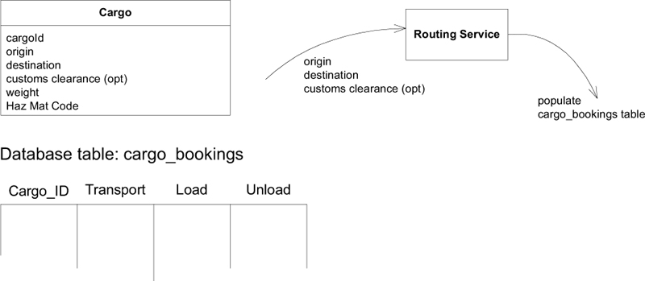
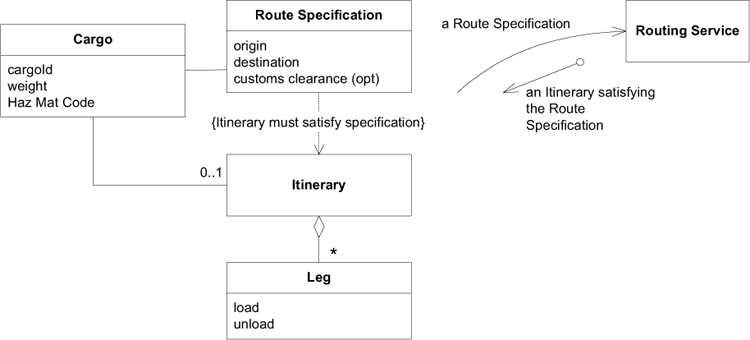
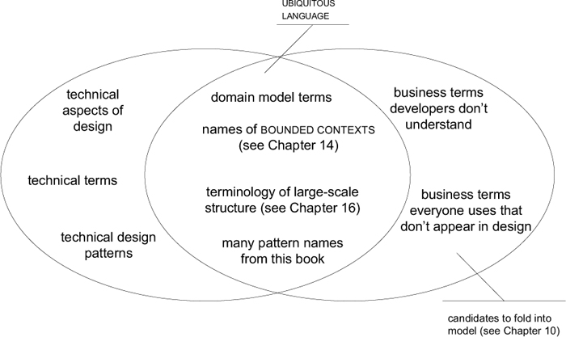
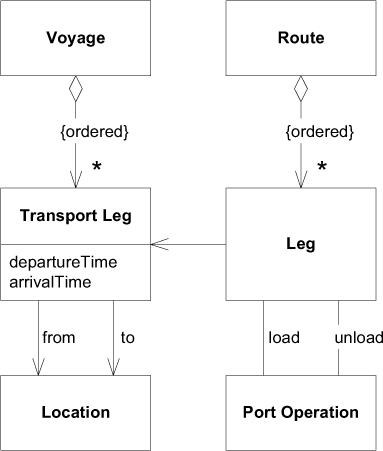
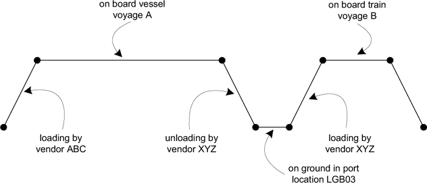

# Ch 2: Communication and the Use of Language

Ubiquitous Language: 團隊 (領域專家、開發團隊等) 使用的共同語言。

## Example: Working out a Cargo Router

以下兩種不同對話方式: (這裡引用原文，原汁原味)

!!! quote "Scenario 1: Minimal Abstraction of the Domain"

    
    
    **User**: So when we change the customs clearance point (報關地點), we need to redo the whole routing plan.

    **Developer**: Right. We’ll delete all the rows in the shipment table with that cargo id, then we’ll pass the origin, destination, and the new customs clearance point into the **Routing Service**, and it will re-populate the table. We’ll have to have a Boolean in the **Cargo** so we’ll know there is data in the shipment table.

    **User**: Delete the rows? OK, whatever. Anyway, if we didn’t have a customs clearance point at all before, we’ll have to do the same thing.

    **Developer**: Sure, anytime you change the origin, destination, or customs clearance point (or enter one for the first time), we’ll check to see if we have shipment data and then we’ll delete it and then let the **Routing Service** regenerate it.

    **User**: Of course, if the old customs clearance just happened to be the right one, we wouldn’t want to do that.

    **Developer**: Oh, no problem. It’s easier to just make the **Routing Service** redo the loads and unloads every time.

    **User**: Yes, but it’s extra work for us to make all the supporting plans for a new itinerary, so we don’t want to reroute unless the change necessitates it.

    **Developer**: Ugh. Well, then, if you are entering a customs clearance point for the first time, we’ll have to query the table to find the old derived customs clearance point, and then compare it to the new one. Then we’ll know if we need to redo it. 

    **User**: You won’t have to worry about this on origin or destination, since the itinerary would always change then.

    **Developer**: Good. We won’t.

!!! quote "Scenario 2: Domain Model Enriched to Support Discussion "

    

    **User**: So when we change the customs clearance point, we need to redo the whole routing plan.

    **Developer**: Right. When you change any of the attributes in the **Route Specification**, we’ll delete the old **Itinerary** (航線) and ask the **Routing Service** to generate a new one based on the new **Route Specification**. 

    **User**: If we hadn’t specified a customs clearance point at all before, we’ll have to do that at the same time.

    **Developer**: Sure, anytime you change anything in the **Route Spec**, we’ll regenerate the **Itinerary**. That includes entering something for the first time.

    **User**: Of course, if the old customs clearance just happened to be the right one, we wouldn’t want to do that.
   
    **Developer**: Oh, no problem. It’s easier to just make the **Routing Service** redo the **Itinerary** every time. 

    **User**: Yes, but it’s extra work for us to make all the supporting plans for a new **Itinerary**, so we don’t want to reroute unless the change necessitates it.

    **Developer**: Oh. Then we’ll have to add some functionality to the **Route Specification**. Then, whenever you change anything in the **Spec**, we’ll see if the **Itinerary** still satisfies the **Specification**. If it doesn’t, we’ll have the **Routing Service** regenerate the **Itinerary**.

    **User**: You won’t have to worry about this on origin or destination, since the **Itinerary** would always change then.

    **Developer**: Fine, but it will be simpler for us to just do the comparison every time. The **Itinerary** will only be generated when the **Route Specification** is no longer satisfied.

!!! quote "If sophisticated domain experts don’t understand the model, there is something wrong with the model."

## Written Design Documents

- 文件應作為程式碼與口頭交流的補充
    - 讀者無法消化程式碼的各種細節
    - 程式碼行為明確不模糊，但不代表我們可以清楚明暸的看懂他的行為
    - 程式碼對於表達其背後的意義有困難
    - A document shouldn't try to do what the code already does well.
- Documents Should Work for a Living and Stay Current 
    - A document must be involved in project activities.
          - 文件上的用語，應用在平常的交流與程式碼中。

## Explanatory Models 

Example: Shipping Operations and Routes

類別圖:

explanatory model: 可以幫助團隊理解類別圖要表達的實際意義。

- 線段代表
      - Port Operation (港口裝貨、卸貨)
      - 貨物在地面上的存放
      - 貨物在船上的運輸
