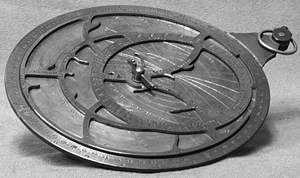
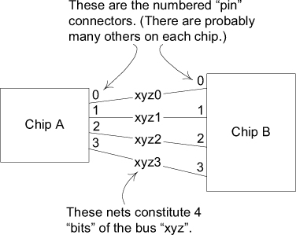
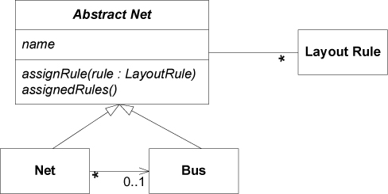

# Ch 3: Binding Model and Implementation



星盤: 手持宇宙模型，用以計算天體位置。(參考: [wiki - 星盤](https://zh.wikipedia.org/zh-tw/%E6%98%9F%E7%9B%98))

## Example: From Procedural to MODEL-DRIVEN



- Chip A 有四個 **pin**，分別為 0, 1, 2, 3
- 透過 xyz0, xyz1, xyz2, xyz3 這四條 **net** 連接到另一個 chip B 的四個 **pin** 0, 1, 2, 3
- xyz0, xyz1, xyz2, xyz3 構成 **bus**

### A Mechanistic Design



### A Model-Driven Design



=== "Main"

    ```java
    public static void assignBusRule(String busName, String ruleType,
                                     double parameter) {
        Bus bus = BusRepository.getByName(busName).orElseThrow();
        bus.assignRule(new LayoutRule(ruleType, parameter));
    }

    @SneakyThrows
    public static void main(String[] args) {
        Collection<Net> nets = NetListImport.read(new File("net_list.txt"));
        NetRepository.addAll(nets);
        Collection<Bus> buses = InferredBusFactory.groupIntoBuses(nets);
        BusRepository.addAll(buses);

        List<String> lines = Files.readAllLines(new File("bus_rules.txt").toPath());
        lines.subList(2, lines.size()).forEach(line -> {
            String[] parts = line.split("\\s+");
            assignBusRule(parts[0], parts[1], Double.parseDouble(parts[2]));
        });

        NetRuleExport.write(new File("net_rules.txt"), NetRepository.allNets());
    }
    ```

=== "Tests"

    ```java
    @Test
    void testBusRuleAssignment() {
        Net a0 = new Net("a0");
        Net a1 = new Net("a1");
        Bus a = new Bus("a"); // Bus is not conceptually dependent
        a.addNet(a0);         // on name-based recognition, and so
        a.addNet(a1);         // its tests should not be either.

        LayoutRule minWidth4 = new LayoutRule(MIN_WIDTH, 4);
        a.assignRule(minWidth4);

        assertThat(a0.getAssignedRules()).contains(minWidth4);
        assertThat(a0.getRule(MIN_WIDTH)).isEqualTo(minWidth4);
        assertThat(a1.getRule(MIN_WIDTH)).isEqualTo(minWidth4);
    }
    ```

=== "AbstractNet"

    ```java
    abstract class AbstractNet {
        private final Set<LayoutRule> rules = new HashSet<>();

        public void assignRule(LayoutRule rule) {
            rules.add(rule);
        }

        public Set<LayoutRule> getAssignedRules() {
            return rules.stream().collect(Collectors.toUnmodifiableSet());
        }
    }
    ```

=== "Bus"

    ```java
    @RequiredArgsConstructor
    @Getter
    @ToString
    class Bus extends AbstractNet {
        private final String name;

        private final List<Net> nets = new ArrayList<>();

        public void addNet(Net net) {
            net.setBus(this);
            nets.add(net);
        }
    }
    ```

=== "Net"

    ```java
    @RequiredArgsConstructor
    @Setter
    @Getter
    @ToString(exclude = "bus")
    class Net extends AbstractNet {
        private final String name;

        private Bus bus;

        @Override
        public Set<LayoutRule> getAssignedRules() {
            return Stream.concat(
                    super.getAssignedRules().stream(),
                    bus.getAssignedRules().stream()
            ).collect(Collectors.toUnmodifiableSet());
        }

        public Optional<LayoutRule> getRule(String ruleName) {
            return getAssignedRules()
                    .stream()
                    .filter(rule -> rule.getName().equals(ruleName))
                    .findFirst();
        }
    }
    ```

=== "LayoutRule"

    ```java
    @Getter
    @RequiredArgsConstructor
    class LayoutRule {
        private final String name;

        private final double value;
    }
    ```

=== "NetRepository"

    ```java
    class NetRepository {

        private static final Collection<Net> nets = new ArrayList<>();

        private NetRepository() {
        }

        public static void addAll(Collection<Net> nets) {
            NetRepository.nets.addAll(nets);
        }

        public static Collection<Net> allNets() {
            return List.copyOf(nets);
        }
    }
    ```

=== "BusRepository"

    ```java
    class BusRepository {

        private static final Collection<Bus> buses = new ArrayList<>();

        private BusRepository() {
        }

        public static Optional<Bus> getByName(String busName) {
            return buses.stream().filter(bus -> bus.getName().equals(busName)).findFirst();
        }

        public static void addAll(Collection<Bus> buses) {
            BusRepository.buses.addAll(buses);
        }
    }
    ```

=== "NetListImport"

    ```java
    class NetListImport {
        private NetListImport() {
        }

        public static Collection<Net> read(File file) {
            try {
                List<String> lines = Files.readAllLines(file.toPath());
                List<String> netsLines = lines.subList(2, lines.size());
                return netsLines.stream().map(
                        line -> new Net(line.substring(0, line.indexOf(' ')))
                ).toList();
            } catch (IOException e) {
                throw new UncheckedIOException(e);
            }
        }
    }
    ```

=== "InferredBusFactory"

    ```java
    class InferredBusFactory {
        private static final Pattern NET_NAME_PATTERN = Pattern.compile("(.+)(\\d+)");

        private InferredBusFactory() {
        }

        public static Collection<Bus> groupIntoBuses(Collection<Net> nets) {
            Map<String, Bus> busMap = new HashMap<>();
            nets.forEach(net -> {
                Matcher matcher = NET_NAME_PATTERN.matcher(net.getName());
                if (matcher.find()) {
                    String busName = matcher.group(1);
                    if (!busMap.containsKey(busName)) {
                        busMap.put(busName, new Bus(busName));
                    }
                    busMap.get(busName).addNet(net);
                }
            });
            return busMap.values();
        }
    }
    ``` 

=== "NetRuleExport"

    ```java
    class NetRuleExport {
        private NetRuleExport() {
        }

        public static void write(File file, Collection<Net> nets) {
            List<String[]> lineTokens = new ArrayList<>();
            StringBuilder sb = new StringBuilder();
            try {
                nets.forEach(net -> net.getAssignedRules().forEach(
                        rule -> lineTokens.add(new String[] {
                                net.getName(), rule.getName(), String.valueOf(rule.getValue()),
                                })
                ));
                int col1Width = Math.max(lineTokens.stream().map(tokens -> tokens[0].length())
                                                   .max(Integer::compareTo)
                                                   .orElse(0), "Net Name".length());
                int col2Width = Math.max(lineTokens.stream().map(tokens -> tokens[1].length())
                                                   .max(Integer::compareTo)
                                                   .orElse(0), "Rule Type".length());
                int col3Width = Math.max(lineTokens.stream().map(tokens -> tokens[2].length())
                                                   .max(Integer::compareTo)
                                                   .orElse(0), "Parameters".length());

                sb.append(String.format("%-" + col1Width + "s    %-" + col2Width + "s    %-" + col3Width + "s\n",
                                        "Net Name", "Rule Type", "Parameters"));
                sb.append("-".repeat(col1Width))
                  .append("    ")
                  .append("-".repeat(col2Width))
                  .append("    ")
                  .append("-".repeat(col3Width))
                  .append("\n");
                DecimalFormat df = new DecimalFormat("#.##");
                lineTokens.forEach(tokens -> sb.append(
                        String.format("%-" + col1Width + "s    %-" + col2Width + "s    %-" + col3Width + "s\n",
                                      tokens[0], tokens[1], df.format(Double.parseDouble(tokens[2])))));

                Files.writeString(file.toPath(), sb.toString());
            } catch (IOException e) {
                throw new UncheckedIOException(e);
            }
        }
    }
    ```

=== "net_list.txt"

    ```txt
    Net Name    Component.Pin
    --------    -------------
    xyz0        A.0, B.0
    xyz1        A.1, B.1
    xyz2        A.2, B.2
    ```

=== "bus_rules.txt"

    ```txt
    Bus Name    Rule Type        Parameters
    --------    -------------    ----------
    xyz         min_linewidth    5
    xyz         max_delay        15
    ```

=== "net_rules.txt"

    ```txt
    Net Name    Rule Type        Parameters
    --------    -------------    ----------
    xyz0        min_linewidth    5         
    xyz0        max_delay        15        
    xyz1        min_linewidth    5         
    xyz1        max_delay        15        
    xyz2        min_linewidth    5         
    xyz2        max_delay        15        
    ```

!!! note "拼拼湊湊的版本，僅提供書本範例的一個示意。還有很大的改進空間，並撰寫對應的單元測試。"

## Example: 造成使用者混淆的 model

使用者認為 Internet Explorer 的書籤是一個網站名稱的清單，且在不同的 session 保持不變。但是，書籤被實作成一個包含 URL 的檔案，檔案名稱是書籤的名稱。因此，當書籤的名稱包含 Windows 檔名不允許的字元時，就會發生問題。 例如: 使用者新增書籤 "Laziness: The Secret to Happiness" 將看到錯誤訊息 "A filename cannot contain any of the following characters: \ / : * ? " < > |"。這會讓使用者困惑，filename 指得是什麼意思。另一種做法，應用程式可以默默地將不合法的字元清掉，雖然不會有太大的傷害，但這不是使用者期望的結果。

將 analysis model / user model 與 design model / implementation model 綁定在一起，可以避免這種情況。

如果書籤只是包含 URL 的檔案集合，使用者應該知道。使用者也可以因此利用他對檔案管理的概念管理書籤。

讓使用者了解 model，有助於讓他們發掘更多應用程式的潛能。
