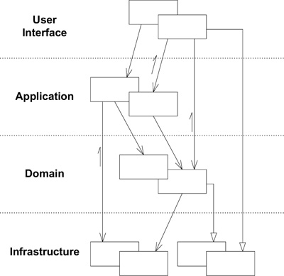
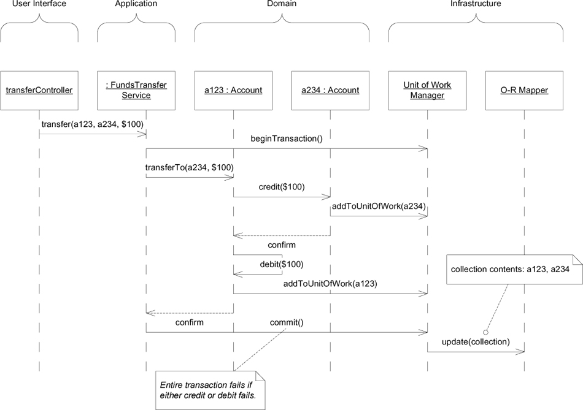

# Ch 4: Isolating the Domain

## Layered Architecture

Layered Architecture 有很多變體，不過，將 **Domain Layer** 分離出來是實作 Domain-Driven Design 的關鍵。

### 範例: Partitioning Online Banking Functionality into Layers

應用程式提供銀行各種功能，這裡使用轉帳(funds transfer)為例。使用者可以輸入或選擇兩組帳號，填寫轉帳金額，然後開始轉帳。

範例省略一些複雜的細節，以利說明。

!!! note
    - 處理 business rule 的是 domain layer 而非 application layer
    - business rule: Every credit has a matching debit

## The Smart UI (Anti-Pattern)

Smart UI 在使用者介面中實作所有的業務邏輯。

優點:

- 簡單，對專案成員的技術要求低，短時間的專案可以很快速開發
- 快速回應修改的要求
- 適用開發週期短，小型的專案

缺點:

- 不將 Domain 與 UI 分離，就無法實作 Domain-Driven Design 
    - 這裡將其視為 Anti-Pattern 的主因。但應考慮優點所描述的情境，並非所有情況都適用 Domain-Driven Design。
- 業務邏輯的程式碼沒有重複使用，當有重複使用的需求時，就需要複製相同的程式碼。
- 隨著專案的複雜度增加，程式的維護難度會急劇的增加。
 