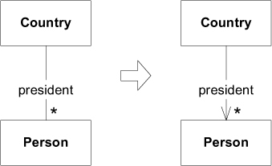
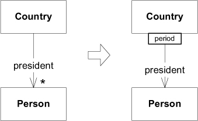
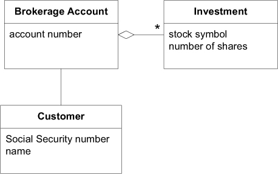
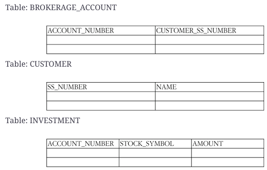
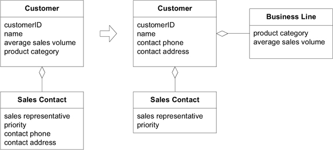
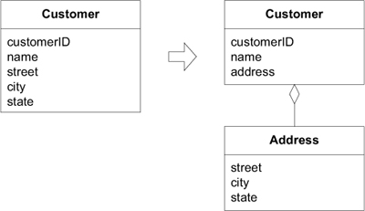

# Ch 5: A Model Expressed in Software

## Associations (關聯)

1. bidirectional association (雙向關聯) 到 unidirectional association (單向關聯)

   

   美國有很多任總統。國家與總統是雙向的關係。但是，當提到 George Washington (喬治・華盛頓) 時，很少會問是哪個國家的總統。關聯的方向，反映了領域中自然的走訪傾向。

2. qualified relationship (限定關係)

   

   一個國家在一個期間只會有一位總統。限定條件將「一對多」的關係簡化成「一對一」的關係。

### 範例: Brokerage Account 中的關聯



符合模型的一種實作:

```java
public class BrokerageAccount {
    String accountNumber;
    Customer customer;
    Set investments;

    // Constructors, etc. omitted

    public Customer getCustomer() {
        return customer;
    }
    public Set getInvestments() {
        return investments;
    }
}
```

同樣也符合模型，但是從關聯式資料庫取出資料的另一種實作:



```java
public class BrokerageAccount {
    String accountNumber;
    String customerSocialSecurityNumber;

    // Omit constructors, etc.

    public Customer getCustomer() {
        String sqlQuery =
            "SELECT * FROM CUSTOMER WHERE" +
            "SS_NUMBER='"+customerSocialSecurityNumber+"'";
        return QueryService.findSingleCustomerFor(sqlQuery);
    }
    public Set getInvestments() {
        String sqlQuery =
            "SELECT * FROM INVESTMENT WHERE" +
            "BROKERAGE_ACCOUNT='"+accountNumber+"'";
        return QueryService.findInvestmentsFor(sqlQuery);
    }
}
```

透過限定 Brokerage Account 與 Investment 的關聯，簡化多重性。限定每支股票只能對應一筆投資。


程式碼調整如下:

=== "Java"

    ```java hl_lines="4 11-13"
    public class BrokerageAccount {
        String accountNumber;
        Customer customer;
        Map investments;
    
        // Omitting constructors, etc.
    
        public Customer getCustomer() {
            return customer;
        }
        public Investment getInvestment(String stockSymbol) {
            return (Investment)investments.get(stockSymbol);
        }
    }
    ```

=== "SQL-based"

    ```java hl_lines="12-17"
    public class BrokerageAccount {
        String accountNumber;
        String customerSocialSecurityNumber;

        //Omitting constructors, etc.

        public Customer getCustomer() {
            String sqlQuery = "SELECT * FROM CUSTOMER WHERE SS_NUMBER='"
               + customerSocialSecurityNumber + "'";
            return QueryService.findSingleCustomerFor(sqlQuery);
        }
        public Investment getInvestment(String stockSymbol) {
            String sqlQuery = "SELECT * FROM INVESTMENT "
               + "WHERE BROKERAGE_ACCOUNT='" + accountNumber + "'"
               + "AND STOCK_SYMBOL='" + stockSymbol +"'";
            return QueryService.findInvestmentFor(sqlQuery);
        }
    }
    ```

## Entities (a.k.a Reference Objects)



將與識別相關的屬性與 Entity 關聯在一起。

- `customerId` 是 `Customer` 的唯一識別碼(identifier)。
- `name` 通常是識別人的方式之一。
- 這裡，將 `contact phone` 與 `contact address` 與 `Customer` 關聯在一起。
    - 這兩個屬性取決實際的應用。例如 `Customer` 有很多不同目的用途的 `contact phone`，有可能就與識別 `Customer` 的方式無關，應將其保持在原來的 `Sales Contact` 中。

將與識別不相關的屬性，從 Entity 移出。

## Value Objects

- value object 是不可變的(immutable)。
- 不需要 identity
- 不要設計得像 Entity 一樣複雜



Value Object 是一個概念整體。`street`, `city`, `state` 不應該是 `Person` 的個別屬性，它們應該是一個整體 - `Address`。這裡 `Customer` 為 Entity，`Address` 為 Value Object。

Value Object 提供最佳化的一種選擇 - Flyweight Pattern (GoF)。

## Service

在 Ubiquitous Language 中表達操作，是動詞，而非名詞。

不同 Layer 層有各自的 Servie。這裡說的是 Domain Layer 中的 Service。

Domain Service 避免客戶端與 Entity Objects, Value Objects 耦合。

### 範例

銀行使用寄電子郵件的應用程式，當帳戶餘額低於臨界值，即發送通知信給客戶。



