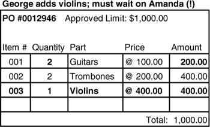

# Ch 6: The Life Cycle of a Domain Object


## Aggregates

假設我們要從資料庫刪除一個 `Person` 物件，那麼此人的姓名、出生日期、工作描述都應該被刪除。但是地址需要刪掉嗎？有可能有其他 `Person` 物件還需要參考到這個地址。不過如果沒有呢？那地址就會越累積越多。

Aggregate 是一個相關物件的群集，有一個 root 與邊界。外部物件只能引用 root。邊界內的物件，可以互相引用。

### 範例: 汽車

汽車是一個有「global identity (全域識別碼)」的 Entity。識別碼用以識別世界上每一輛汽車個體，是 Aggregate root。

輪胎，有「里程數」與「磨損度」屬性。如果我們會關心某個輪胎被裝在哪台汽車上面，就需要將輪胎視為 Entity，給予識別碼。不過，我們並不會關心特定輪胎被安裝在哪台汽車上。輪胎從汽車拆除後，我們也不會關心他後續的存在。我們只會搜尋汽車，透過汽車了解其輪胎狀況。

引擎有自己的序號，有時候會獨立追蹤。因此，引擎可以是 Aggregate root。


!!! note "可以被外部用識別碼查詢，就是 Aggregate root。"


**invariant** 是 Aggregate 內的物件必須遵守的規則。如圖中的

1. `{time period must not overlap on same wheel}`
2. `{mileage = sum(Position.mileage)}`

Aggregate 與 Aggregate 之間不應求即時同步，可以透過 event 或 batch 等機制更新。

Aggregate 的規則:

- Root Entities 有 global identity (全域唯一識別)
    - 範例: 若 `Car` 的車號是 ABC-123，那麼應用程式不會有另外一台車也是 ABC-123。
- Root Entities 負責檢查 invariant
    - 範例: `Car` 必須檢查`{time period must not overlap on same wheel}` 與 `{mileage = sum(Position.mileage)}`
- 邊界內的 Entities 有 local identity (邊界內唯一識別)
    - 範例: `Car` ABC-123 的 LF `Wheel` 只在 ABC-123 裡面唯一。另一台車，假設 DEF-456，也有 LF `Wheel`，但是這兩個 `Wheel` 是不同的。
- Aggregate 外，只能參考 Root Entities，不能參考內部的物件
    - 內部物件可以傳遞到外部，但是外部不能保留對內部物件的參考
    - 範例: 外部只能保留 `Car` 的參考，不能保留 `Wheel`, `Tire`, `Position` 的參考
- Aggregate root 可以透過資料庫查詢。其他內部物件必須透過 root 走訪得到。
    - 範例: 可以查詢資料庫車號 ABC-123 得到 `Car`，但是不能查詢 `Wheel` 得到 `Car`。
- Aggregate 內部物件可以保留其他 aggregate root 的參考。
- 刪除操作必須一次性刪除整個 Aggregate。

### 範例: 採購訂單的完整性

Domain model


假定資料庫儲存了一筆 Purchase Order 的情況。


Object diagram

```plantuml
object "0012946 : Purchase Order" as po {
  approved limit = 1000
}

object "Guitars : Part" as g {
  price = 100
}

object "Trombones : Part" as t {
  price = 200
}

object "001 : Purchase Order Line Item" as i1 {
  quantity = 3
}

object "002 : Purchase Order Line Item" as i2 {
  quantity = 2
}

po -d-> i1
po -d-> i2
i1 -d- g
i2 -d- t
```

#### 操作期間忽略其他資料庫變化造成的問題


1. George 修改 Guitars 的 Quantity 為 5，更新後 Total 為 900，滿足 invariant，予以更新。
2. Amanda 修改 Trombones 的 Amount 為 600，更新後 Total 為 900 滿足 invariant，予以更新。


但是這兩筆資料更新後，造成 PO 的 Total 變成 1100，超過 PO 的 approved limit 1000。

#### 一次鎖定整筆 PO 進行更新


1. George 修改 Guitars 的 Quantity 為 5，更新後 Total 為 900，滿足 invariant，予以更新。
    - 因為 George 進行修改，鎖定整筆 PO，Amanda 要修改需要排隊等 George 完成。
2. Amanda 修改 Trombones 的 Amount 為 600，更新後 Total 為 1100 違反 invariant，不予更新。

如果 George 修改 Guitars 時，有人提高 Guitars 的 Price，是不是也會可能違反 invariant。因此，可能也需要考慮在鎖定 PO 時，也鎖定 Part。

不過，過度鎖定會造成複雜的競爭問題，如下：


1. George 修改 PO #0012946。Guitars, Trombones 都被鎖定。
2. Amanda 要修改 PO #0012932，所以鎖定 Violins。然後要把 Trombones 加到 PO，但是 Trombones 被鎖定，所以 Amanda 要等 George 完成。
3. Sam 要修改 PO #0013003，所以鎖定 Piano。然後要把 Trombones 加到 PO，但是 Trombones 被鎖定，所以 Sam 要等 George 完成。

接著，George 要把 Violins 加到 PO，但是 Violins 被 Amanda 鎖定，所以 George 要等 Amanda 完成。



結果是，三個人都在相互等待。

#### 加入業務知識

1. Parts 會在多個 PO 使用，會產生 high contention。
2. 修改 Parts 的機會低於修改 PO。
3. 修改 Parts 的 Price 可以不必影響已存在的 PO。


`Purchase Order Line Item` 中保留了一份 `price`，它是填寫 PO 時的價格，而非最新價格。

Aggregate 強迫 `Purchase Order` 與 `Purchase Order Line Item` 的新增與刪除。而 `Part` 的新增與刪除是獨立的。

## Factory


Factory 的實作手段: (GoF Design Patterns)
1. Factory method
2. Abstract factory
3. Builder

整個 Aggregate 通常由 Factory 建立，並回傳 Aggregate root。


### 在既有的 Aggregate 中新增元素


在 Aggregate root 增加 Factory method，用以新增元素。

但是，Factory method 產生的元素可以不必屬於 Aggregate。


`TradeOrder` 不屬於 `Brokerage Account` 的 Aggregate。但是讓 `Brokerage Account` 產生 `TradeOrder` 是很自然的事情。因為

- `TradeOrder` 建立需要 `Brokerage Account` 的資訊。
- `Brokerage Account` 控制交易是否允許。

### 重建 Aggregate


CUST: customer?


