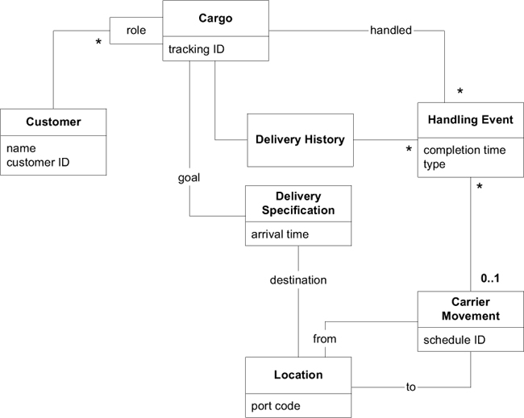
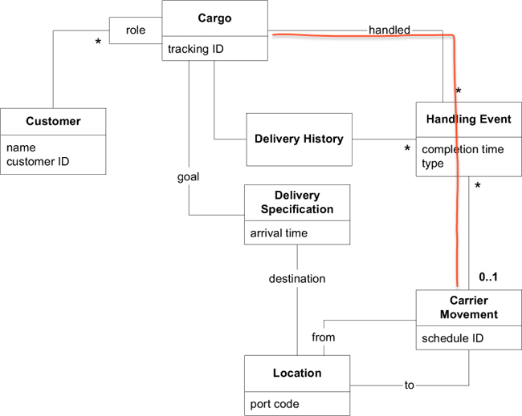

# Ch 7: Using the Language: An Extended Example

## Cargo Shipping System (貨物運送系統)

我們要替一家貨運公司開發軟體，最初的需求如下:

1. 追蹤貨物的處理狀態
2. 預約寄送貨物
3. 當貨物抵達某個地方時，自動寄送發票給客戶

用來表示 Domain Model 的 class diagram 如下:

透過 Domain Model 我們可能使用以下的描述:

- **Cargo** (貨物) 涉及多個 **Customer** (客戶)，每一個 **Customer** 扮演著不同的 **Role** (角色)。
- **Cargo** (貨物) 的 **Goal** (目標) 已指定。
- 透過一組滿足 **Specification** (規格) 的 **Carrier Movement** (運輸動作) 將達成 **Delivery Goal** (運送目標)。

圖中的每個物件的意義:

- **Handling Event** (處理事件): 描述對 **Cargo** 採取的處理，像是
    - loading it onto a ship (將貨物裝上船)
    - clearing it through customs (將貨物通過海關檢查並獲得許可)
    - loading (裝貨)
    - unloading (卸貨)
    - being claimed by the receiver (被收貨人提走)
- **Delivery Specification** (運送規格): 描述 **delivery goal** (運送目標)，包含了 **destination** (目的地) 與 **arrival time** (抵達時間)。
- **Customer**: **Role** (角色) 區隔了 **Customer** (客戶) 在運送扮演的身份。
    - **Role** 可以是 shipper (託運人), receiver (收貨人), payer (付款人) 等。
    - **Customer** 與 **Cargo** 的關係是「qualified (限定的) many-to-one」而非「many-to-many」。
- **Carrier Movement** (運輸行動): 描述 **Carrier** (如，卡車或船) 從一 **Location** (地點) 到另一 **Location** (地點) 的旅程。
    - ??? tip "看圖說明"
          
          **Cargo** 經過多個 **Handling Event** 處理，透過 **Carrier** 的 **Carrier Movement** 在 **Location** 之間移動。
- **Delivery History** (運送歷史紀錄): 描述 **Cargo** 在運送過程的。

Model 已經涵蓋實作需要的概念。假定我們有適當的機制保存物件與搜尋物件。

Model 的 refinement, design, implementation 是在迭代開發的過程中互相配合、同步進行的。也就是說，Model 不會是完全設計好，然後再交由下一個階段進行實作，而是應隨著開發不斷地發展、改進與調整。

這個範例從一個相對比較成熟的 Model 開始。並且，為了聚焦本章的重點，範例限制 Model 的修改動機必須是「為了使 Model 能與具體的實作相互關聯」，然後使用 building block patterns 進行修改 (即 Entity, Value Object, Aggregation, Repository)。
