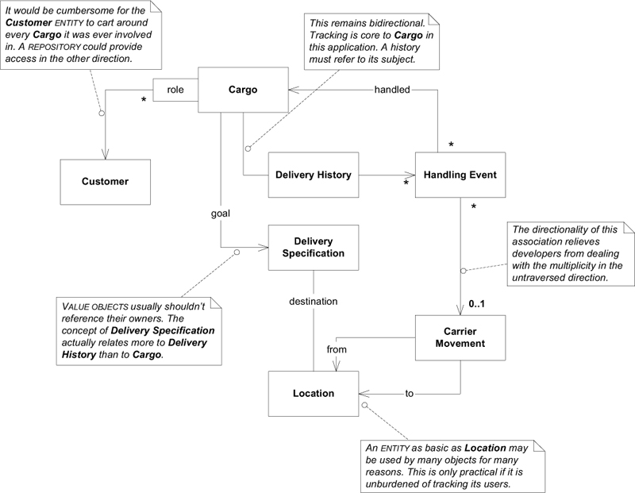
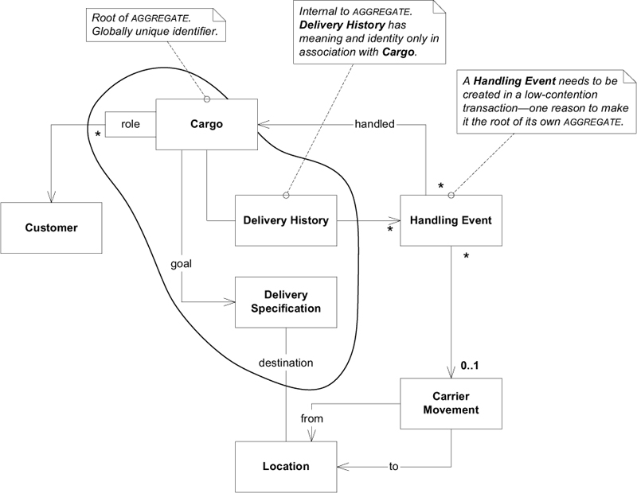
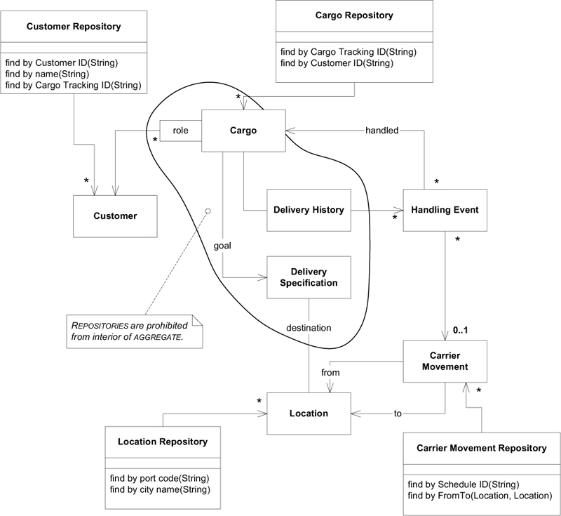
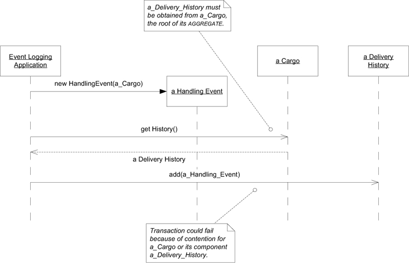
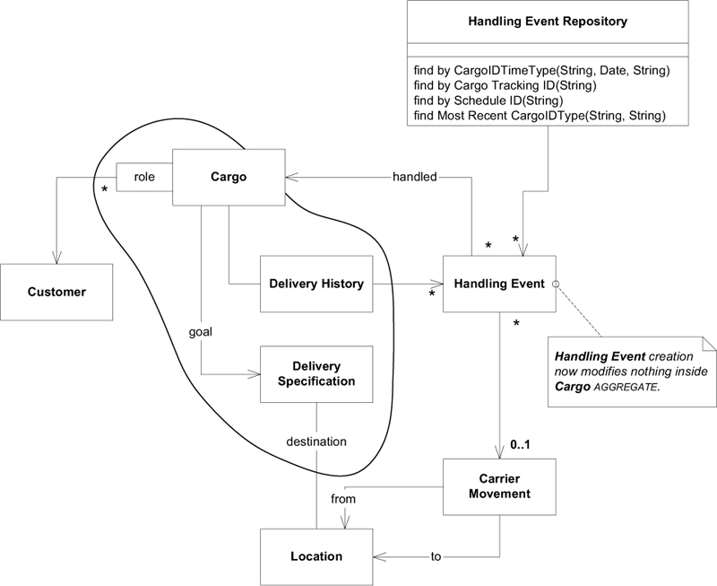
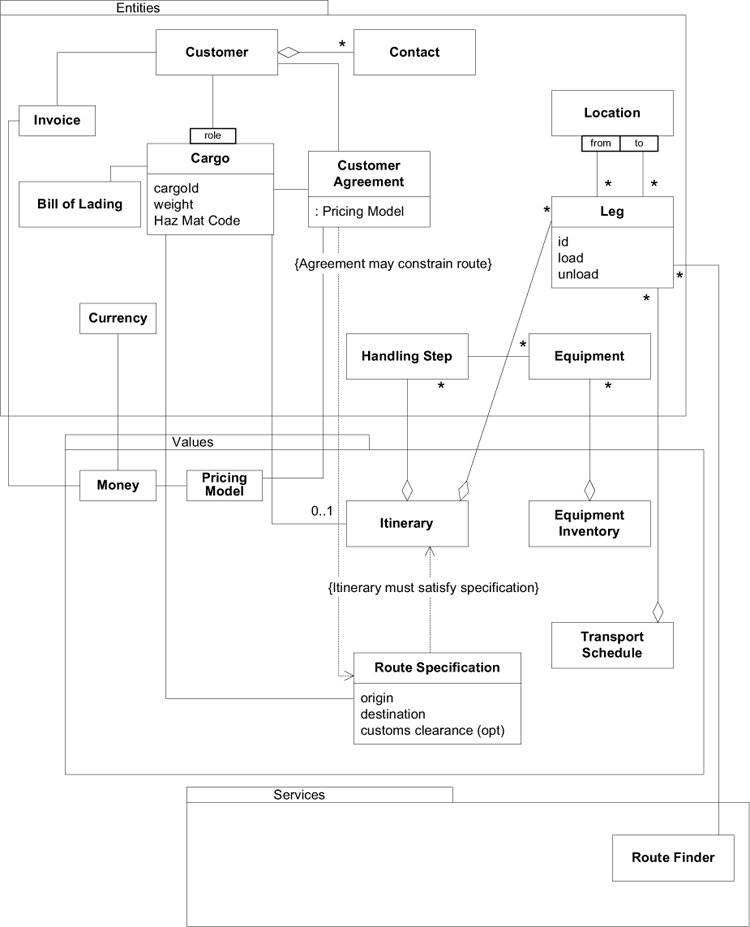
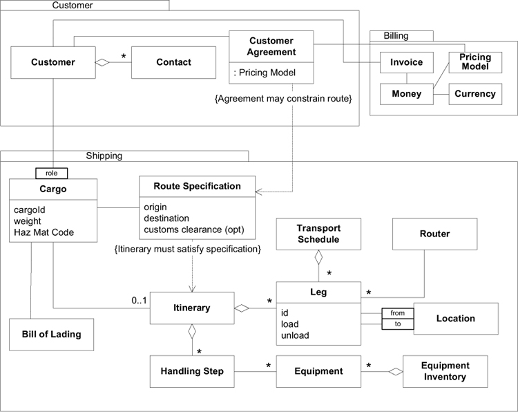
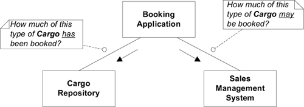
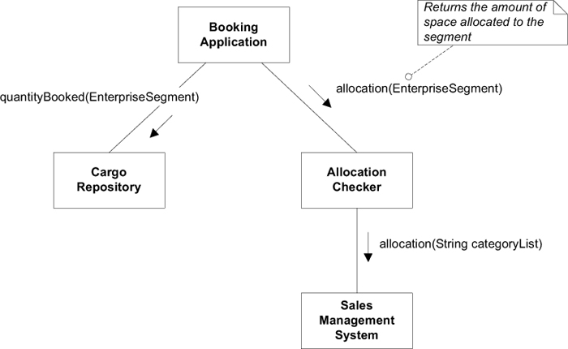
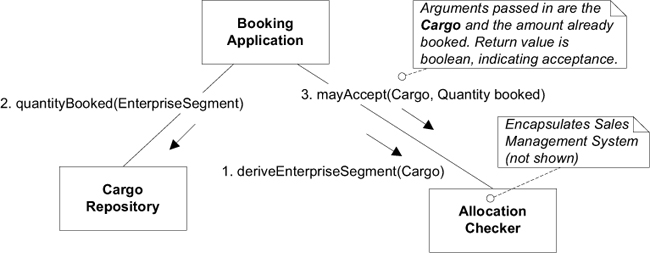

# Ch 7: Using the Language: An Extended Example

## Cargo Shipping System (貨物運送系統)

我們要替一家貨運公司開發軟體，最初的需求如下:

1. 追蹤貨物的處理狀態
2. 預約寄送貨物
3. 當貨物抵達某個地方時，自動寄送發票給客戶

用來表示 Domain Model 的 class diagram 如下:


透過 Domain Model 我們可能使用以下的描述:

- `Cargo` (貨物) 涉及多個 `Customer` (客戶)，每一個 `Customer` 扮演著不同的 `Role` (角色)。
- `Cargo` (貨物) 的 `Goal` (目標) 已指定。
- 透過一組滿足 `Specification` (規格) 的 `Carrier Movement` (運輸動作) 將達成 `Delivery Goal` (運送目標)。

圖中的每個物件的意義:

- `Handling Event` (處理事件): 描述對 `Cargo` 採取的處理，像是
    - loading it onto a ship (將貨物裝上船)
    - clearing it through customs (將貨物通過海關檢查並獲得許可)
    - loading (裝貨)
    - unloading (卸貨)
    - being claimed by the receiver (被收貨人提走)
- `Delivery Specification` (運送規格): 描述 `delivery goal` (運送目標)，包含了 `destination` (目的地) 與 `arrival time` (抵達時間)。
- `Customer`: `Role` (角色) 區隔了 `Customer` (客戶) 在運送扮演的身份。
    - `Role` 可以是 shipper (託運人), receiver (收貨人), payer (付款人) 等。
    - `Customer` 與 `Cargo` 的關係是「qualified (限定的) many-to-one」而非「many-to-many」。
- `Carrier Movement` (運輸行動): 描述 `Carrier` (如，卡車或船) 從一 `Location` (地點) 到另一 `Location` (地點) 的旅程。
    - ??? tip "看圖說明"
          
          `Cargo` 經過多個 `Handling Event` 處理，透過 `Carrier` 的 `Carrier Movement` 在 `Location` 之間移動。
- `Delivery History` (運送歷史紀錄): 描述 `Cargo` 在運送過程的。

Model 已經涵蓋實作需要的概念。假定我們有適當的機制保存物件與搜尋物件。

Model 的 refinement, design, implementation 是在迭代開發的過程中互相配合、同步進行的。也就是說，Model 不會是完全設計好，然後再交由下一個階段進行實作，而是應隨著開發不斷地發展、改進與調整。

這個範例從一個相對比較成熟的 Model 開始。並且，為了聚焦本章的重點，範例限制 Model 的修改動機必須是「為了使 Model 能與具體的實作相互關聯」，然後使用 building block patterns 進行修改 (即 Entity, Value Object, Aggregation, Repository 等)。

## Isolating the Domain: Introducing the Applications

使用 Layered Architecture 將 domain 與其他部分區隔。

以下是三個 application layer 的 class:

1. **Tracking Query**: 查詢 `Cargo` 的處理情況。
2. **Booking Application**: 註冊新的 `Cargo` 讓系統處理。
3. **Incident Logging Application**: 紀錄 `Cargo` 處理的事件。

Application layer 負責向 domain layer 問問題，domain layer 負責回答問題。

## 區分 Entity 與 Value Object

檢視每一個物件: (判斷方法: 可以共用的物件是 Value Object，不行的是 Entity)

- `Customer`
    - Entity
    - 唯一識別碼: customer ID
- `Cargo`
    - Entity
    - 唯一識別碼: tracking ID
- `Handling Event` 與 `Carrier Movement`
    - Entity
    - 唯一識別碼
        - `Carrier Movement`: schedule ID (從 shipping schedule 中的 code)
        - `Handling Event`: Cargo tracking ID + completion time + type
- `Location`
    - Entity
- `Delivery History`
    - Entity
    - 唯一識別碼: Cargo tracking ID (`Delivery History` 與 `Cargo` 一對一關聯，沒有自己的唯一識別碼。`Delivery History` 的識別碼來自 `Cargo`)
- `Delivery Specification`
    - Value Object (可以有兩個 `Cargo` 送往相同的地點，因此共用同一個 Specification)
- `Role` 與其他屬性
    - Value Object
    - 其他屬性，包含像是 time, name

## 關聯

指定關聯方向。圖中說明每個關聯方向的原因。



- `Carrier Movement - Handling Event`
    - 如果要從 `Carrier` 追蹤貨物，就需要 `Carrier Movement -> Handling Event`，但是我們的業務不需要。
    - 業務需要追蹤 `Cargo` 的狀態，需要透過 `Cargo -> Delivery History -> Handling Event -> Carrier Movement -> Location` 知道目前 `Cargo` 的位址。

## Aggregate Boundaries

Aggregate root 是 Entity 且有自己的唯一識別碼: `Customer`, `Cargo`, `Carrier Movement`, `Location`

`Cargo` 的 aggregate 可以把所有因為 `Cargo` 而存在的事物劃入邊界中，包含 `Delivery History`, `Delivery Specification`, `Handling Event`。

`Handling Event` 最後被設計成自己為 aggregate，因為業務上有需要查詢 `Cargo` 處理狀態，需要透過 `Handling Event`。



## Repository

只有 Aggregate root 會有 Repository。



沙盤推演，這些 Repository 是否能滿足需求。

- **Booking Application**
    - 客戶 `Customer` (`Customer Repository`)
    - 預定貨物要運送到 `Location` (`Location Repository`)
- **Activity Logging Application**
    - 使用 `Carrier Movement Repository` 查詢要裝貨的 `Carrier Movement`。
    - 使用 `Cargo Repository` 紀錄已完成裝貨。

沒有 `Handling Event Repository`，在這次迭代中 `Handling Event` 是與 `Delivery History` 關聯產生集合 且 沒有查詢 `Handling Event` 的需求。

## 場景演練 (Working Through Scenarios)

經常演練 Scenario，確保 Model 能夠有效的解決問題。

### 應用程式功能範例: 更改 Cargo 的目的地

`Delivery Specification` 是 Value Object，最簡單做法是，建立新的 `Delivery Specification` 並且更新 `Cargo` 的 `Delivery Specification`。

### 應用程式功能範例: 重複業務 (Repeat Business)

允許使用者在 `Repository` 中找到一個 `Cargo` 並基於它產生新的 `Cargo`。

Aggregate 邊界內的物件與屬性，都要小心考慮:

- 應建立新的，空的 `Delivery History`，舊的歷史不適用在新的 `Cargo` 上。
- 應複製 `Customer Role` 的 Map，並且保留 key 與 value 的 reference。也就是，參考到與原 `Cargo` 相同的 `Customer`，因為他是屬於 Aggregate 邊界外的 Entity。
- 產生新的 `Tracking ID`。

複製 `Carge` Aggregate 並沒有對外部物件產生副作用。

## 建立物件

### Cargo

#### `Cargo` 的 constructor

```java
public Cargo(String trackingId) {
    this.trackingId = trackingId;
    this.deliveryHistory = new DeliveryHistory(this);
    this.customerrolers = new HashMap<Role, Customer>();
}
```

- `DeliveryHistory` 與 `Cargo` 雙向關聯。
- `Cargo` Aggregate 包含 `DeliveryHistory`，所以 `Cargo` 要負責生成 `DeliveryHistory`。

#### Repeat Business

為了滿足重複業務 (Repeat Business) 的需求，可以使用 Factory。以下提供幾種實作方式:

=== "使用 Factory Method"

    ```java
    public Cargo copyPrototype(String newTrackingId)
    ```

=== "使用 Factory"

    ```java
    public Cargo newCargo(Cargo prototype, String newTrackingId)
    ```

=== "使用 Factory (自動產生 tracking id)"

    ```java
    public Cargo newCargo(Cargo prototype)
    ```

    回傳的 `Cargo` 會有新的 `trackingId`。

以上回傳的 `Cargo` 都實作

1. 空的 `DispatchHistory`
2. `DeliverySpecification` 為 `null`

### Handling Event

建立 Entity 需要把所有 identity 都傳入。

Handling Event 的 identity 是 `Cargo` 的 tracking ID, `Completion Time`, `Type`。

```java
public HandlingEvent(Cargo handled, String eventType, Date completionTime) {
    this.handled = handled;
    this.completionTime = completionTime;
    this.eventType = eventType;
}
```

對於 Entity，非 identity 的屬性，通常可以之後再設定。

另一種做法，在 `HandlingEvent` 中，加入 Factory Method 提供必要屬性，建立 `HandlingEvent`。 以下是建立一個 loading event 的 Factory Method:

```java
public static HandlingEvent newLoading(
    Cargo handled, CarrierMovement loadedOnto, Date completionTime
) {
    HandlingEvent result = new HandlingEvent(handled, LOADING_EVENT, completionTime);
    result.setCarrierMovement(loadedOnto);
    return result;
}
```

`DeliveryHistory` 與 `HandlingEvent` 有一個單向關聯。因此，建立 `HandlingEvent` 時，透過 `Cargo` 取得 `DeliveryHistory`，然後將 `HandlingEvent` 加入其中。



## 重構: Cargo aggregate 的另一種設計

如前所述，增加 `HandlingEvent` 必須要更新 `DeliveryHistory`，使得修改牽扯 `Cargo` Aggregate。若同時有其他 client 在修改 `Cargo`，因為競爭狀況，造成 `HandlingEvent` 建立延遲或者失敗。因此，能夠在不產生競爭況狀況下，增加 `HandlingEvent` 是重要的需求，我們要考慮另一種設計。

- 在 `DeliveryHistory` 中不使用 `HandlingEvent` 的集合，而用 query 替代。

為了讓 `DeleryHistory` 能夠查詢 `HandlingEvent`，需要增加 `HandlingEvent` 的 Repository。此外，Repository 也可以用來最佳化，提供最有效率的查詢方式。



## Module

以下是稍微大一點的 Shipping Model。以下物件根據其套用的 Pattern 進行分類:



Module 本身沒有傳達出 domain knowledge。



Module 的名稱應成為團隊語言的一部份。例如：「我們公司替客戶(`Customer`)送貨(`Shipping`)，所以能向他們收取費用(`Bill`)。我們的銷售與行銷人員與客戶(`Customer`)協商並簽署合約。操作人員負責將貨物運送(`Shipping`)到指定的目的地。後勤人員負責帳單(`Billing`)，根據與客戶(`Customer`)簽約的價格，寄送發票。」

## 增加功能: Allocation Checking

銷售部門使用其他軟體來管理客戶關係、銷售計劃等。其中一項功能為收益管理(yield management)，可以讓公司根據「貨物類型、出發地、目的地」或「以分類作為輸入的其他因素」來制定不同貨物類型的運送配額。配額構成各類貨物的運送目標，這樣就不會造成「低利潤貨物過多」、「高利潤貨物過少」、「預定量不足 (還有可以運送很多貨物)」、「預定量過載」等。

現在，要將收益管理的功能整合進開發的系統，讓客戶在預約寄送貨物時，可以根據配額 (allocation) 決定是否接受預約。




### 串接兩個系統

<font style="color:#FF7F50">:material-exclamation:</font> 系統與 `Sales Management System` 連接的介面，會想到以 `Sales Management Interface` 來命名。
<font style="color:green">:material-check:</font> 命名成 `Allocation Checker` 反映它在系統的職責。

### 加強 Model: Segmenting the Business



`Enterprise Segment` 是 Value Object。(Analysis Patterns, Fowler 1996)

```java title="Enterprise Segment 示意"
public class EnterpriseSegment {
    private final String region;
    private final String productType;
    private final String customerCategory;
    ...
}
```

`EnterpriseSegment` 定義了判斷運送量的依據標準，透過 `EnterpriseSegment` 可以查詢已預約量與配額。例如:

- `{region=台北, productType=冷凍食品, customerCategory=一般用戶} 配額 50 公斤`
- `{region=台北, productType=電子產品, customerCategory=一般用戶} 配額 100 公斤`

這個設計的問題:

- 接受或拒絕 `Cargo` 的預約是 Domain 的責任，而非 application layer (即 `Booking Application`) 的責任。
- `EnterpriseSegment` 是如何生成的，沒有清楚說明。也就是，`Booking Application` 如何知道 `Cargo` 的分類，進而產生 `EnterpriseSegment`。

這兩個設計問題，適合給 `Allocation Checker` 處理。



1. 透過 `Cargo` 取得 `EnterpriseSegment` (`Allocation Checker` 知道 `Cargo` 的配額所屬的分類)
2. 透過 `EnterpriseSegment` 查詢配額
3. 透過 `Cargo` 跟已預約的量，檢查訂單是否接收或拒絕。
    - `Allocation Checker` 知道如何從 `Cargo` 生成 `EnterpriseSegment`，所以這裡傳入的是 `Cargo`。

!!! note "`EnterpriseSegment` 在這裡應該可以理解成 Request Payload，把 request 所需要的最小資料封裝成物件。這樣的做法可以不暴露處理 request 的實作內部，讓 client 的程式碼不容易因為內部結構修改而受影響。"
