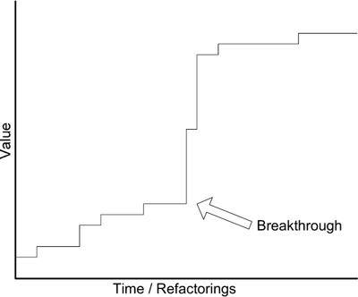
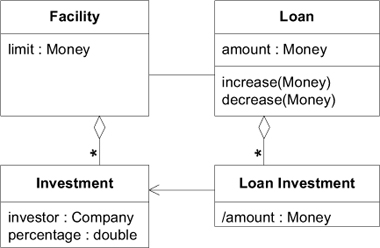
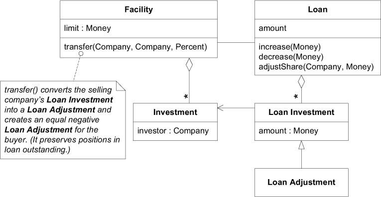
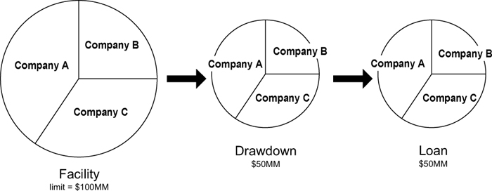
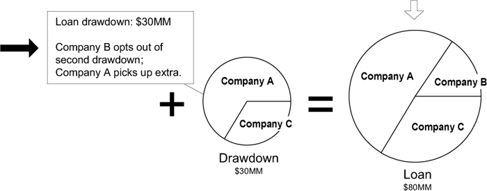
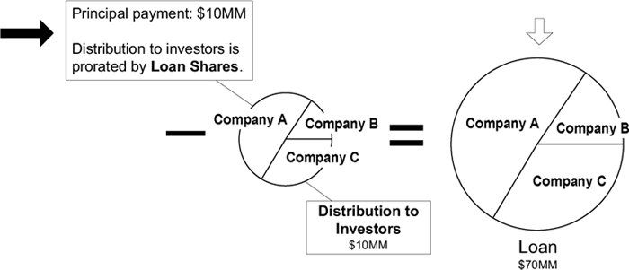

# Ch 8: Breakthrough



## 一個 breakthrough 的故事

這是一個管理聯合貸款的程式。

假設 Intel 需要建造一個十億美元的工廠，需要申請貸款。因為額度太大，沒有一間借貸公司有能力獨立承擔，於事聯合其他公司共同支持巨額信貸。開發的軟體負責追蹤與支援這種信貸。

以下展示模型。`Loan Investment` (貸款投資) 用來表示投資者在一筆 `Loan` (貸款) 所承擔的股份，與投資者在 `Facility` (信貸) 所持的股份成正比。



!!! example "範例"
    - 一筆 1000 萬美元的 `Loan` (貸款)
    - 這筆 `Loan` 是從 `Facility` (信貸) 中提供。 (`Loan` 不能超過 `Facility` 的上限，就像信用卡的刷卡累積金額不能超過刷卡的額度。)
    - `Facility` (信貸) 以下三間公司共同出資:
        - 投資者 A 出資 500 萬美元，佔 `Facility` 的 50%
        - 投資者 B 出資 300 萬美元，佔 `Facility` 的 30%
        - 投資者 C 出資 200 萬美元，佔 `Facility` 的 20%

    ```plantuml
    object ":Facility" as facility {
        limit = 5000 萬美元
    }
    object ":Loan" as loan{
        amount = 1000 萬美元
    }
    object ":Investment" as a {
        investor = 投資者 A
        percentag = 50%
    }
    object ":Investment" as b {
        investor = 投資者 B
        percentag = 30%
    }
    object ":Investment" as c {
        investor = 投資者 C
        percentag = 20%
    }
    object ":Loan Investment" as lia {
        amount = 500萬
    }
    object ":Loan Investment" as lib {
        amount = 300萬
    }
    object ":Loan Investment" as lic {
        amount = 200萬
    }

    facility o-- a
    facility o-- b
    facility o-- c
    facility - loan
    loan o-- lia
    loan o-- lib
    loan o-- lic
    a <-- lia
    b <-- lib
    c <-- lic
    ```

出乎意料的需求: 借貸方要求提款時，銀行領導人會要求投資人按各自股份進行支付。投資人通常會按照自己股份支付，但他們也會協商要求少投入(或多投入)。於是，模型加入了 `Loan Adjustment` (貸款調整) 來處理處理需求。



## Breakthrough

既有的模型將 `Loan` 與 `Facility` 綁在一起，不適用在實際的業務。

新模型應有的關鍵: `Loan` 與 `Facility` 是獨立的。使用以下圖演練數個 Scenarios。



圖顯示，一億美元的 `Facility`，借貸方提取金額 5000 萬美元。三個放貸方依照原先承諾的 `Facility` 股份支付。



接著，借貸方又提了一筆 3000 萬美元，Company B 決定不參與 `Loan` 而改由 Company A 承擔這部分的股份。

隨著 `Loan` 的提取額不斷地增加，與 `Facility` 的股份比例不再相同的現象很常見。



借貸方還款，金額依據 `Loan` 的股份分配給放貸方，而非 `Facility` 的股份。同樣地，利息也是按照 `Loan` 的股份分配。


借貸方享有 `Facility` 權利所支付的費用，依照 `Facility` 的股份，而不是放貸方出了多少錢。
