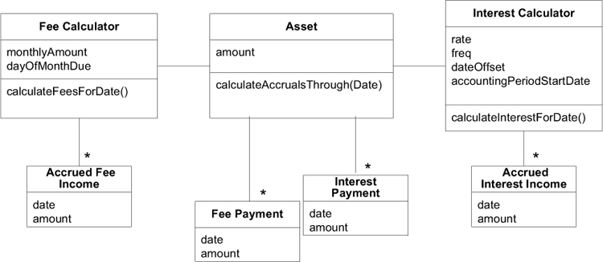
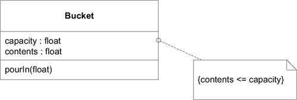
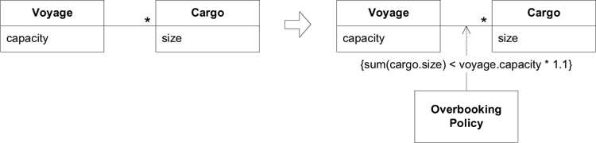
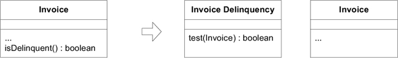
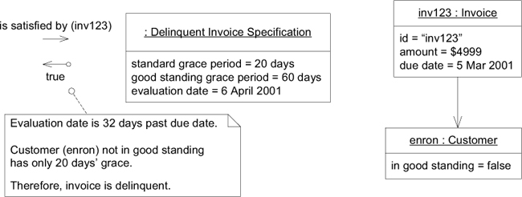
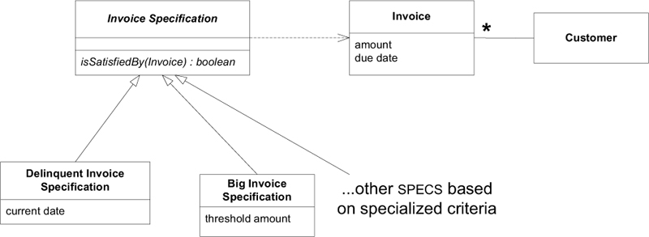
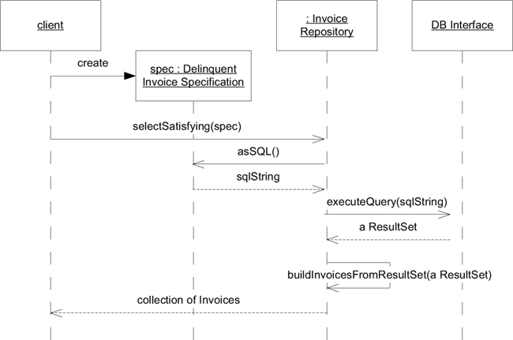
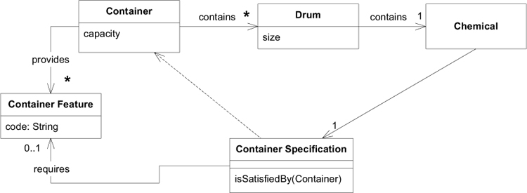

# Ch 9: Making Implicit Concepts Explicit

## Example: Hearing a Missing Concept in the Shipping Model

!!! quote

    The team had already developed a working application that could book a cargo. They were starting to build an “operations support” application that would help juggle the work orders for loading and unloading cargos at the origin and destination and at transfers between ships.

    The booking application used a routing engine to plan the trip for a cargo. Each leg of the journey was stored in a row of a database table, indicating the ID of the vessel voyage (a particular voyage by a particular ship) slated to carry the cargo, the location where it would be loaded, and the location where it would be unloaded.

    

    **Developer**: I want to make sure the “cargo bookings” table has all the data that the operations application will need.

    **Expert**: They’re going to need the whole itinerary for the `Cargo`. What information does it have now?

    **Developer**: The cargo ID, the vessel voyage, the loading port, and the unloading port for each leg.

    **Expert**: What about the date? Operations will need to contract handling work based on the expected times.

    **Developer**: Well, that can be derived from the schedule of the vessel voyage. The table data is normalized.

    **Expert**: Yes, it is normal to need the date. Operations people use these kinds of itineraries to plan for upcoming handling work.

    **Developer**: Yeah . . . OK, they’ll definitely have access to the dates. The operations management application will be able to provide the whole loading and unloading sequence, with the date of each handling operation. The “itinerary,” I guess you would say.

    **Expert**: Good. The itinerary is the main thing they’ll need. Actually, you know, the booking application has a menu item that will print an itinerary or e-mail it to the customer. Can you use that somehow?

    **Developer**: That’s just a report, I think. We won’t be able to base the operations application on that.

    [Developer looks thoughtful, then excited.]

    **Developer**: So, this itinerary is really the link between booking and operations.

    **Expert**: Yes, and some customer relations, too.

    **Developer**: [Sketching a diagram on the whiteboard.] So would you say it is something like this?

    

    **Expert**: Yes, that looks basically right. For each leg you’d like to see the vessel voyage, the load and unload location, and time.

    **Developer**: So once we create the `Leg` object, it can derive the times from the vessel voyage schedule. We can make the `Itinerary` object our main point of contact with the operations application. And we can rewrite that itinerary report to use this, so we’ll get the domain logic back into the domain layer.

    **Expert**: I didn’t follow all of that, but you are right that the two main uses for the `Itinerary` are in the report in booking and in the operations application.

    **Developer**: Hey! We can make the `Routing Service` interface return an itinerary object instead of putting the data in the database table. That way the routing engine doesn’t need to know about our tables.

    **Expert**: Huh?

    **Developer**: I mean, I’ll make the routing engine just return an `Itinerary`. Then it can be saved in the database by the booking application when the rest of the booking is saved.

    **Expert**: You mean it isn’t that way now?!

    The developer then went off to talk with the other developers involved in the routing process. They hashed out the changes to the model and the implications for the design, calling on the shipping experts when needed. They came up with the diagram.

    

```plantuml
object ":Cargo" as cargo {
    cargoId = 123
    origin = 捷運中山佔
    destination = 高鐵左營站
    weight = 500克
}
```

| Cargo ID | Voyage Id | Load Loc | Unload Loc |
|----------|-----------|----------|------------|
| 123      | V1        | 捷運中山站    | 捷運台北車站     |
| 123      | V2        | 捷運台北車站   | 高鐵台北車站     |
| 123      | V3        | 高鐵台北車站   | 高鐵左營站      |


## Example: Earning Interest the Hard Way

假定一家金融公司，該公司投資於商業貸款(commercial loans)和其他利息資產(interest-bearing assets)。公司有一個應用程式用來追蹤這些投資與收益。每晚，程式會執行腳本，計算當天的利息(interest)和費用(fees)，並記錄到公司的財務軟體。


晚上的腳本，程式走訪每個 `Asset`，並執行 `calculateInterestForDate()` 計算當天的利息(interest)。腳本將回傳值(the amount earned) 與指定的 ledger 名稱，傳送給財務軟體的 Service 公開的介面。財務軟體將 amount 過到 ledger 中。相似的流程，腳本計算每一個 `Asset` 的費用(fee)，並記錄到不同的 ledger 中。

開發人員在計算利息遭遇越來越複雜的問題，他懷疑是否有更適合的模型，所以他請教專家。

!!! quote

    **Developer**: Our **Interest Calculator** is getting out of hand.

    **Expert**: That is a complicated part. We still have more cases we’ve been holding back.

    **Developer**: I know. We can add new interest types by substituting a different **Interest Calculator**. But what we’re having the most trouble with right now is all these special cases when they don’t pay the interest on schedule.

    **Expert**: Those really aren’t special cases. There’s a lot of flexibility in when people pay.

    **Developer**: Back when we factored out the **Interest Calculator** from the **Asset**, it helped a lot. We may need to break it up more.

    **Expert**: OK.

    **Developer**: I was thinking you might have a way of talking about this interest calculation.

    **Expert**: What do you mean?

    **Developer**: Well, for example, we’re tracking the interest (利息) due but unpaid within an accounting period (會計期間). Do you have a name for that?

    **Expert**: Well, we don’t really do it like that. The interest earned and the payment are quite separate postings.

    **Developer**: So you don’t need that number?

    **Expert**: Well, sometimes we might look at it, but it isn’t the way we do business.

    **Developer**: OK, so if the payment (付款) and interest (利息) are separate, maybe we should model them that way. How does this look? [_Sketching on whiteboard_]

    

    **Expert**: It makes sense, I guess. But you just moved it from one place to another.

    **Developer**: Except now the **Interest Calculator** only keeps track of interest earned, and the **Payment** keeps that number separately. It hasn’t simplified it a lot, but does it better reflect your business practice?

    **Expert**: Ah. I see. Could we have interest history, too? Like the **Payment History**.

    **Developer**: Yes, that has been requested as a new feature. But that could have been added onto the original design.

    **Expert**: Oh. Well, when I saw interest and **Payment History** separated like that, I thought you were breaking up the interest to organize it more like the **Payment History**. Do you know anything about accrual basis accounting (應計制會計)?

    **Developer**: Please explain.

    **Expert**: Each day, or whenever the schedule calls for, we have an interest accrual (應計利息) that gets posted to a ledger (收支總帳). The payments are posted a different way. This aggregate (合計) you have here is a little awkward.

    **Developer**: You’re saying that if we keep a list of “accruals,” they could be aggregated or . . . “posted” as needed.

    **Expert**: Probably posted on the accrual date, but yes, aggregated anytime. Fees work the same way, posted to a different ledger, of course.

    **Developer**: Actually, the interest calculation would be simpler if it was done just for one day, or period. And then we could just hang on to them all. How about this?

    

    **Expert**: Sure. It looks good. I’m not sure why this would be easier for you. But basically, what makes any asset valuable is what it can accrue in interest, fees, and so on.

    **Developer**: You said fees work the same way? They . . . what was it . . . post to different ledgers (分類帳)?

    

    **Developer**: With this model, we get the interest calculation, or rather, the accrual calculation logic that was in the **Interest Calculator** separated from tracking. And I hadn’t noticed until now how much duplication there is in the **Fee Calculator**. Also, now the different kinds of fees can easily be added.

    **Expert**: Yes, the calculation was correct before, but I can see everything now.

最終，開發人員得到以下模型:


重構後的程式，每晚腳本會走訪每一個 `Asset`，並執行 `calculateAccrualsThrough(Date)`，其回傳 `Accural` 的集合，其金額會被過帳到對應的分類帳(ledger)中。

## Example: Earning Interest by the Book

!!! quote "Accrual Basis Accounting"

    This method recognizes income when it is earned, even if it is not paid. All expenses also show when they are incurred whether they have been paid for or billed to be paid at a later date. Any obligation due, including taxes, will be shown as expense.

    -- Finance and Accounting: How to Keep Your Books and Manage Your Finances Without an MBA, a CPA or a Ph.D., by Suzanne Caplan (Adams Media, 2000)



## 將不明顯的概念表示在模型中

### 明確表示出限制



圖中將 `Bucket` (桶子) 的 `contents` (內容) 不能超過 `capacity` (容量) 的限制明確表示出來。

以下程式碼實作 model 的限制條件。

```java title="模型的實作"
class Bucket {
  private float capacity;
  private float contents;

  public void pourIn(float addedVolume) {
    if(contents + addedVolume > capacity) {
      contents = capacity;
    } else {
      contents = contents + addedVolume;
    }
  }
}
```

以下版本的實作，讓程式碼與模型的關係更加明顯。

```java title="比較好的實作: 將規則抽成 method"
class Bucket {
  private float capacity;
  private float contents;

  public void pourIn(float addedVolume) {
    float volumePresent = contents + addedVolume;
    contents = constrainedToCapacity(volumePresent);
  }

  private float constrainedToCapacity(float volumePlacedIn) {
    if(volumePlacedIn > capacity) {
      return capacity;
    } else {
      return volumePlacedIn;
    }
  }
}
```

如此，這條規則就有名有姓了。

### 範例: Overbooking Policy

第一章提到的範例: 運輸業務常見的業務慣例，預定超出運輸能力 10% 的貨物。



## Specification


用來描述 **Boolean test**。例如，`Invoice` 類別，有一個演算法判別是否已經過期。

```java
public boolean isOverduce() {
  Date currentDate = new Date();
  return currentDate.after(dueDate);
}
```

在 `Invoice` 類別中，可能有另一個 method `isDelinquent()`，也是用來檢查是否過期 (是否拖欠款項)。隨著發展，可能參雜其他邏輯，像是寬限期(grace period)、或參考付款歷史紀錄等。而且，可能還會開始相依其他 domain object、subsystems等。然而，長出來的這些相依關係，可能與 `Invoice` 本身的意涵沒什麼關聯。

商業邏輯通常不適合放在 Entity 或 Value Object 中。但是，把商業邏輯移出 domain layer 的作法更糟糕。

將 Boolean test 提取到單獨的 Value Object 中。此物件用於計算另一個物件，評估某個條件是否為真。



圖中的 `Invoice Delinquency` 稱作 Specification，用來測試物件，檢查他們是否滿足指定的條件。換句話說，Specification 就是一個 Predicate。

將拖欠規則提取成 Specification，更詳細的描述規則。以下範例使用 object diagram 說明。

- 發票 inv123 在 2001/4/6 評估，已過期 32 天。
- 信譽良好的客戶寬限期是 60 天，非信譽良好的客戶寬限期是 20 天。
- enron 非信譽良好的客戶，只有 20 天的寬限期。

由於已過 20 天寬限期， inv123 為拖欠票據。



## 套用與實作 Specification

Specification 的三種目的:

1. 驗證 (validation)
2. 選擇 (selection) 或 查詢 (query)
3. 建立 (creation)

### Validation



```java title="Domain Layer 的程式碼"
class DelinquentInvoiceSpecification extends InvoiceSpecification {
  private Date currentDate;
  // An instance is used and discarded on a single date

  public DelinquentInvoiceSpecification(Date currentDate) {
    this.currentDate = currentDate;
  }

  public boolean isSatisfiedBy(Invoice candidate) {
    int gracePeriod = candidate.customer().getPaymentGracePeriod();
    Date firmDeadline = DateUtility.addDaysToDate( candidate.dueDate(), gracePeriod);
    return currentDate.after(firmDeadline);
  }
}
```

當我們需要標記拖欠款項的客戶，會在 Application layer 有類似以下的程式碼。

```java title="Application layer 的程式碼"
public boolean accountIsDelinquent(Customer customer) {
   Date today = new Date();
   Specification delinquentSpec = new DelinquentInvoiceSpecification(today);
   Iterator it = customer.getInvoices().iterator();
   while (it.hasNext()) {
      Invoice candidate = (Invoice) it.next();
      if (delinquentSpec.isSatisfiedBy(candidate))
        return true;
   }
   return false;
}
```

### Selection or Querying

需求是列出所有拖欠款項的客戶。

```java
public Set selectSatisfying(InvoiceSpecification spec) {
  Set results = new HashSet();
  Iterator it = invoices.iterator();
  while(it.hasNext()) {
    Invoice candidate = (Invoice) it.next();
    if(spec.isSatisfiedBy(candidate))
      result.add(candidate);
  }
  return results;
}

Set delinquentInvoices = invoiceRepository.selectSatisfying(new DelinquentInvoiceSpecification(currentDate));
```



```java
public String asSQL() {
    return "SELECT * FROM INVOICE, CUSTOMER" +
           " WHERE INVOICE.CUST_ID = CUSTOMER.ID" +
           " AND INVOICE.DUE_DATE + CUSTOMER.GRACE_PERIOD" +
           "  < " + SQLUtility.dateAsSQL(currentDate);
}
```

以上作法的問題: SQL 暴露到 Domain Layer。

以下程式碼將 SQL 放到 Repository 中，改進了這個問題。

```java
public class InvoiceRepository {

  public Set selectWhereGracePeriodPast(Date aDate){
    //This is not a rule, just a specialized query
    String sql = whereGracePeriodPast_SQL(aDate);
    ResultSet queryResultSet = SQLDatabaseInterface.instance().executeQuery(sql);
    return buildInvoicesFromResultSet(queryResultSet);
  }

  public String whereGracePeriodPast_SQL(Date aDate) {
    return "SELECT * FROM INVOICE, CUSTOMER" +
           "  WHERE INVOICE.CUST_ID = CUSTOMER.ID" +
           "  AND INVOICE.DUE_DATE + CUSTOMER.GRACE_PERIOD" +
           "    < " + SQLUtility.dateAsSQL(aDate);
  }

  public Set selectSatisfying(InvoiceSpecification spec) {
    return spec.satisfyingElementsFrom(this);
  }
}

public class DelinquentInvoiceSpecification {
  // Basic DelinquentInvoiceSpecification code here

  public Set satisfyingElementsFrom(InvoiceRepository repository) {
    //Delinquency rule is defined as: "grace period past as of current date"
    return repository.selectWhereGracePeriodPast(currentDate);
  }
}
```

```plantuml
skinparam style strictuml
skinparam sequenceParticipant underline

participant "client" as client
participant "spec : Delinquent\nInvoice Specification" as spec
participant ": Invoice Repository" as repo
participant "DB Interface" as db

client -> spec **: create
client -> repo++: selectSatisfying(spec)
repo -[#red]> spec++: <font color=red>satisfyingElementsFrom(this)</font>
spec -[#red]> repo++: <font color=red><b>selectWhereGracePeriodPast(currentDate)</b></font>
repo -[#red]> repo: <font color=red>sqlString = whereGracePeriodPast_SQL(currentDate)</font>
repo -> db: executeQuery(sqlString)
db --> repo: a ResultSet
repo -> repo: buildInvoicesFromResultSet(a ResultSet)
return <font color=red>collection of Invoices</font>
return <font color=red>collection of Invoices</font>
return collection of Invoices
```

雖然 SQL 實作沒有擺在 Specification 中，但是 Specification 已經表明超過寬限期即為拖欠款項。

然而，這種作法還有問題: `InvoiceRepository.whereGracePeriodPast_SQL` 只適用在特定的需求情境。以下程式碼，將過濾的程式碼放到 Specification 中，改進此問題。

```java
public class InvoiceRepository {

  public Set selectWhereDueDateIsBefore(Date aDate) {
    String sql = whereDueDateIsBefore_SQL(aDate);
    ResultSet queryResultSet = SQLDatabaseInterface.instance().executeQuery(sql);
    return buildInvoicesFromResultSet(queryResultSet);
  }

  public String whereDueDateIsBefore_SQL(Date aDate) {
    return "SELECT * FROM INVOICE" +
           "  WHERE INVOICE.DUE_DATE" +
           "     < " + SQLUtility.dateAsSQL(aDate);
   }

  public Set selectSatisfying(InvoiceSpecification spec) {
    return spec.satisfyingElementsFrom(this);
  }
}

public class DelinquentInvoiceSpecification {
  //Basic DelinquentInvoiceSpecification code here

  public Set satisfyingElementsFrom(InvoiceRepository repository) {
    Collection pastDueInvoices = repository.selectWhereDueDateIsBefore(currentDate);

    Set delinquentInvoices = new HashSet();
    Iterator it = pastDueInvoices.iterator();
    while (it.hasNext()) {
      Invoice anInvoice = (Invoice) it.next();
      if (this.isSatisfiedBy(anInvoice))
        delinquentInvoices.add(anInvoice);
    }
    return delinquentInvoices;
  }
}
```

```plantuml
skinparam style strictuml
skinparam sequenceParticipant underline

participant "client" as client
participant "spec : Delinquent\nInvoice Specification" as spec
participant ": Invoice Repository" as repo
participant "DB Interface" as db

client -> spec **: create
client -> repo++: selectSatisfying(spec)

repo -[#red]> spec++: <font color=red>satisfyingElementsFrom(this)</font>

spec -[#red]> repo++: <font color=red><b>selectWhereDueDateIsBefore(currentDate)</b></font>
repo -[#red]> repo: <font color=red>sqlString = whereDueDateIsBefore_SQL(currentDate)</font>
repo -> db: executeQuery(sqlString)
db --> repo: a ResultSet
repo -> repo: buildInvoicesFromResultSet(a ResultSet)
return <font color=red>collection of Invoices</font>
loop each invoice
opt isSatisfiedBy(invoice)
spec -[#red]> spec: <font color=red>delinquentInvoices.add(invoice)</font>
end opt
end loop
return <font color=red>delinquentInvoices</font>
return collection of Invoices
```

此做法會將更多的 invoice 載入記憶體中，然後再進行過濾，相較於前一版的程式效能會比較不好一點。用「效率」交換「更好的責任分離」需要根據情境評估取捨。

### Creation

#### 範例: Chemical Warehouse Packer

撰寫軟體尋找有效且安全的儲存化學物品的方式。



每種化學物品都有容器規格:

| Chemical                 | Container Specification  |
|--------------------------|--------------------------|
| TNT (2,4,6-三硝基甲苯)        | 防爆容器 (Armored container) |
| Sand (沙子)                |                          |
| Biological Sample (生物樣本) | 不能與易爆用品混裝                |
| Ammonia (阿摩尼亞, 氨水)       | 通風容易                     |

我們將他撰寫成 Container Specification，我們可以撰寫一個將化學用品混裝在容器的方法，並檢驗是否滿足約束條件:

| Container Features | Contents                     | Specification Satisfied? |
|--------------------|------------------------------|--------------------------|
| Armored (防爆)       | 20 lbs. TNT<br>500 lbs. sand | ✓                        |
|                    | 50 lbs biological sameple    | ✓                        |
|                    | ammonia                      | ✗                        |

實作示意程式碼:

```java
public class ContainerSpecification {
  private ContainerFeature requiredFeature;

  public ContainerSpecification(ContainerFeature reuired) {
    requiredFeature = required;
  }

  boolean isSatisfiedBy(Container aContainer) {
    return aContainer.getFeatures().contains(requiredFeature);
  }
}

public class Container {

  private Collection<ContainerFeature> features;

  boolean isSafelyPacked() {
    Iterator it = content.iterator();
    while (it.hasNext()) {
      Drum drum = (Drum) it.next();
      if (!drum.containerSpecfication().isSatisfiedBy(this))
        return false;
    }
    return true;
  }
}

tnt.setContainerSpecification(new ContainerSpecification(ARMORED));
```

監控所有化學用品是否安全儲存:

```java
Iterator it = containers.iterator();
while (it.hasNext()) {
  Container container = (Container) it.next();
  if (!container.isSafelyPacked())
    unsafeContainers.add(container);
}
```

不過需求沒有要撰寫監控程式。我們需要撰寫的是 pack (包裝) 程式，以下程式碼需要按 Specification 對 drums 進行包裝。

```java
public interface WarehousePacker {
  public void pack(
    Collection<Container> containersToFill,
    Collection<Drum> drumsToPack
  ) throws NoAnswerFoundException;

    /* ASSERTION: At end of pack(), the ContainerSpecification
    of each Drum shall be satisfied by its Container.
    If no complete solution can be found, an exception shall
    be thrown. */
}
```
