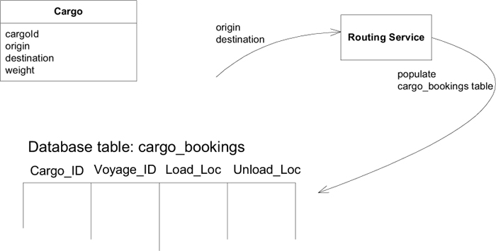
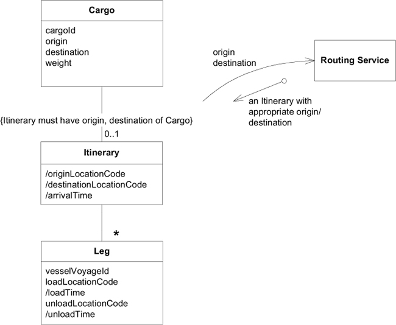
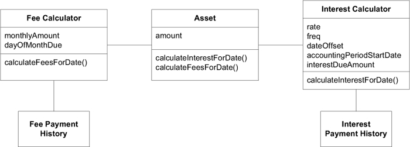
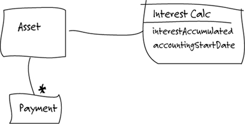
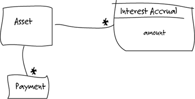
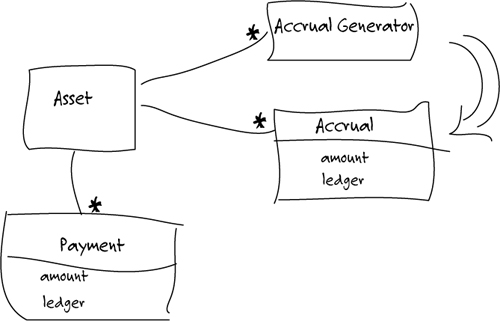
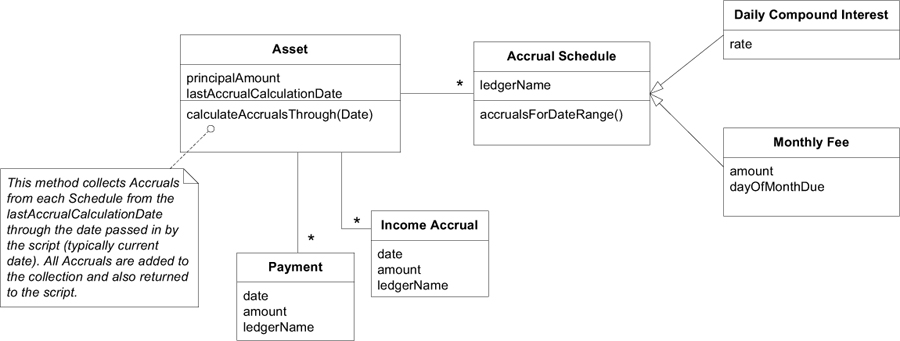

# Ch 9: Making Implicit Concepts Explicit

## Example: Hearing a Missing Concept in the Shipping Model

!!! quote

    The team had already developed a working application that could book a cargo. They were starting to build an “operations support” application that would help juggle the work orders for loading and unloading cargos at the origin and destination and at transfers between ships.

    The booking application used a routing engine to plan the trip for a cargo. Each leg of the journey was stored in a row of a database table, indicating the ID of the vessel voyage (a particular voyage by a particular ship) slated to carry the cargo, the location where it would be loaded, and the location where it would be unloaded.

    

    **Developer**: I want to make sure the “cargo bookings” table has all the data that the operations application will need.

    **Expert**: They’re going to need the whole itinerary for the `Cargo`. What information does it have now?

    **Developer**: The cargo ID, the vessel voyage, the loading port, and the unloading port for each leg.

    **Expert**: What about the date? Operations will need to contract handling work based on the expected times.

    **Developer**: Well, that can be derived from the schedule of the vessel voyage. The table data is normalized.

    **Expert**: Yes, it is normal to need the date. Operations people use these kinds of itineraries to plan for upcoming handling work.

    **Developer**: Yeah . . . OK, they’ll definitely have access to the dates. The operations management application will be able to provide the whole loading and unloading sequence, with the date of each handling operation. The “itinerary,” I guess you would say.

    **Expert**: Good. The itinerary is the main thing they’ll need. Actually, you know, the booking application has a menu item that will print an itinerary or e-mail it to the customer. Can you use that somehow?

    **Developer**: That’s just a report, I think. We won’t be able to base the operations application on that.

    [Developer looks thoughtful, then excited.]

    **Developer**: So, this itinerary is really the link between booking and operations.

    **Expert**: Yes, and some customer relations, too.

    **Developer**: [Sketching a diagram on the whiteboard.] So would you say it is something like this?

    

    **Expert**: Yes, that looks basically right. For each leg you’d like to see the vessel voyage, the load and unload location, and time.

    **Developer**: So once we create the `Leg` object, it can derive the times from the vessel voyage schedule. We can make the `Itinerary` object our main point of contact with the operations application. And we can rewrite that itinerary report to use this, so we’ll get the domain logic back into the domain layer.

    **Expert**: I didn’t follow all of that, but you are right that the two main uses for the `Itinerary` are in the report in booking and in the operations application.

    **Developer**: Hey! We can make the `Routing Service` interface return an itinerary object instead of putting the data in the database table. That way the routing engine doesn’t need to know about our tables.

    **Expert**: Huh?

    **Developer**: I mean, I’ll make the routing engine just return an `Itinerary`. Then it can be saved in the database by the booking application when the rest of the booking is saved.

    **Expert**: You mean it isn’t that way now?!

    The developer then went off to talk with the other developers involved in the routing process. They hashed out the changes to the model and the implications for the design, calling on the shipping experts when needed. They came up with the diagram.

    

```plantuml
object ":Cargo" as cargo {
    cargoId = 123
    origin = 捷運中山佔
    destination = 高鐵左營站
    weight = 500克
}
```

| Cargo ID | Voyage Id | Load Loc | Unload Loc |
|----------|-----------|----------|------------|
| 123      | V1        | 捷運中山站    | 捷運台北車站     |
| 123      | V2        | 捷運台北車站   | 高鐵台北車站     |
| 123      | V3        | 高鐵台北車站   | 高鐵左營站     |


## Example: Earning Interest the Hard Way

假定一家金融公司，該公司投資於商業貸款(commercial loans)和其他利息資產(interest-bearing assets)。公司有一個應用程式用來追蹤這些投資與收益。每晚，程式會執行腳本，計算當天的利息(interest)和費用(fees)，並記錄到公司的財務軟體。



晚上的腳本，程式走訪每個 `Asset`，並執行 `calculateInterestForDate()` 計算當天的利息(interest)。腳本將回傳值(the amount earned) 與指定的 ledger 名稱，傳送給財務軟體的 Service 公開的介面。財務軟體將 amount 過到 ledger 中。相似的流程，腳本計算每一個 `Asset` 的費用(fee)，並記錄到不同的 ledger 中。

開發人員在計算利息遭遇越來越複雜的問題，他懷疑是否有更適合的模型，所以他請教專家。

!!! quote

    **Developer**: Our **Interest Calculator** is getting out of hand.

    **Expert**: That is a complicated part. We still have more cases we’ve been holding back.

    **Developer**: I know. We can add new interest types by substituting a different **Interest Calculator**. But what we’re having the most trouble with right now is all these special cases when they don’t pay the interest on schedule.

    **Expert**: Those really aren’t special cases. There’s a lot of flexibility in when people pay.

    **Developer**: Back when we factored out the **Interest Calculator** from the **Asset**, it helped a lot. We may need to break it up more.

    **Expert**: OK.

    **Developer**: I was thinking you might have a way of talking about this interest calculation.

    **Expert**: What do you mean?

    **Developer**: Well, for example, we’re tracking the interest (利息) due but unpaid within an accounting period (會計期間). Do you have a name for that?

    **Expert**: Well, we don’t really do it like that. The interest earned and the payment are quite separate postings.

    **Developer**: So you don’t need that number?

    **Expert**: Well, sometimes we might look at it, but it isn’t the way we do business.

    **Developer**: OK, so if the payment (付款) and interest (利息) are separate, maybe we should model them that way. How does this look? [_Sketching on whiteboard_]

    

    **Expert**: It makes sense, I guess. But you just moved it from one place to another.

    **Developer**: Except now the **Interest Calculator** only keeps track of interest earned, and the **Payment** keeps that number separately. It hasn’t simplified it a lot, but does it better reflect your business practice?

    **Expert**: Ah. I see. Could we have interest history, too? Like the **Payment History**.

    **Developer**: Yes, that has been requested as a new feature. But that could have been added onto the original design.

    **Expert**: Oh. Well, when I saw interest and **Payment History** separated like that, I thought you were breaking up the interest to organize it more like the **Payment History**. Do you know anything about accrual basis accounting (應計制會計)?

    **Developer**: Please explain.

    **Expert**: Each day, or whenever the schedule calls for, we have an interest accrual (應計利息) that gets posted to a ledger (收支總帳). The payments are posted a different way. This aggregate (合計) you have here is a little awkward.

    **Developer**: You’re saying that if we keep a list of “accruals,” they could be aggregated or . . . “posted” as needed.

    **Expert**: Probably posted on the accrual date, but yes, aggregated anytime. Fees work the same way, posted to a different ledger, of course.

    **Developer**: Actually, the interest calculation would be simpler if it was done just for one day, or period. And then we could just hang on to them all. How about this?

    

    **Expert**: Sure. It looks good. I’m not sure why this would be easier for you. But basically, what makes any asset valuable is what it can accrue in interest, fees, and so on.

    **Developer**: You said fees work the same way? They . . . what was it . . . post to different ledgers (分類帳)?

    

    **Developer**: With this model, we get the interest calculation, or rather, the accrual calculation logic that was in the **Interest Calculator** separated from tracking. And I hadn’t noticed until now how much duplication there is in the **Fee Calculator**. Also, now the different kinds of fees can easily be added.

    **Expert**: Yes, the calculation was correct before, but I can see everything now.


最終，開發人員得到以下模型:



重構後的程式，每晚腳本會走訪每一個 `Asset`，並執行 `calculateAccrualsThrough(Date)`，其回傳 `Accural` 的集合，其金額會被過帳到對應的分類帳(ledger)中。
