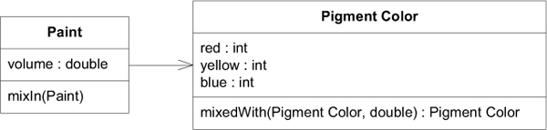
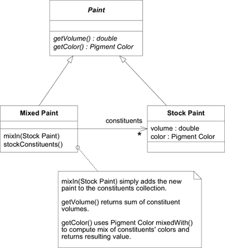
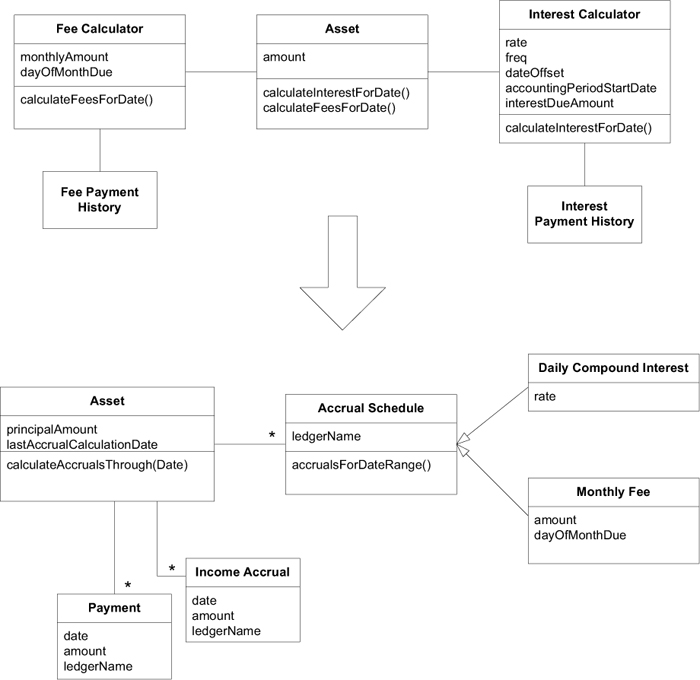
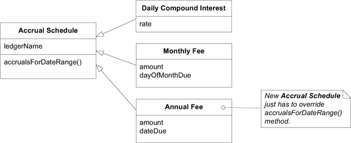
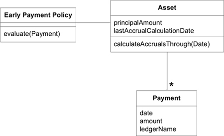

# Ch 10: Supple Design

一些有助於達到 supple design 的 patterns。


## Intention-Revealing Interfaces

### 範例: Refactoring: A Paint-Mixing (調漆) Application

一個油漆商店的程式，可以展示給客戶標準調漆後的結果。以下是初始設計，他有一個單一 domain  class。


我們要知道 `paint(Point)` 做什麼的唯一方法就是去讀他實作程式碼:

```java
public void paint(Paint paint) {
  v = v + paint.getV(); //After mixing, volume is summed
  // Omitted many lines of complicated color mixing logic
  // ending with the assignment of new r, b, and y values.
}
```

程式碼看起來像是，兩個 `Paint` 混合後，體積 (volume) 增加了，顏色混合了。另一個角度，替這個 method 撰寫測試。

```java
public void testPaint() {
   // Create a pure yellow paint with volume=100
   Paint yellow = new Paint(100.0, 0, 50, 0);
   // Create a pure blue paint with volume=100
   Paint blue = new Paint(100.0, 0, 0, 50);

   // Mix the blue into the yellow
   yellow.paint(blue);

   // Result should be volume of 200.0 of green paint
   assertEquals(200.0, yellow.getV(), 0.01);
   assertEquals(25, yellow.getB());
   assertEquals(25, yellow.getY());
   assertEquals(0, yellow.getR());
}
```

但是，這個測試程式碼並沒有告訴我們 `paint` 做了什麼。讓我們重新編寫測試，使得他是以 client 的角度來看待。

```java hl_lines="8 11-14"
public void testPaint() {
   // Start with a pure yellow paint with volume=100
   Paint ourPaint = new Paint(100.0, 0, 50, 0);
   // Take a pure blue paint with volume=100
   Paint blue = new Paint(100.0, 0, 0, 50);

   // Mix the blue into the yellow
   ourPaint.mixIn(blue);

   // Result should be volume of 200.0 of green paint
   assertEquals(200.0, ourPaint.getVolume(), 0.01);
   assertEquals(25, ourPaint.getBlue());
   assertEquals(25, ourPaint.getYellow());
   assertEquals(0, ourPaint.getRed());
}
```


## Side-Effect-Free Functions

### 範例: Refactoring the Paint-Mixing Application Again


```java
public void mixIn(Paint other) {
  volume = volume.plus(other.getVolume());
  // Many lines of complicated color-mixing logic
  // ending with the assignment of new red, blue,
  // and yellow values.
}
```


Color 是很重要的概念，把它抽出變成一個明確的物件。


油漆的調色，與 RGB 調色是不同的，需要反映在名稱上，將其命名成 `Pigment Color` (顏料顏色)。Color 對應的操作也一併移出。`Pigment Color` 是 Value Object，是 immutable object，提供Side-Effect-Free Functions。

```java
public class PigmentColor {
  public PigmentColor mixedWith(PigmentColor other,
                                double ratio) {
    // Many lines of complicated color-mixing logic
    // ending with the creation of a new PigmentColor object
    // with appropriate new red, blue, and yellow values.
  }
}

public class Paint {
  public void mixIn(Paint other) {
     volume = volume + other.getVolume();
     double ratio = other.getVolume() / volume;
     pigmentColor = pigmentColor.mixedWith(other.pigmentColor(), ratio);
  }
}
```


## Assertions

### 範例: Back to Paint Mixing



在前面的範例中，`p1.maxIn(p2)` 操作後，`p2` 的狀態變化並沒有說明。對於現實的理解，混合動作應當是一個油漆(`p2`)加到另一個油漆(`p1`)中。因此，`p1` 的體積應加上 `p2` 的體積，並且 `p2` 的體積應歸零。但是目前實作是，`p1` 的體積會加上 `p2` 的體積，而 `p2` 的體積保持不變。然而，修改參數的作法會有副作用 (side-effect)，會增加程式不好的風險。

雖然修改參數(`p2`)的作法會有副作用，不好，但是卻是符合直覺。我們可以宣告一個固定規則(invariant) [^1]:

    Total volume of paint is unchanged by mixing.

[^1]: 第六章提到，invariant 是在 Aggregate 內部物件必須遵守的規則。

經過調查，原本那個實作，是為了印出油漆調色前與調色後的清單，這樣可以幫助使用者知道顏色是怎麼混合出來的。因此，要滿足混合後總體積不變的規則，就無法滿足應用的需求。例子中，尷尬的狀況源於概念遺失(missing concepts)，需要新的模型來表達。



```java
public void testMixingVolume {
  PigmentColor yellow = new PigmentColor(0, 50, 0);
  PigmentColor blue = new PigmentColor(0, 0, 50);

  StockPaint paint1 = new StockPaint(1.0, yellow);
  StockPaint paint2 = new StockPaint(1.5, blue);
  MixedPaint mix = new MixedPaint();

  mix.mixIn(paint1);
  mix.mixIn(paint2);
  assertEquals(2.5, mix.getVolume(), 0.01);
}
```

## Conceptual Contour (概念輪廓)

### 範例: The contours of accruals







## Standalone classes

依賴關係 :material-arrow-up-right: 思考負擔 :material-arrow-up-right: 能處裡的複雜度 :material-arrow-down-right:。

為了理解一個物件，而必須保留在大腦之中的其他概念，都是在增加思考負擔。

消除依賴，減少理解物件需要花費的力氣。

盡力把最複雜的計算提煉到 Standalone class 中，我們可以對此物件進行獨立的分析與測試。例如，原本範例油漆(paint) 與 顏色(color) 緊密相關，我們從中將顏料(pigment)提取出來，變成顯式的概念。

## Closure of Operation (閉合操作)

集合中任兩個元素組合時，結果仍在這個集合之中，這種操作稱「閉合操作」。 閉合操作可以降低對操作的理解門檻。

### 範例: 過濾薪水低於 40,000 的員工

過濾(filter)是閉合操作。

#### <font style="color: red">:octicons-x-16:</font> 使用必要的 Iterator 概念

```java
Set employees = (some Set of Employee object);
Set lowPaidEmployees = new HashSet();
Iterator it = employees.iterator();
while (it.hasNext()) {
    Employee anEmployee = it.next();
    if (anEmployee.salary() < 40000) {
        lowPaidEmployees.add(anEmployee);
    }
}
```

#### <font style="color: green">:octicons-check-16:</font> 不增加新的概念

lambda 是基礎函數類型，不會增加開發人員思考負擔。

=== "Smelltakl (書本範例)"

    ```smelltalk
    employees := (some Set of Employee objects).
    lowPaidEmployees := employees select:
        [:anEmployee | anEmployee salary < 40000].
    ```

=== "Java"

    ```java
    Set employees = (some Set of Employee object);
    Set lowPaidEmployees = employees
        .stream()
        .filter(anEmployee -> anEmployee.salary() < 40000)
        .toSet();
    ```
