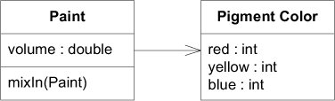

# Ch 10: Supple Design

一些有助於達到 supple design 的 patterns。


## Intention-Revealing Interfaces

### 範例: Refactoring: A Paint-Mixing (調漆) Application

一個油漆商店的程式，可以展示給客戶標準調漆後的結果。以下是初始設計，他有一個單一 domain  class。


我們要知道 `paint(Point)` 做什麼的唯一方法就是去讀他實作程式碼:

```java
public void paint(Paint paint) {
  v = v + paint.getV(); //After mixing, volume is summed
  // Omitted many lines of complicated color mixing logic
  // ending with the assignment of new r, b, and y values.
}
```

程式碼看起來像是，兩個 `Paint` 混合後，體積 (volume) 增加了，顏色混合了。另一個角度，替這個 method 撰寫測試。

```java
public void testPaint() {
   // Create a pure yellow paint with volume=100
   Paint yellow = new Paint(100.0, 0, 50, 0);
   // Create a pure blue paint with volume=100
   Paint blue = new Paint(100.0, 0, 0, 50);

   // Mix the blue into the yellow
   yellow.paint(blue);

   // Result should be volume of 200.0 of green paint
   assertEquals(200.0, yellow.getV(), 0.01);
   assertEquals(25, yellow.getB());
   assertEquals(25, yellow.getY());
   assertEquals(0, yellow.getR());
}
```

但是，這個測試程式碼並沒有告訴我們 `paint` 做了什麼。讓我們重新編寫測試，使得他是以 client 的角度來看待。

```java hl_lines="8 11-14"
public void testPaint() {
   // Start with a pure yellow paint with volume=100
   Paint ourPaint = new Paint(100.0, 0, 50, 0);
   // Take a pure blue paint with volume=100
   Paint blue = new Paint(100.0, 0, 0, 50);

   // Mix the blue into the yellow
   ourPaint.mixIn(blue);

   // Result should be volume of 200.0 of green paint
   assertEquals(200.0, ourPaint.getVolume(), 0.01);
   assertEquals(25, ourPaint.getBlue());
   assertEquals(25, ourPaint.getYellow());
   assertEquals(0, ourPaint.getRed());
}
```


## Side-Effect-Free Functions

### 範例: Refactoring the Paint-Mixing Application Again


```java
public void mixIn(Paint other) {
  volume = volume.plus(other.getVolume());
  // Many lines of complicated color-mixing logic
  // ending with the assignment of new red, blue,
  // and yellow values.
}
```


Color 是很重要的概念，把它抽出變成一個明確的物件。



油漆的調色，與 RGB 調色是不同的，需要反映在名稱上，將其命名成 `Pigment Color` (顏料顏色)。Color 對應的操作也一併移出。`Pigment Color` 是 Value Object，是 immutable object，提供Side-Effect-Free Functions。

```java
public class PigmentColor {
  public PigmentColor mixedWith(PigmentColor other,
                                double ratio) {
    // Many lines of complicated color-mixing logic
    // ending with the creation of a new PigmentColor object
    // with appropriate new red, blue, and yellow values.
  }
}

public class Paint {
  public void mixIn(Paint other) {
     volume = volume + other.getVolume();
     double ratio = other.getVolume() / volume;
     pigmentColor = pigmentColor.mixedWith(other.pigmentColor(), ratio);
  }
}
```


