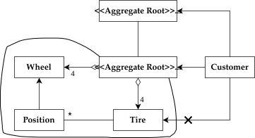
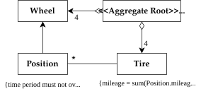
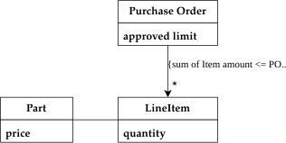
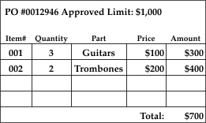
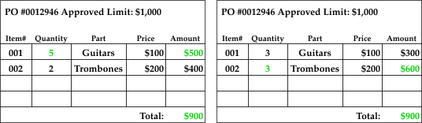
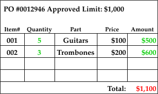
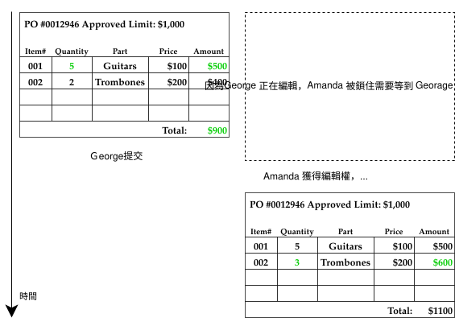
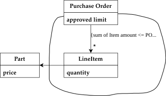

# Aggregate

Aggregate 是 Domain-Driven Design 中用來管理「一組相關物件」的模式。它讓我們以業務語意去劃定邊界，確保資料的一致性與完整性。

---

## What

!!! abstract "定義"
    **Aggregate** 是一組緊密相關的物件集合，被視為一個**資料修改的單元**。每個 Aggregate 由一個 **Aggregate Root** 與一條明確的 **Boundary (邊界)** 所定義。

- **Aggregate Root**：Aggregate 的唯一對外入口。外部世界只能引用 Root，不能直接操作邊界內的其他物件。
- **Boundary**：劃定哪些物件屬於同一個 Aggregate。邊界內的物件可以互相引用，邊界之間的物件則只能透過 Root 互動。

---

## Why

沒有 Aggregate 的情況下，任何外部物件都可以自由地修改邊界內的任一物件，導致：

- **Invariant 被破壞**：無法保證業務規則（如採購訂單的總金額限制）在多人操作時仍然成立。
- **難以追蹤刪除責任**：例如刪除 `Person` 時，它的 `Address` 要一起刪嗎？如果沒有邊界，這個決策分散在每個操作中。
- **Locking 難以管理**：多使用者同時修改一個物件群集時，不知道該鎖住哪個範圍。

Aggregate 透過明確的邊界與 Root 來集中這些責任，讓業務規則有一個守護者。

---

## Rules

| 規則 | 說明 |
| :--- | :--- |
| **Aggregate Root 有 Global ID** | 可被外部直接查詢（如資料庫查詢）。 |
| **內部物件只有 Local ID** | 只在此 Aggregate 邊界內唯一，外部無法直接查詢。 |
| **外部只能持有 Root 的引用** | 內部物件可以傳遞到外部，但外部不能保留對它的持久引用。 |
| **Root 負責檢查 Invariant** | 所有對邊界內物件的修改，都必須通過 Root 的業務規則驗證。 |
| **只能透過 Root 查詢內部物件** | 不可繞過 Root 直接查出邊界內的物件。 |
| **刪除以 Aggregate 為單位** | 刪除 Root 時，邊界內所有物件必須一併刪除。 |
| **跨 Aggregate 不需即時同步** | Aggregate 之間可透過 Domain Event 或 Batch 等最終一致性機制更新。 |

---

## Examples

### 汽車 (Car)



| 物件 | 類型 | 說明 |
| :--- | :--- | :--- |
| `Car` | **Aggregate Root** | 具有全球唯一車籍號碼 (VIN)，是查詢的入口。 |
| `Wheel` | 邊界內 Entity | 具有 Local ID（如 LF, RR），不被外部直接追蹤。 |
| `Tire` | 邊界內 Entity | 消耗品，透過 `Car` 管理，不獨立追蹤。 |
| `Position` | 邊界內 Value Object | 記錄零件的安裝位置與里程，協助維護 Invariant。 |
| `Engine` | 可能是另一個 Aggregate Root | 若引擎需要獨立維修追蹤，則自成一個 Aggregate。 |

**Invariants：**



- `{time period must not overlap on same wheel}`：同一個輪框不可在相同時間點出現在多個位置。
- `{mileage = sum(Position.mileage)}`：輪胎的總里程必須等於各 Position 的里程總和。

### 採購訂單 (Purchase Order)



當多個使用者同時修改 PO 的不同 Line Item 時，各自看來都符合金額上限，但合併後卻超標——這正是 Invariant 被破壞的例子。

資料庫中 PO 的初始情況


Georage 與 Amanda 同時修改 PO，分別增加 Guitar 與 Trombone 的數量。這兩個人在各自的視圖中，都認為修改是合法的 (Total <= Approved Limit)。


但兩個人的修改合併後，總金額卻超過了上限 (Total > Approved Limit)。


**解法**：將整筆 `Purchase Order` 視為一個 Aggregate，任何修改都需要鎖定整個 Root (PO)，由 Root 統一驗證金額上限。



---

## How

### Aggregate Root 的基本結構

```java
// Aggregate Root
public class PurchaseOrder {
    private final PurchaseOrderId id;        // Global ID
    private final Money approvedLimit;
    private final List<LineItem> lineItems;  // 邊界內物件

    // 只能透過 Root 的方法來修改邊界內物件
    public void addLineItem(Part part, int quantity) {
        Money newTotal = calculateTotal().add(part.getPrice().times(quantity));

        // Root 負責檢查 Invariant
        if (newTotal.isGreaterThan(approvedLimit)) {
            throw new ApprovedLimitExceededException(approvedLimit, newTotal);
        }

        lineItems.add(new LineItem(part.getId(), part.getPrice(), quantity));
    }

    private Money calculateTotal() {
        return lineItems.stream()
            .map(LineItem::getAmount)
            .reduce(Money.ZERO, Money::add);
    }
}
```

```java
// 邊界內物件 (Local Identity)
public class LineItem {
    private final PartId partId;
    private final Money price;   // PO 建立當下的價格快照，非最新價格
    private final int quantity;

    public Money getAmount() {
        return price.times(quantity);
    }
}
```

### 跨 Aggregate 的引用



```java
// 正確：只持有另一個 Aggregate Root 的 ID
public class LineItem {
    private final PartId partId; // 只存 Part 的 ID，而非 Part 物件本身
    // ...
}

// 錯誤：不應持有其他 Aggregate 內部物件的引用
public class LineItem {
    private final Part part; // ❌ 直接引用 Part 物件（若 Part 是另一個 Aggregate）
}
```

### Repository 只為 Root 提供查詢

```java
// 正確：Repository 只針對 Aggregate Root
public interface PurchaseOrderRepository {
    Optional<PurchaseOrder> findById(PurchaseOrderId id);
    void save(PurchaseOrder order);
}

// 錯誤：不應提供 LineItem 的獨立查詢
public interface LineItemRepository {  // ❌
    Optional<LineItem> findById(LineItemId id);
}
```

