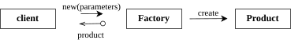
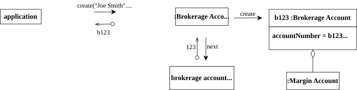
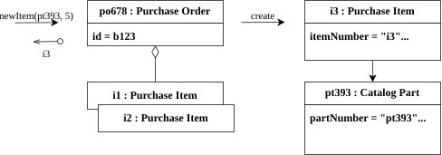
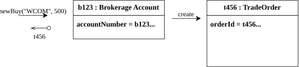
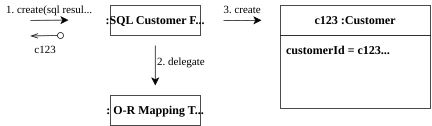
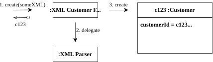

# Factory

Factory 是 Domain-Driven Design 中負責**建立複雜物件或 Aggregate** 的模式。它將「如何建立物件」的邏輯集中管理，讓 client 不需要知道建立的細節。

{style="zoom:1.3"}

---

## What

!!! abstract "定義"
    **Factory** 是一種將物件建立邏輯封裝起來的機制。當一個物件或 Aggregate 的建立過程很複雜，或建立過程需要揭露許多內部細節時，Factory 將這些複雜性隱藏起來，提供一個清楚的建立介面。

Factory 的實作手段 (GoF Design Patterns)：

- **Factory Method**：在類別中定義建立物件的方法，子類別可以決定實際建立的型別。
- **Abstract Factory**：提供一個建立相關物件家族的介面，無需指定具體類別。
- **Builder**：逐步建立複雜物件，適合有很多可選設定的情境。

---

## Why

當物件或 Aggregate 的建立過程複雜時，不加以封裝會產生問題：

- **洩漏內部細節**：client 被迫了解物件的內部結構才能完成建立，破壞了封裝性。
- **Invariant 不易保護**：建立邏輯分散在各處，容易忘記設定某個必要狀態，導致物件一開始就違反 invariant。
- **建立與使用耦合**：client 同時負責知道「如何建立」與「如何使用」，職責不清。

Factory 將建立責任集中，確保每個新建立的物件都滿足其 invariant，並從一開始就處於有效狀態。

### 何時只需要 Constructor (不需 Factory)

並非所有的物件都需要 Factory。書中強調，如果符合以下情況，直接使用 Constructor 即可，過度使用 Factory 反而會增加不必要的複雜度：

1. **類別本身就是具體型別**：沒有複雜的多型 (Polymorphism) 或繼承階層。
2. **Client 關心實作細節**：例如要選擇某個具體的「策略 (Strategy)」，Client 本來就需要知道特定實作。
3. **Client 已經擁有所有構造所需屬性**：不需要透過複雜的內部狀態計算或其他物件來提取資訊。
4. **建構過程很簡單**：沒有複雜的組裝邏輯，也就是 `new` 一下就好了。
5. **能夠輕易滿足 Invariant**：只要把參數傳入 Constructor，物件立刻就是完全合法且立即可用的狀態。

---

## Rules

| 規則 | 說明 |
| :--- | :--- |
| **Factory 確保 Invariant** | 建立出來的物件或 Aggregate 必須處於一致且有效的狀態。 |
| **整個 Aggregate 由 Factory 建立** | Factory 建立整個 Aggregate，並回傳 Aggregate Root。 |
| **Aggregate Root 可作為 Factory Method 的宿主** | 在既有的 Aggregate 中新增元素，可以在 Root 上加入 Factory Method。 |
| **Factory Method 產生的物件不一定屬於此 Aggregate** | Factory Method 可以用來建立另一個 Aggregate 的物件，只要建立邏輯與此 Aggregate 相關即可。 |
| **重建 (Reconstitution) 與新建不同** | 從資料庫重建物件時，不一定需要驗證所有 Invariant（資料已存在，應該是合法的），但要確保物件狀態完整還原。 |

---

## Examples

### 分配全域 Identity 與封裝複雜建構邏輯

{style="zoom:1.3"}

針對 Entity 或 Aggregate Root 的建立，有時會牽涉到無法單純靠 Constructor 解決的外部依賴（例如需要向外部機制取得流水號）。Factory 的任務就是將這些**前置準備與外部資源的互動**封裝起來：

- **取得與分配全域唯一的 Identity (ID)**：如圖中，Factory 向 `brokerage account number sequence` (通常是資料庫 sequence 或其他外部服務) 要求一個唯一的流水號 `123`，然後才以此流水號建立物件。這可以避免將產生 ID 的基礎設施邏輯混入核心的 Domain Object 中。
- **根據參數處理 Aggregate 的內部組裝**：如圖中接收到 `MARGIN_APPROVED` 參數後，Factory 除了建立 Aggregate Root（`:Brokerage Account`）之外，還一併負責把其內部的元件（`:Margin Account`）建立起來並組裝好。Factory 將這段「確保整個 Aggregate 從一開始就完整可用」的複雜機制給封裝了。

```java
public class BrokerageAccountFactory {
    private final AccountNumberSequence accountSequence;

    // Factory 隱藏了向系統取得 ID 以及組裝 Aggregate 內部元件的複雜度
    public BrokerageAccount create(String customerName, AuthorizationType authType) {
        // 1. Factory 負責與外部基礎設施互動，取得流水號 (如 123)
        long seq = accountSequence.next();

        // 2. 將流水號轉換/組合成系統實際的 Identity 格式 (如 b123)
        AccountNumber number = new AccountNumber("b" + seq);

        // 3. 建立 Aggregate Root
        BrokerageAccount account = new BrokerageAccount(number, customerName);

        // 4. 若符合特定條件 (如 MARGIN_APPROVED)，負責建立並組裝 Aggregate 內部的其他元件
        if (authType == AuthorizationType.MARGIN_APPROVED) {
            MarginAccount margin = new MarginAccount();
            account.enableMargin(margin); // 將 MarginAccount 組裝進 Root
        }

        return account;
    }
}
```

### 在既有的 Aggregate 中新增元素

{style="zoom:1.3"}

通常在既有的 Aggregate 中新增元素時，可以把 Aggregate Root 當作 Factory。透過在 Root 上提供 Factory Method，能有效封裝內部物件（例如 `Purchase Item`）的建立細節，並確保 Aggregate 內部的 Invariant 不被破壞。

```java
// Aggregate Root
public class PurchaseOrder {
    private List<PurchaseItem> items;
    private Money approvedLimit;

    // Factory Method: 建立並封裝內部元素的邏輯
    public PurchaseItem newItem(CatalogPart part, int quantity) {
        Money price = part.getPrice();
        Money itemTotal = price.times(quantity);

        // Factory Method 在建立內部物件前，負責驗證 Invariant
        if (this.total().add(itemTotal).isGreaterThan(approvedLimit)) {
            throw new ApprovedLimitExceededException();
        }

        // 隱藏 PurchaseItem 的建構細節
        PurchaseItem newItem = new PurchaseItem(part.getPartNumber(), price, quantity);
        this.items.add(newItem);

        return newItem; // 根據範例，回傳新建的 PurchaseItem (i3) 供 Client 暫時操作或取值
    }

    private Money total() {
        return items.stream()
                .map(item -> item.getPrice().times(item.getQuantity()))
                .reduce(Money.ZERO, Money::add);
    }
}
```


### 建立不屬於此 Aggregate 的物件

{style="zoom:1.3"}

雖然同樣是在 Aggregate Root 上加上 Factory Method，但所建立出來的元素 **不一定** 要屬於同一個 Aggregate。

```java
public class BrokerageAccount {
    private final AccountNumber accountNumber;
    private final String customerName;

    // Factory Method：建立 BuyOrder 的 TradeOrder，但 TradeOrder 並不屬於 BrokerageAccount 這個 Aggregate
    public TradeOrder newBuy(Security security, int numberOfShares) {
        // ... (可在這裡檢查業務規則，例如帳戶是否有下單權限) ...

        // TradeOrder 建立需要引用 BrokerageAccount 的標識符 (accountNumber)
        TradeOrder order = new TradeOrder(
            TradeOrderId.generate(),
            this.accountNumber,  // 對應圖片的 brokerageAccountId
            security,
            numberOfShares,
            OrderType.BuyOrder
        );

        return order; // 回傳新建的 TradeOrder (t456)
    }
}
```

!!! note "為什麼讓 `BrokerageAccount` 產生 `TradeOrder`？"
    雖然 `TradeOrder` 不屬於 `BrokerageAccount` 的 Aggregate，但讓它來負責建立 `TradeOrder` 是自然的，因為：

    - `TradeOrder` 建立需要 `BrokerageAccount` 的資訊（如帳戶 ID）。
    - `BrokerageAccount` 控制交易是否允許（業務邏輯聚集在有知識的地方）。

### 重建 Aggregate（Reconstitution）

當物件已經被持久化到儲存媒體（如資料庫或 XML），我們將它讀取並還原回記憶體中 Domain Object 的過程稱為**重建（Reconstitution）**。

透過 Factory 來處理重建過程，我們能將「解析外部資料格式」（如 SQL 資料列或 DOM 節點）的麻煩事與物件產生的邏輯封裝起來。這樣一來，保證了 Domain Object 的純粹，不受底層技術細節污染。

{style="zoom:1.3"}
*▲ 從關聯式資料庫的 SQL Result Set 中提取資料並交由 Factory 重建物件*

{style="zoom:1.3"}
*▲ 從 XML 文件解析內容並交由 Factory 重建物件*

#### 新建 (Creation) 與重建 (Reconstitution) 對 Invariant 的處理差異

在重建過程中有一條很重要的守則：**重建時，通常不需要重新驗證 Invariant。**

新建遇到錯誤時，我們會丟出例外拒絕建立。但「重建」的目的在於「真實還原被持久化的資料」。如果一筆資料存入後，業務規則發生了變更（例如總額上限被調降），我們在還原舊訂單時如果依舊嚴厲地驗證，可能會導致「歷史資料再也讀不出來」的窘境。因此，重建的職責就是放寬限制，如實還原物件原貌。

```java
public class PurchaseOrderFactory {

    // 1. 用於新建（Creation）：必須嚴格驗證所有 Invariant、並產生初始狀態
    public PurchaseOrder create(CustomerId customerId, Money approvedLimit) {
        // ... (可能有各種業務規則檢查)
        return new PurchaseOrder(
            PurchaseOrderId.generate(), customerId, approvedLimit, Collections.emptyList()
        );
    }

    // 2. 用於重建（Reconstitution）：從外部資料源負責還原狀態
    // 這裡的方法允許外部放入完整的持久化資料，且會跳過 Invariant 的拒絕性檢查
    public PurchaseOrder reconstitute(
            PurchaseOrderId id,
            CustomerId customerId,
            Money approvedLimit,
            List<LineItem> lineItems) {
        return new PurchaseOrder(id, customerId, approvedLimit, lineItems);
    }
}
```

---

## Factory vs. Repository

| | Factory | Repository |
| :--- | :--- | :--- |
| **職責** | 建立（新建或重建）物件 | 保存、查詢、刪除物件 |
| **物件狀態** | 新建的物件，尚未持久化 | 已持久化的物件 |
| **身份 (Identity)** | 通常在建立時指派新 ID | 使用已存在的 ID 查詢 |

Repository 可以**委託 Factory** 來重建從資料庫取出的物件：

```java
public class JpaPurchaseOrderRepository implements PurchaseOrderRepository {

    private final PurchaseOrderFactory factory;

    @Override
    public Optional<PurchaseOrder> findById(PurchaseOrderId id) {
        return jpa.findById(id.value())
            .map(record -> factory.reconstitute(
                new PurchaseOrderId(record.getId()),
                new CustomerId(record.getCustomerId()),
                Money.of(record.getApprovedLimit()),
                toLineItems(record.getLineItems())
            ));
    }
}
```

Client 從 Factory 建立物件後，需要知道應透過 Repository 保存物件：

```java
// client 的使用流程
PurchaseOrder order = purchaseOrderFactory.create(customerId, approvedLimit);
// ... 對 order 進行操作 ...
purchaseOrderRepository.save(order);  // 透過 Repository 持久化
```
