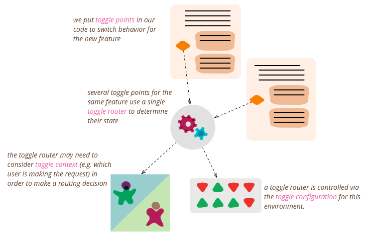
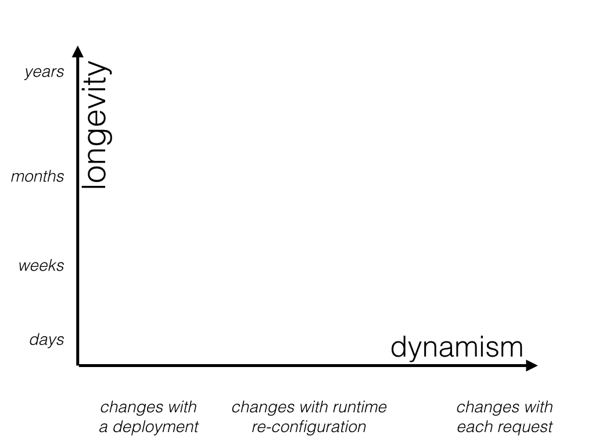
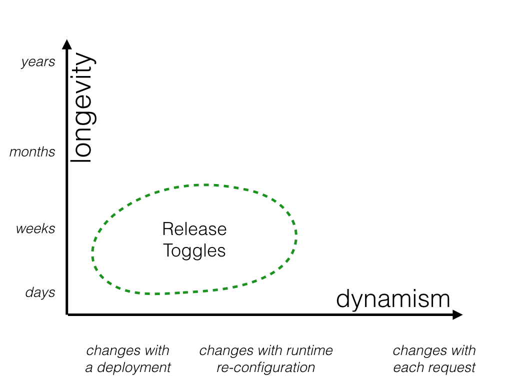
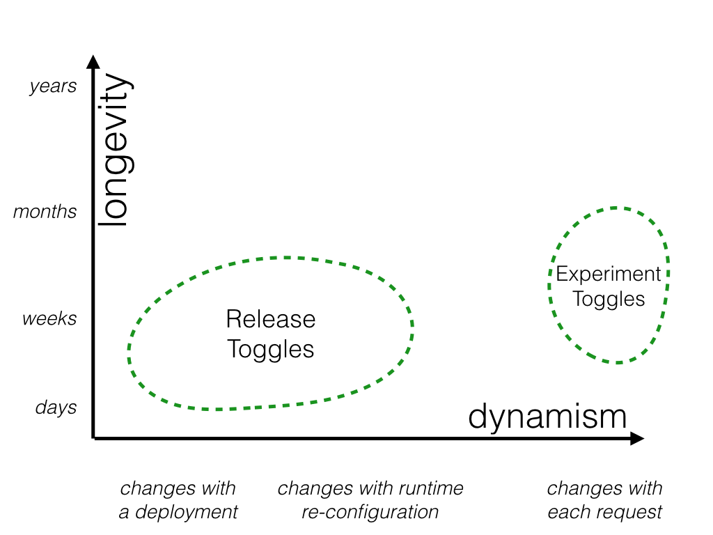
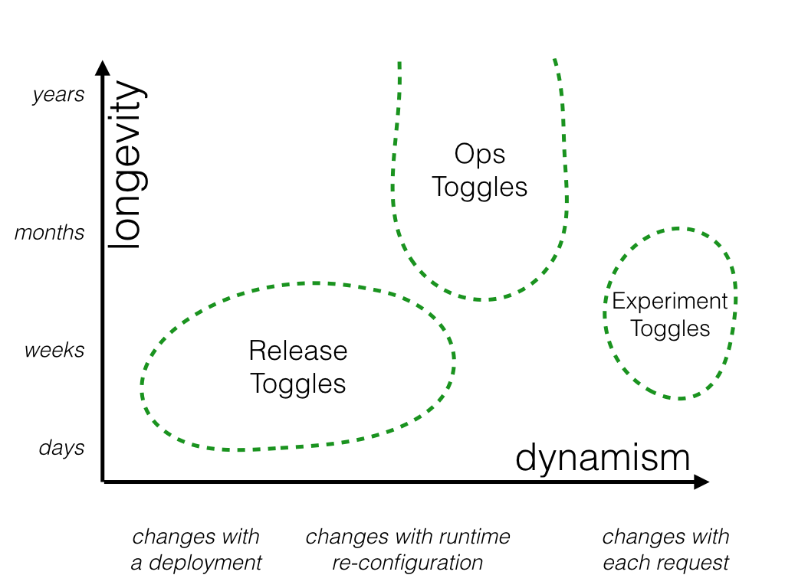
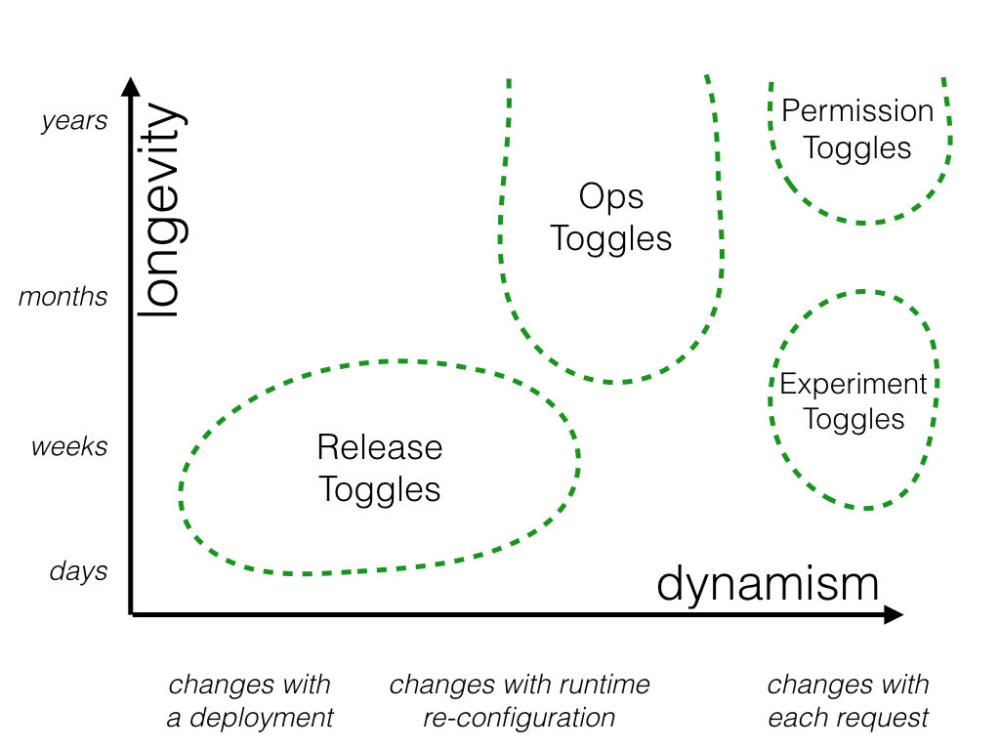
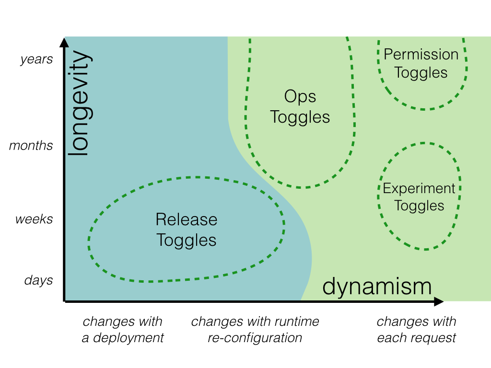
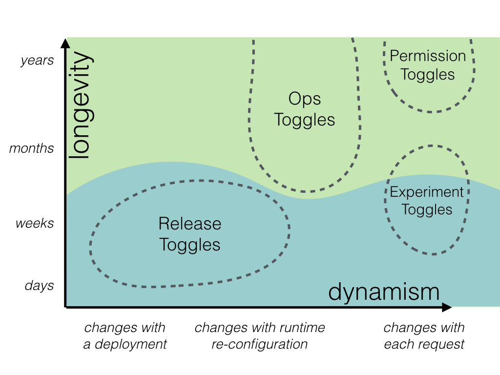

## 背景

使用 Toggle 開關控制功能的啟用與否。

=== "Before: 使用舊演算法"

    ```javascript
    function reticulateSplines() {
        // current implementation lives here
    }
    ```

=== "After: 使用 Toggle 切換新舊演算法"

    ```javascript
    function reticulateSplines() {
        var useNewAlgorithm = false;
        // useNewAlgorithm = true; // UNCOMMENT IF YOU ARE WORKING ON THE NEW SR ALGORITHM

        if (useNewAlgorithm) {
            return enhancedSplineReticulation();
        } else {
            return oldFashionedSplineReticulation();
        }
    }

    function oldFashionedSplineReticulation() {
        // current implementation lives here
    }

    function enhancedSplineReticulation() {
        // TODO: implement better SR algorithm
    }
    ```

    更改 `useNewAlgorithm` 布林值切換新舊演算法。

### Toggle Router

```javascript
function reticulateSplines() {
    if (featureIsEnabled("use-new-SR-algorithm")) {
        return enhancedSplineReticulation();
    } else {
        return oldFashionedSplineReticulation();
    }
}
```

- `featureIsEnabled` 實作判斷 toggle 是否打開或關閉的功能，稱作 ==Toggle Router==。
- In-memory toggle 的實作範例:

    ```javascript
    function createToggleRouter(featureConfig) {
        return {
            setFeature(featureName, isEnabled) {
                featureConfig[featureName] = isEnabled;
            },
            featureIsEnabled(featureName) {
                return featureConfig[featureName];
            }
        };
    }
    ```

    - 查表 `featureConfig` 詢問 toggle `featureConfig` 是否打開

- Testability: 可是測試 toggle 開與關的兩種行為應符合預期。

    ```javascript
    describe('spline reticulation', function() {
        let toggleRouter;
        let simulationEngine;

        beforeEach(function() {
            toggleRouter = createToggleRouter();
            simulationEngine = createSimulationEngine({toggleRouter: toggleRouter});
        });

        it('works correctly with old algorithm', function() {
            // Given
            toggleRouter.setFeature("use-new-SR-algorithm", false);

            // When
            const result = simulationEngine.doSomethingWhichInvolvesSplineReticulation();

            // Then
            verifySplineReticulation(result);
        });

        it('works correctly with new algorithm', function() {
            // Given
            toggleRouter.setFeature("use-new-SR-algorithm", true);

            // When
            const result = simulationEngine.doSomethingWhichInvolvesSplineReticulation();

            // Then
            verifySplineReticulation(result);
        });
    });
    ```

### Toggle Configuration



==Toggle Configuration== 設定 toggle 的開關狀態。

==Toggle Context== 為操作的環境，用來提供 Toggle Configuration 決定 toggle 的開關與否。例如，測試的環境與線上的環境。

### Canary(金絲雀) releasing

??? question "金絲雀(canary) release 跟金絲雀有什麼關係？"
    煤礦工業曾經使用金絲雀鳥來偵測煤礦中有害氣體的存在，如一氧化碳。金絲雀對於有毒氣體特別敏感，如果有毒氣體泄漏到煤礦中，金絲雀會優先感受到並死亡，警示煤礦工人及時撤離以保護生命安全。
    在 canary release 中，將有小部分的使用者收到新的 release，這些使用者就是金絲雀，團隊需要觀察這些使用者的回饋來判斷軟體是否有問題，就像金絲雀在煤礦中作為氣體探測器一樣，提前感知可能的風險。

流程:

1. 加強 Toggle Router，讓使用者的 toggle 的評估結果始終保持一致。
    - 使用者 A 的 Toggle Router 是 on 時，之後的結果也會是 on。反之，結果是 off，之後的節果也會是 off。
2. 隨機挑選使用者作為 Canary。
    - 例如，1% 的使用者作為 Canary，使用 toggle on 的功能，其他 99% 保持原樣，使用 toggle off 的功能。
3. 團隊評估 Canary 族群，使用新功能是否造成負面的影響。
4. 沒有問題之後，將 toggle on 的功能推送給所有的使用者。
5. 移除該 toggle

### A/B testing

讓數據來佐證想法，避免 HiPPO 現象。

1. 將使用者分成 A, B 兩群。
2. A 群使用功能 X, B 群使用功能 Y，透過 toggle 控制 X, Y 功能的切換。
3. 搜集數據，評估 X, Y 功能的使用結果。

## Toggle 的種類



Toggle 技術的使用，考慮兩個面向:

1. longevity: toggle 的生命週期
2. dynamism: 需要多動態的切換

### Release Toggles



開發中的功能，線上環境將 toggle 設定成 off，等到開發完畢後再將 toggle 設定成 on。

Toggle 的生命週期通常是一個功能開發的時間。在開發的過程，無開關 toggle 的需求。

### Experiment Toggles



Toggle 會打開數小時或數週的時間，用來搜集數據。

因為每次系統變更都可能會讓搜集的數據失效，所以搜集的時間不會太長。

### Ops Toggles



新功能上線，團隊不確定功能會造成的影響，想要透過一個開關可以讓我們減緩新功能的影響，或者停用新功能。

當團隊對新功能信心足夠時，Toggle 就可以移除。

少數的狀況，Toggle 會保留較長的時間，主要作用是讓團隊可以在系統高負載的情況下，可以停用需要昂貴的運算功能，減輕負載狀況。

### Permission Toggles



- 只允許付費使用者使用 permium 功能。
- 只允許特定使用者存取 alpha 或 beta 的功能。
    - per-request 決定 toggle 打開或關閉。

## 管理不同種類的 Toggle

### 管理動態 v.s. 靜態的 Toggle

- 要越動態，程式的開發成本越高。
    - 靜態: 使用變數，或 map 設定 toggle 的開關與否。當有變動需要，改程式碼，然後重新編譯、部署。
    - 動態: 根據不同使用者、不同請求決定 toggle 的開關。



### 管理短期 v.s. 長期的 Toggle

- 短期的 toggle，在不久的將來就會移除
    - 不想花費過多的成本在短期的程式碼上，可優先考慮簡單的使用 if-else 實作
- 長期的 toggle
    - 會在程式碼中存活比較久的時間，我們希望能有效的管理，不要讓 ==toggle point== 散落在各個地方。



## 實作

我們實作一個新的功能，在 email 中提供一個方便使用者取消訂單的連結。並且，可以透過 feature toggle 打開或關閉此功能。

```javascript title="Version 1"
const features = fetchFeatureTogglesFromSomewhere();

function generateInvoiceEmail() {
    const baseEmail = buildEmailForInvoice(this.invoice);
    if (features.isEnabled("next-gen-ecomm")) {
        return addOrderCancellationContentToEmail(baseEmail);
    } else {
        return baseEmail;
    }
}
```

```plantuml
hide circle
class Client
class Emailer {
    generateInvoiceEmail()
}
class Features {
    isEnable(key: str): bool
}

Client --> Emailer
Emailer -> Features
```

!!! warning "潛在議題"

    - 決定是否開啟在 email 中增加連結的功能，由一個神奇的字串(magic string) "next-gen-ecomm" 決定。
    - 產生 email 內容的 function，相依字串 "next-gen-ecomm"，並需要知道他與取消訂單的連結有關係。
    - 無法做到，只想開啟 "next-gen-ecomm" toggle 的部分功能，但是不想要開啟取消訂單連結的功能。
    - 無法只開啟取消訂單連結的功能給部分使用者。

```javascript hl_lines="5" title="Version 2 (De-coupling decision points from decision logic)"
const features = fetchFeatureTogglesFromSomewhere();
const featureDecisions = createFeatureDecisions(features);
function generateInvoiceEmail() {
    const baseEmail = buildEmailForInvoice(this.invoice);
    if (featureDecisions.includeOrderCancellationInEmail()) {
        return addOrderCancellationContentToEmail(baseEmail);
    } else {
        return baseEmail;
    }
}

function createFeatureDecisions(features) {
    return {
        includeOrderCancellationInEmail() {
            return features.isEnabled("next-gen-ecomm");
        }
        // ... additional decision functions also live here ...
    };
}
```

```plantuml
hide circle
class Client
class Emailer {
    generateInvoiceEmail()
}
class FeatureDecisions {
    includeOrderCancellationInEmail(): bool
}
class Features {
    isEnable(key: str): bool
}

Client --> Emailer
Emailer -> FeatureDecisions
FeatureDecisions -> Features
```

!!! warning "潛在議題"

    - 程式碼直接相依 feature flagging system，將使得**測試困難**。
    - feature flagging system 會在程式碼各處流行，會越來越多程式碼跟他有相依性。這將使得替換 feature flagging system 難度增加。

```javascript title="Version 3 (Inversion of Decision)" hl_lines="6 10"
const features = fetchFeatureTogglesFromSomewhere();
const featureDecisions = createFeatureDecisions(features);
const factory = createFeatureAwareFactoryBasedOn(featureDecisions)
const emailler = factory.invoiceEmailler()

function createInvoiceEmailler(config) {
   return {
        generateInvoiceEmail() {
            const baseEmail = buildEmailForInvoice(this.invoice);
            if (config.includeOrderCancellationInEmail) {
                return addOrderCancellationContentToEmail();
            } else {
                return baseEmail;
            }
       },
       // ... other invoice emailer methods ...
   };
}

function createFeatureAwareFactoryBasedOn(featureDecisions) {
    return {
        invoiceEmailler() {
            return createInvoiceEmailler({
                includeOrderCancellationInEmail: featureDecisions.includeOrderCancellationInEmail()
            });
        },
        // ... other factory methods ...
    };
}
```

```javascript title="Version 3 (測試)"
describe( 'invoice emailling', function() {
    it( 'includes order cancellation content when configured to do so', function() {
        // Given
        const emailler = createInvoiceEmailler({includeOrderCancellationInEmail: true});

        // When
        const email = emailler.generateInvoiceEmail();

        // Then
        verifyEmailContainsOrderCancellationContent(email);
    };

    it( 'does not includes order cancellation content when configured to not do so', function() {
        // Given
        const emailler = createInvoiceEmailler({includeOrderCancellationInEmail: false});

        // When
        const email = emailler.generateInvoiceEmail();

        // Then
        verifyEmailDoesNotContainOrderCancellationContent(email);
    };
});
```

!!! warning "潛在議題"

    使用 if-else 判斷，不適合用在

    - toggle 數量很多 或
    - long-live toggle

```javascript title="Version 4 (Strategy)"
const features = fetchFeatureTogglesFromSomewhere();
const featureDecisions = createFeatureDecisions(features);
const factory = createFeatureAwareFactoryBasedOn(featureDecisions)
const emailler = factory.invoiceEmailler()

function createInvoiceEmailler(additionalContentEnhancer) {
    return {
        generateInvoiceEmail() {
            const baseEmail = buildEmailForInvoice(this.invoice);
            return additionalContentEnhancer(baseEmail);
        },
        // ... other invoice emailer methods ...
    };

}

function identityFn(x) { return x; }

function createFeatureAwareFactoryBasedOn(featureDecisions) {
    return {
        invoiceEmailler() {
            if (featureDecisions.includeOrderCancellationInEmail()) {
                return createInvoiceEmailler(addOrderCancellationContentToEmail);
            } else {
                return createInvoiceEmailler(identityFn);
            }
        },
        // ... other factory methods ...
    };
}
```

## 參考

- [Feature Toggles (aka Feature Flags)](https://martinfowler.com/articles/feature-toggles.html)

*[HiPPO]: Highest Paid Person's Opinion
