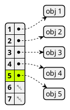
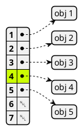
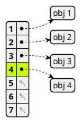

# Item 7: Eliminate obsolete object references

```java
// Can you spot the "memory leak"?
public class Stack {
    private Object[] elements;
    private int size = 0;
    private static final int DEFAULT_INITIAL_CAPACITY = 16;

    public Stack() {
        elements = new Object[DEFAULT_INITIAL_CAPACITY];
    }

    public void push(Object e) {
        ensureCapacity();
        elements[size++] = e;
    }

    public Object pop() {
        if (size == 0)
            throw new EmptyStackException();
        return elements[--size];
    }

    /**
     * Ensure space for at least one more element, roughly
     * doubling the capacity each time the array needs to grow.
     */
    private void ensureCapacity() {
        if (elements.length == size)
            elements = Arrays.copyOf(elements, 2 * size + 1);
    }
}
```

stack `size` = 5



`pop()`後，呼叫端的到 `obj 5`，並且 stack `size` = 4



雖然 `obj 5` 被 pop 出來了，因為 stack 的 reference 仍然指向 `obj 5`，即使 stack 外部沒有任何地方參考到 `obj 5`，`obj 5` 也不會被 GC 回收。這種情況就造成 memory leak。

像這種 object 指向一個沒有在維護的 reference，稱為 obsolete object reference。

解決方式就是將 obsolete object reference 設為 `null`。



修正的程式碼如下:

```java hl_lines="5"
public Object pop() {
    if (size == 0)
        throw new EmptyStackException();
    Object result = elements[--size];
    elements[size] = null; // Eliminate obsolete reference
    return result;
}
```

!!! quote "Nulling out object references should be the exception rather than the norm. (將物件參考設為 null 應該是例外，而不是常態。)"

另一種會造成 memory leak 的是快取。

- 可以使用 `WeakHashMap` 來實作快取，當快取的 key 不再被使用時，`WeakHashMap` 會自動移除這個 key-value pair。
- 定期清空快取，可以使用 `ScheduledThreadPoolExecutor` 來定期清空快取。
- 或者在新增新資料到快取時順便進行清理。`LinkedHashMap` 類別提供了一個方法 `removeEldestEntry`，來幫助實現。
- 對於更複雜的快取，你可能需要直接使用 `java.lang.ref`。

第三種造成 memory leak 的情況是 listener 和 callback。
