# Item 8: Avoid finalizers and cleaners

## 什麼是 Finalizers

finalizer 是 Java 提供的一種 resource 回收機制，作用於 GC (Garbage Collection) 在回收物件前，會呼叫物件的 `finalize` 方法來釋放 resource。



若物件有 resource 需要釋放，就將釋放的程式碼寫在 `protected void finalize()`。

```java
public class ClassWithFinalizer {
    @Override
    protected void finalize() {
        // release resource
    }
}
```

Finalizer 有 Security, Reliability, Performance 風險，不建議使用，並被棄用。在 Java 9 被標記為 deprecated 且為 removal。

## Finalizer 的替代方案

不使用 finalizer 可以使用 `try-finally` 替代。

```java linenums="1"
FileInputStream  input  = null;
FileOutputStream output = null;
try {
  input = new FileInputStream(file1);
  output = new FileOutputStream(file2);

  // ... copy bytes from input to output ...

} finally {
  if (output != null) {
    try {
      output.close();
    } catch (Exception e) {
      // ignore exception
    }
  }
  if (input != null) {
    try {
      input.close();
    } catch (Exception e) {
      // ignore exception
    }
  }
}
```

程式碼中，在 `try` 區塊中建立 resource，並在 `finally` 區塊中釋放 resource。因為 `try` 區塊中不止一個 resource，所以在 `finally` 區塊中要分別釋放。為了避免釋放 resource 時發生例外影響其他 resource 的釋放，所以在釋放 resource 時要用 `try-catch` 包住，忽略例外。

這樣的寫法真的是又臭又長。

### try-with-resources

Java 7 新增的 try-with-resources 可以用來釋放 resource，改進上面所提到的 `try-finally` 的寫法。等價寫法如下:

```java
try (FileInputStream input = new FileInputStream(file1);
     FileOutputStream output = new FileOutputStream(file2)) {
    // ... copy bytes from input to output ...
}
```

### Cleaners

try-with-resource 不適用在生命週期長的 resource，Java 9 新增了 Cleaner 用來釋放長生命週期的 resource。

Cleaner 允許註冊 release action 的動作，當物件 unreachable 時，Cleaner 會執行 release action。

```java linenums="1"
public class CleaningExample implements AutoCloseable {
    private static final Cleaner cleaner = Cleaner.create();

    static class State implements Runnable {

        State(...) {
            // 準備清理動作所需要的資料。
        }

        public void run() {
            // 執行清理動作，最多執行一次。
        }
    }

    private final State state;
    private final Cleaner.Cleanable cleanable;

    public CleaningExample() {
        this.state = new State(...);
        this.cleanable = cleaner.register(this, state);
    }

    public void close() {
        cleanable.clean();
    }
}
```

- `State` 稱作 clean action，實作 `Runnable` 介面，負責執行釋放 resource 的動作。
- `CleaningExample` 實作 `AutoCloseable` 介面，負責註冊 clean action。當物件變得 unreachable 時，clean action 會被執行。
    - 注意，clean action 不要回去參考 `AutoCloseable` 物件，否則會讓 unreachable 狀態永遠無法達到。
- 向 cleaner 註冊 clean action 後回傳 `Cleanable` 物件，用來執行 clean action。
    - 最有效率的做法是在 resource 不需要時，呼叫 `clean()` 來執行 clean action。(第 23-25 行)
- clean action 在 cleaner 的 thread 中執行，所有 clean action 拋出的例外都會被忽略。所以 clean action 的例外不會影響其他的 clean action。
- `AutoClosable` 註冊的所有 clean action 都執行完畢，GC 才會回收物件。
- Clean action 可以用 lambda 來實作，但會很容易不小心參考到 `AutoCloseable` 物件。所以按範例實作成 nested static class 可以避免這種錯誤。

如果依賴 cleaner 自動執行 clean action，要注意的是，不能保證在 `System.exit` (包含程式正常結束) 是否會被執行。因此，有可能程式結束了，但是 clean action 並沒有執行。

另外，cleaner 受 GC 排程，也會有 Reliability 與 Performance 的問題。

簡單來說，應避免使用 finalizer 與 cleaner。

## 額外參考

- [JEP 421: Deprecate Finalization for Removal](https://openjdk.org/jeps/421)