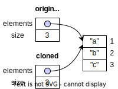
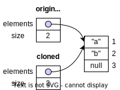
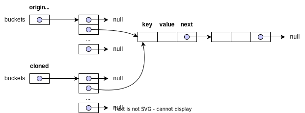
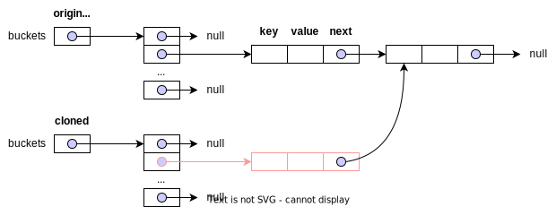
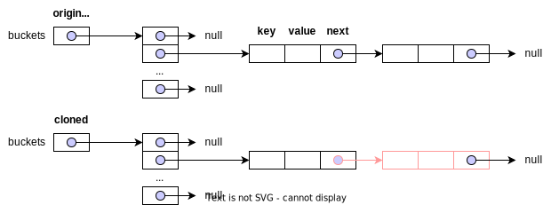

# Item 13: Override `clone` judiciously (明智地)

## 使用 `Cloneable` 實作 `clone` 方法的範例

以下是使用 `Cloneable` 期望會實作出來的程式碼樣貌:

```java hl_lines="16-23"
public class Main {
    public static class Person implements Cloneable { // (1)!
        private final String name;

        public Person(String name) {
            this.name = name;
        }

        @Override
        public boolean equals(Object obj) {
            if(obj instanceof Person p)
                return name.equals(p.name);
            return super.equals(obj);
        }

        @Override
        public Person clone() { // (2)!
            try {
                return (Person) super.clone();
            } catch (CloneNotSupportedException e) {
                throw new AssertionError();
            }
        }
    }

    public static void main(String[] args) {
        Person original = new Person("Teddy");
        Person clone = original.clone();
        System.out.println(original == clone); // false
        System.out.println(original.getClass() == clone.getClass()); // true
        System.out.println(original.equals(clone)); // true

    }
}
```

1. 實作 `Cloneable` 介面，並且覆寫 `clone` 方法。
2. covariant return types: Java 允許 override 方法的 return type 是原方法的子類別。`Object.clone` 的 return type 是 `Object`，而 `Person.clone` 的 return type 是 `Person`。

先說結論，應避免使用 `Cloneable` 實作 `clone`。以下說明原因。

## `Cloneable` 的問題

### `Cloneable` 沒有宣告 `clone` 方法，無法直接呼叫 `Cloneable.clone`

這是 `Cloneable` 設計上最大的缺陷，因為他沒有宣告 `clone` method，而 `Object.clone` 被宣告成 `protected`。也就是說，呼叫端無法因為物件是 `Cloneable` 就直接呼叫 `clone` 方法。

```java
Cloneable person = new Person("Teddy");
Person clone = person.clone(); // ❌ 語法錯誤，因為 Cloneable 沒有宣告 clone 方法
```

也許有人可以反駁說，我們可以透過 reflection 來呼叫 `clone` 方法:

```java linenums="1" hl_lines="29"
public class Main {
    public static class Person implements Cloneable {
        private final String name;

        public Person(String name) {
            this.name = name;
        }

        @Override
        public boolean equals(Object obj) {
            if(obj instanceof Person p)
                return name.equals(p.name);
            return super.equals(obj);
        }

        @Override
        public Person clone() {
            try {
                return (Person) super.clone();
            } catch (CloneNotSupportedException e) {
                throw new AssertionError();
            }
        }
    }

    public static void main(String[] args)
            throws NoSuchMethodException, InvocationTargetException, IllegalAccessException {
        Cloneable original = new Person("Teddy");  // (1)!
        Person clone = (Person) original.getClass().getMethod("clone").invoke(original);  // (2)!

        System.out.println(original == clone); // false
        System.out.println(original.getClass() == clone.getClass()); // true
        System.out.println(original.equals(clone)); // true
    }
}
```

1. 我們只關注在物件的 clone 功能，這裡將 `Person` 宣告成 `Cloneable`。
2. 使用 reflection 的方式呼叫 `clone` 方法，但不是推薦的做法。

不過 `Cloneable` 沒有強迫實作介面的類別必須實作 `clone`。當我們把 `clone` (lines 16-23) 實作刪除，在跑一次程式，將在第 29 行的地方，因為找不到 `clone` 方法而拋出例外 `java.lang.NoSuchMethodException`。

!!! note  "`Cloneable` 沒有宣告任何 method，那他到底做了什麼?"
    `Cloneable` 影響 `Object.clone` 的行為。當一個物件實作 `Cloneable` 介面，齊其 `Object.clone` 會將回傳欄位逐一複製的物件副本。如果物件沒有實作 `Cloneable` 介面就呼叫 `Object.clone` 就會拋出 `CloneNotSupportedException`。

    這種設計不是典型的 interface 做法，而且不應模仿。

### `Cloneable.clone` 沒有呼叫 `super.clone` 實作，將會造成子類別 `clone` ˋ轉型的問顋

```java
public static class Animal implements Cloneable {
    @Override
    public Animal clone() {
        return new Animal(); // (1)!
    }
}

public static class Person extends Animal {
    @Override
    public Person clone() {
        return (Person) super.clone(); // (2)!
    }
}
```

1. `Animal` 的 `clone` 方法沒有呼叫 `super.clone`，而是透過呼叫 constructor 建立 `Animal` 物件。因為 `Cloneable.clone` 並沒有規範，這裡的實作方法沒有任何編譯的錯誤。
2. 因為 `Animal` 的 `clone` 方法沒有呼叫 `super.clone` 而是透過 constructor 建立物件，回傳的物件型態為 `Animal`，導致這裡呼叫 `super.clone` 會無法將 `Animal` 轉型成 `Person` 物件，而拋出 `java.lang.ClassCastException` 例外。

### 預設 `Object.clone` 的實作是 shallow copy，當 mutable field 被宣告成 `final` 就破功了

```java
public class Main {
    public static class Stack implements Cloneable {
        private Object[] elements;
        private int size = 0;
        private static final int DEFAULT_INITIAL_CAPACITY = 16;

        public Stack() {
            this.elements = new Object[DEFAULT_INITIAL_CAPACITY];
        }

        public void push(Object e) {
            ensureCapacity();
            elements[size++] = e;
        }

        public Object pop() {
            if (size == 0)
                throw new EmptyStackException();
            Object result = elements[--size];
            elements[size] = null; // Eliminate obsolete reference
            return result;
        }

        // Ensure space for at least one more element.
        private void ensureCapacity() {
            if (elements.length == size)
                elements = Arrays.copyOf(elements, 2 * size + 1);
        }

        @Override
        public Stack clone() {
            try {
                return (Stack) super.clone();
            } catch (CloneNotSupportedException e) {
                throw new AssertionError();
            }
        }
    }

    public static void main(String[] args) {
        Stack stack = new Stack();
        stack.push("a");
        stack.push("b");
        stack.push("c");

        Stack cloned = stack.clone();

        System.out.println("stack pop: " + stack.pop());
        System.out.println("cloned pop: " + cloned.pop());
    }
}
```

輸出結果:

```html
stack pop: c
cloned pop: null <!-- (1)! -->
```

1. 期望結果是 c，但實際是 `null`

`stack.clone` 後的記憶示意:



這是 shallow copy 的結果，`cloned` 物件的 `elements` 指向的是 `stack` 物件的 `elements`。 當 `stack` 物件的 `elements` 被修改時，`cloned` 物件的 `elements` 也會被修改。所以 `stack.pop` 後，`elements` 中的元素被設定成 `null` 導致之後 `cloned.pop` 出的內容就不會是正確的。



當 client 端進一步操作 `clone.pop` 的物件時，因為 `null` 就會引起 `NullPointerException`。

我們需要 `clone` 方法實作 deep copy，這樣才能避免這個問題。

```java hl_lines="5"
@Override
public Stack clone() {
    try {
        Stack clone = (Stack) super.clone();
        clone.elements = clone.elements.clone();
        return clone;
    } catch (CloneNotSupportedException e) {
        throw new AssertionError();
    }
}
```

注意到，如果 `elements` 被宣告成 `final` 就破功了，因為無法重新被 assign value。

### 有些狀況需要遞迴的 clone



僅僅 deep clone 到 `buckets` 還不夠。



`buckets` 中的 `Entry` 物件也需要 deep clone。



直到每一個 `Entry` 物件都被 clone。

實作的部分就不在這裡站篇幅了，可以參考 `Hashtable.Entry` 的程式碼。

### deep copy 與 `clone` 的設計出發點不同

!!! quote "A class implements the `Cloneable` interface to indicate to the Object. `clone()` method that it is legal for that method to make a field-for-field copy of instances of that class."
    
    field-for-field copy 指的是 shallow copy。

在包含有 mutable field 的物件時，程式會需要

1. 呼叫 `super.clone()` 來取得 shallow copy
2. 重新初始化 mutable field 或者 依照原物件的狀態重新建立 mutable field 的物件

### 父類別 clone 方法呼叫子類別 override 的方法將導致狀態不一致

- [ ] 書中說會有這個問題，但是找不到具體並合理的範例呈現真的會有這個問題。

!!! quote
    ... If clone invokes a method that is overridden in a subclass, this method will execute before the subclass has had a chance to fix its state in the clone, quite possibly leading to corruption in the clone and the original. ...

## 不使用 `clone` 的替代方案

使用 copy constructor 或者 copy factory 來取代 `clone` 方法。

=== "Copy Constructor"

    ```java
    public Yum(Yum yum) {...}
    ```

=== "Copy Factory"

    ```java
    public static Yum newInstance(Yum yum) {...}
    ```

好處:

- 在語意的實作上，比 clone 更清楚。
- 不會有需要遵守文件上的規定，但違規卻不會有任何語法錯誤的機制。
- 可以避免 `clone` 實作在遇到 final 欄位時，無法重新 assign value 的問題。
- 不必處理不必要的例外，像是 `CloneNotSupportedException`。
- 不必進行物件型態轉型，可以避免錯誤轉型。

Method 接受的參數型別相依於抽象類別而非具體類別。例如 `List` 而非 `ArrayList`。這種做法稱作 conversion constructors 或 conversion factories。
