# 3. Creating a Set of Cooperating Microservices

```plantuml
component "Product Composite" as pc
component "Product" as p
component "Review" as r
component "Recommendation" as rd

pc --> p
pc --> r
pc --> rd
```

| Service           | Port |
| :---------------- | :--- |
| Product Composite | 6000 |
| Product           | 6001 |
| Recommendation    | 6002 |
| Review            | 6003 |

> 書本使用 7000 ~ 7003，但因為 macos 上，7000 被 airplay 使用，所以改用 6000 ~ 6003

## 建立 microservice 專案

新增四個 Spring Boot 專案，目錄結構如下:

```text
/
├── product-composite-service
├── product-service
├── recommendation-service
└── review-service
```

- 專案相依 `actuator`, `webflux`
- 使用 gradle 編譯專案

    ??? tip "使用 `./gradlew build` 編譯"

        ```shell
        cd product-service; ./gradlew build; cd -; cd recommendation-service; ./gradlew build; cd -; cd review-service; ./gradlew build; cd -; cd product-composite service; ./gradlew build; cd -;
        ```

## 單一指令編譯專案

調整專案結構，使可以用單一指令 `./gradlew build` 編譯所有專案。

```plantuml
@startsalt
{
{T
+ microservices
++ product-service
+++ <del>.gitignore</del> __(搬移到外層)__
+++ <del>gradle</del> __(搬移到外層)__
+++ <del>gradlew</del> __(搬移到外層)__
+++ <del>gradlew.bat</del> __(搬移到外層)__
++ review-service
+++ <del>.gitignore</del> __(刪除)__
+++ <del>gradle</del> __(刪除)__
+++ <del>gradlew</del> __(刪除)__
+++ <del>gradlew.bat</del> __(刪除)__
++ recommendation-service
+++ <del>.gitignore</del> __(刪除)__
+++ <del>gradle</del> __(刪除)__
+++ <del>gradlew</del> __(刪除)__
+++ <del>gradlew.bat</del> __(刪除)__
++ product-composite-service
+++ <del>.gitignore</del> __(刪除)__
+++ <del>gradle</del> __(刪除)__
+++ <del>gradlew</del> __(刪除)__
+++ <del>gradlew.bat</del> __(刪除)__
++ .gitignore __(從內層搬移出來)__
++ gradle __(從內層搬移出來)__
++ gradlew __(從內層搬移出來)__
++ gradlew.bat __(從內層搬移出來)__
++ settings.gradle.kts __(新增)__
}
}
@endsalt
```



在最外層新增 settings.gradle.kts:

```kotlin
include(":product-service")
include(":review-service")
include(":recommendation-service")
include(":product-composite-service")
```

## Adding RESTful APIs

### Product API

將 product-service 的 port 設定成 `6001`。

```plantuml
hide circle

class ProductService {
    getProduct(productId: Int): Product
}
note right of ProductService::getProduct
GET /products/{productId}
end note

class Product {
    productId: Int
    name: String
    weight: Int
    serviceAddress: String
}

ProductService ..> Product
```

!!! note "書中作者將 Controller 視作 Service，因此命名成 `ProductService`。"

| Case                  | Result                                        |
| :-------------------- | :-------------------------------------------- |
| /products/1           | 200, productId = 1                            |
| /products/13          | 404, product not found                        |
| /prodcuts/-1          | 422 (UNPROCESSABLE_ENTITY), invalid productId |
| /products/not-integer | 400, type mismatch                            |


#### Test: Get product

讓測試通過。

```kotlin hl_lines="6-15"
@SpringBootTest(webEnvironment = SpringBootTest.WebEnvironment.RANDOM_PORT)
class ProductServiceApplicationTests {

    @Autowired lateinit var client: WebTestClient

    @Test
    fun getProductById() {
        client.get()
            .uri("/product/1")
            .accept(MediaType.APPLICATION_JSON)
            .exchange()
            .expectStatus().isOk()
            .expectHeader().contentType(MediaType.APPLICATION_JSON)
            .expectBody().jsonPath("$.productId").isEqualTo(1)
    }
}
```

- 設定 `@SpringBootTest` 參數 `webEnvironment = SpringBootTest.WebEnvironment.RANDOM_PORT`。
- Autowire `WebTestClient`。
- 目前沒有 persistence layer，用假資料即可。
- 實作 `ServiceUtil` 封裝 `serviceAddress` 的細節。

    - 格式為 `${hostName}/${ipAddress}:${port}`

        ??? tip "使用 `InetAddress` 取得 `hostName` 與 `ipAddress`"
            取得 host name: `InetAddress.getLocalHost().getHostName()`
            取得 host IP: `InetAddress.getLocalHost().getHostAddress()`

#### Test: Get product not found

讓測試通過。

```kotlin
@Test
fun getProductNotFound() {
    client.get()
        .uri("/product/13")
        .accept(MediaType.APPLICATION_JSON)
        .exchange()
        .expectStatus().isNotFound
        .expectHeader().contentType(MediaType.APPLICATION_JSON)
        .expectBody()
        .jsonPath("$.path").isEqualTo("/product/13")
        .jsonPath("$.message").isEqualTo("No product found for productId: 13")
}
```

- 宣告 `NotFoundException`，在 product 找不到時拋出。
- 使用 `@RestControllerAdvice` 處理例外狀況

    ??? tip "使用 `@RestControllerAdvice` 處理 product not found 的 response"

        ```kotlin
        @RestControllerAdvice
        class GlobalControllerExceptionHandler {

            @ResponseStatus(HttpStatus.NOT_FOUND)
            @ExceptionHandler(NotFoundException::class)
            @ResponseBody
            fun handleNotFoundException(
                request: ServerHttpRequest,
                e: NotFoundException
            ): HttpErrorInfo {
                return HttpErrorInfo(
                    ZonedDateTime.now(),
                    request.path.pathWithinApplication().value(),
                    HttpStatus.NOT_FOUND,
                    requireNotNull(e.message)
                )
            }

            data class HttpErrorInfo(
                val timestamp: ZonedDateTime,
                val path: String,
                val httpStatus: HttpStatus,
                val message: String,
            )
        }
        ```

- 例外狀況回傳 `HttpErrorInfo`

    ```plantuml
    hide circle

    class HttpErrorInfo {
        timestamp: ZonedDateTime
        path: String
        httpStatus: HttpStatus
        message: String
    }
    ```


#### Test: Get product negative product id

讓測試通過。

```kotlin
@Test
fun getProductInvalidParameterNegativeValue() {
    client.get()
        .uri("/product/-1")
        .accept(MediaType.APPLICATION_JSON)
        .exchange()
        .expectStatus().isEqualTo(HttpStatus.UNPROCESSABLE_ENTITY) // 422
        .expectHeader().contentType(MediaType.APPLICATION_JSON)
        .expectBody()
        .jsonPath("$.path").isEqualTo("/product/-1")
        .jsonPath("$.message").isEqualTo("Invalid productId: -1")
}
```

- 宣告 `InvalidInputException`，在 `productId` 為負數時拋出。
- 處理例外拋出時回傳的資料。

#### Test: Get product invalid parameter productId type mismatch

讓測試通過。

```kotlin
@Test
fun getProductInvalidParameterString() {
    client.get()
        .uri("/product/not-integer")
        .accept(MediaType.APPLICATION_JSON)
        .exchange()
        .expectStatus().isEqualTo(HttpStatus.BAD_REQUEST)
        .expectHeader().contentType(MediaType.APPLICATION_JSON)
        .expectBody()
        .jsonPath("$.path").isEqualTo("/product/not-integer")
        .jsonPath("$.message").isEqualTo("Type mismatch.")
}
```

- 資料型態不吻合會被 Spring 擋下，預設錯誤訊息沒有 `message` 欄位，通過設定可以加入。
    - `server.error.include-message=always`

### Recommendation API

```plantuml
hide circle

interface RecommendationService {
    getRecommendations(productId: Int): List<Recommendation>
}
note right of RecommendationService::getRecommendations
GET /recommendations?productId={productId}
end note

class Recommendation {
    productId: Int
    recommendationId: Int
    author: String
    rate: Int
    content: String
    serviceAddress: String
}

RecommendationService ..> Recommendation
```

| Case                                   | Result                                                    |
| :------------------------------------- | :-------------------------------------------------------- |
| /recommendations?productId=1           | 200, len=3, [0].productId = 1                             |
| /recommendations?productId=113         | 200, len=0                                                |
| /recommendations?productId=-1          | 422, Invalid productId = -1                               |
| /recommendations                       | 400, Required query parameter 'productId' is not present. |
| /recommendations?productId=not-integer | 400, Type mismatch.                                       |

- 重構:

    1. 將 `serviceAddress` 的組合程式碼抽出成 component

        ??? tip "video"
            <video controls>
                <source src="3_001.mp4" type="video/mp4">
                你的瀏覽器不支援此影片格式。
            </video>

    2. 將 `ServiceAddress` 移動到 `util` 共用 module

        ??? tip "video"
            <video controls>
                <source src="3_002.mp4" type="video/mp4">
            </video>

    3. 將 Exceptions, Exception Handler 移動到 `util` 共用

        ??? tip "video"
            <video controls>
                <source src="3_003.mp4" type="video/mp4">
            </video>

??? tip

    - `?productId=` 使用 `@RequestParam`

### Review API

```plantuml
hide circle

class ReviewService {
    getReviews(productId: Int): List<Review>
}

note right of ReviewService::getReviews
GET /reviews?productId={productId}
end note

class Review {
    productId: Int
    reviewId: Int
    author: String
    subject: String
    content: String
    serviceAddress: String
}

ReviewService ..> Review
```

| Case                           | Result                                                    |
| :----------------------------- | :-------------------------------------------------------- |
| /reviews?productId=1           | 200, len = 3, [0].productId = 1                           |
| /reviews?productId=213         | 200, len = 0                                              |
| /reviews?productId=-1          | 422, Invalid productId = -1                               |
| /reviews                       | 400, Required query parameter 'productId' is not present. |
| /reviews?productId=not-integer | 400, Type mismatch                                        |

### Refactor: 抽 Service interface

```plantuml
hide circle

package api {
    interface ProductService #orange {
        getProduct(productId: Int): Product
    }
    interface RecommendationService #orange {
        getRecommendations(productId: Int): List<Recommendation>
    }
    interface ReviewService #orange {
        getReviews(productId: Int): List<Review>
    }

    class Product #orange
    class Recommendation #orange
    class Review #orange

    ProductService .> Product
    RecommendationService .> Recommendation
    ReviewService .> Review
}

package product-service {
    class "ProductService<font color=orange>Impl</font>" as ProductServiceImpl
}
package recommendation-service {
    class "RecommendationService<font color=orange>Impl</font>" as RecommendationServiceImpl
}
package review-service {
    class "ReviewService<font color=orange>Impl</font>" as ReviewServiceImpl
}

ProductService <|.. ProductServiceImpl
RecommendationService <|.. RecommendationServiceImpl
ReviewService <|.. ReviewServiceImpl
```

- 將 `ProductService`, `RecommendationService`, `ReviewService` 抽成 interface 放到 `api` 下。
    - 先重新命名既有的 class，加上後墜 `Impl`。(使用 ++shift+f6++ 或 vim ++"\\rn"++ )
    - 抽 interface (使用 ++ctrl+t++ > Extract Interface...)
- 將 `Product`, `Recomendation`, `Review` 移動到 `api` 下。
    - 使用 ++f6++

### Product Composite API

```plantuml
hide circle

package api {
    interface ProductService
    interface RecommendationService
    interface ReviewService
}

package product-composite {
    class ProductCompositeService {
        getProduct(productId: Int): ProductAggregate
    }
    note right of ProductCompositeService::ProductAggregate
    GET /product-composite/{productId}
    end note

    class ProductCompositeIntegration

    class ProductAggregate {
        productId: Int
        name: String
        weight: Int
        recommendations: List<RecommendationSummary>
        reviews: List<ReviewSummary>
        serviceAddresses: ServiceAddresses
    }

    class RecommendationSummary {
        recommendationId: Int
        author: String
        rate: Int
    }

    class ReviewSummary {
        reviewId: Int
        author: String
        subject: String
    }

    class ServiceAddresses {
        cmp: String <font color=green># product composite service</font>
        pro: String <font color=green># product service</font>
        rev: String <font color=green># review service</font>
        rec: String <font color=green># recommendation service</font>
    }

    ProductCompositeService ..> ProductAggregate
    ProductCompositeService --> ProductCompositeIntegration
    ProductAggregate --> RecommendationSummary
    ProductAggregate --> ReviewSummary
    ProductAggregate --> ServiceAddresses
}

package product {
    class ProductServiceImpl
}

package review {
    class ReviewServiceImpl
}

package recommendation {
    class RecommendationServiceImpl
}

ProductService <|.. ProductServiceImpl
RecommendationService <|.. RecommendationServiceImpl
ReviewService <|.. ReviewServiceImpl
ProductService <|.. ProductCompositeIntegration
RecommendationService <|.. ProductCompositeIntegration
ReviewService <|.. ProductCompositeIntegration
```

| Case                  | Result                                                         |
| :-------------------- | :------------------------------------------------------------- |
| /product-composite/1  | 200, productId = 1, len(recommendations) = 3, len(reviews) = 3 |
| /product-composite/13 | 404, Not found productId = 13.                                 |
| /product-composite/-1 | 422, Invalid productId = -1                                    |

#### Test: Get product

讓測試通過。

```kotlin
@SpringBootTest(webEnvironment = SpringBootTest.WebEnvironment.RANDOM_PORT)
@EnableWireMock(ConfigureWireMock(portProperties = ["app.product-service.port", "app.recommendation-service.port", "app.review-service.port"]))
class ProductCompositeServiceApplicationTests {
    @Test
    fun `get product by product id`() {
        stubFor(get("/product/1").willReturn(okJson(""" { "productId": 1, "name": "product 1", "weight": 123, "serviceAddress": "localhost/127.0.0.1:7001" } """)))
        stubFor(
            get("/recommendation?productId=1").willReturn(
                okJson(
                    """ [
                        { "recommendationId": 1, "productId": 1, "author": "Teddy", "rate": 1, "content": "content-1", "serviceAddress": "localhost/127.0.0.1:7002" },
                        { "recommendationId": 2, "productId": 1, "author": "Teddy", "rate": 2, "content": "content-2", "serviceAddress": "localhost/127.0.0.1:7002" },
                        { "recommendationId": 3, "productId": 1, "author": "Teddy", "rate": 3, "content": "content-3", "serviceAddress": "localhost/127.0.0.1:7002" }
                    ] """
                )
            )
        )
        stubFor(
            get("/review?productId=1").willReturn(
                okJson(
                    """ [
                        { "reviewId": 1, "productId": 1, "author": "Teddy", "subject": "subject-1", "content": "content-1", "serviceAddress": "localhost/127.0.0.1:7003" },
                        { "reviewId": 2, "productId": 1, "author": "Teddy", "subject": "subject-2", "content": "content-2", "serviceAddress": "localhost/127.0.0.1:7003" },
                        { "reviewId": 3, "productId": 1, "author": "Teddy", "subject": "subject-3", "content": "content-3", "serviceAddress": "localhost/127.0.0.1:7003" }
                        ] """
                )
            )
        )

        client.get()
            .uri("/product-composite/1")
            .accept(APPLICATION_JSON)
            .exchange()
            .expectStatus().isOk()
            .expectHeader().contentType(APPLICATION_JSON)
            .expectBody()
            .jsonPath("$.productId").isEqualTo(1)
            .jsonPath("$.recommendations.length()").isEqualTo(3)
            .jsonPath("$.reviews.length()").isEqualTo(3)
    }
}
```

- 使用 `RestTemplate` 串接 API

    ??? tip "使用 `RestTemplate` 配合 `ParameterizedTypeReference` 接收 List 處理 generic type 的問題"

        ```kotlin title="Example"
        override fun getRecommendations(productId: Int): List<Recommendation> {
            return checkNotNull(
                restTemplate.exchange(
                    "http://$recommendationServiceHost:$recommendationServicePort/recommendation?productId=$productId",
                    HttpMethod.GET,
                    null,
                    object : ParameterizedTypeReference<List<Recommendation>>() {}
                ).body)
        }
        ```

- 逐步實作，分三個 subtask: `$.productId`, `$.recommendations.length()`, `$.reviews.length()`，一次做一個，還沒有做的 assertion 先註解起來。
- 定義 properties: microservices 的 host 與 port
- Spring 建議的 Mock Server
    - [WireMockk](https://docs.spring.io/spring-cloud-contract/docs/current/reference/html/project-features.html#features-wiremock) 這裡的測試使用這個
    - [MockWebServer](https://docs.spring.io/spring-framework/reference/web/webflux-webclient/client-testing.html)

#### Test: Get product not found

讓測試通過。

```kotlin
@Test
fun `get product not found`() {
    stubFor(
        get("/product/13").willReturn(
            jsonResponse(
                """{"timestamp":  ${ZonedDateTime.now()}, "path": "/product/13", "httpStatus": ${HttpStatus.NOT_FOUND.value()}, "message": "Product with productId=13 not found"}""",
                HttpStatus.NOT_FOUND.value()
            )
        )
    )

    client.get()
        .uri("/product-composite/13")
        .accept(APPLICATION_JSON)
        .exchange()
        .expectStatus().isNotFound()
        .expectHeader().contentType(APPLICATION_JSON)
        .expectBody()
        .jsonPath("$.path").isEqualTo("/product-composite/13")
        .jsonPath("$.message").isEqualTo("Not found: 13")
}
```

#### Test: Get product invalid parameter

讓測試通過。

```kotlin
@Test
fun `get product invalid parameter`() {
    stubFor(
        get("/product/-1").willReturn(
            jsonResponse(
                """{"timestamp":  ${ZonedDateTime.now()}, "path": "/product/-1", "httpStatus": ${HttpStatus.UNPROCESSABLE_ENTITY.value()}, "message": "Invalid productId: -1"}""",
                HttpStatus.UNPROCESSABLE_ENTITY.value()
            )
        )
    )

    client.get()
        .uri("/product-composite/-1")
        .accept(APPLICATION_JSON)
        .exchange()
        .expectStatus().isEqualTo(HttpStatus.UNPROCESSABLE_ENTITY)
        .expectHeader().contentType(APPLICATION_JSON)
        .expectBody()
        .jsonPath("$.path").isEqualTo("/product-composite/-1")
        .jsonPath("$.message").isEqualTo("Invalid: -1")
}
```

## Disable gradle build to generate plain jar file

預設 `gradle build` 會產生兩個 jar 檔案:

1. ordinary JAR file
2. plain JAR file containing only the class files resulting from compiling the Java files in the Spring Boot application

我們不需要第 2 個 jar 檔。設定 `build.gradle.kts` 讓 `gradle build` 僅產生第一個 jar 檔案。

??? tip

    在跟目錄新增檔案，加入以下設定。

    ```gradle title="build.gradle.kts"
    subprojects {
        afterEvaluate {
            if (plugins.hasPlugin("org.springframework.boot")) {
                tasks.getByName("jar") {
                    enabled = false
                }
            }
        }
    }
    ```

## 手動測試

- 啟動 microservices

    ```shell
    $ for jar in $(find . -name "*-service-*.jar"); do
        java -jar $jar &
    done
    ```

- 測試 product-service, recommendation-service, review-service, product-composite-service 的 API。

- 停掉所有 microservices

    ```shell
    pkill -P $$
    ```

## 半自動化測試

### 透過 `curl` 得到 request 的 response 與 http code

- 執行 `http://localhost:6000/product-composite/1` 將 response 與 http code 存到變數

??? tip

    ```bash
    #!/usr/bin/env bash

    result=$(eval curl http://localhost:6000/product-composite/1 -s -w "%{http_code}")
    http_code=${result:(-3)}
    response=${result%???}

    echo "$response"
    echo "$http_code"
    ```

    - `-w "%{http_code}"` 在結果後輸出 http code
    - `http_code=${result:(-3)}` 擷取 result 的後三碼 http code
    - `response=${result%???}` 移除 result 結尾三碼

### 撰寫 `assertCurl` 驗證 http code 符合預期

- `assertCurl ${expectedCode} ${curl}`
- 符合預期，顯示 "Test OK"
- 不符合預期，顯示 "Test FAILED"，並提供以下訊息供 debug
    - 預期的 code 與實際的 code，
    - curl 指令
    - response body
- function

    ```bash
    function name() {
        $1 # first argument
        $2 # second argument
    }
    ```

- if-else statement

    ```bash
    if [ condition ]
    then
        statement
    else
        statement
    fi
    ```

    - Equal evaluation: `=`

??? tip

    ```bash
    function assertCurl() {
        expected_code=$1
        result=$(eval "$2" -s -w "%{http_code}")
        http_code=${result:(-3)}
        response=${result%???}

        if [ "$http_code" = "$expected_code" ]
        then
            echo "Test OK"
        else
            echo "Test FAILED, expected code: $expected_code, got: $http_code"
            echo "- Failing command: $2"
            echo "- Response: $response"
        fi
    }

    assertCurl 200 "curl http://localhost:6000/product-composite/1"
    ```

### 撰寫 `assertEqual` 驗證兩個值是否相等

- 驗證 `productId` 為 `1`
    - `$(echo "$response" | jq ".productId")` 從 response 擷取 `productId` 值
- 驗證 `recommendations` 長度為 `3`
    - `$(echo "$response" | jq ".recommendations | length")`
- 驗證 `reviews` 長度為 `3`

### Test: product not found

- `productId` 為 `13` 時，not found
- status code: `404`
- assert message:
    - `jq -r ".."`: 用 `-r` 可以避免輸出字串的前後有雙引號

### Test: product no recommendation

- `productId` 為 `113`
- status code: `200`
- assert recommendations 長度 `0`, reviews 長度 `3`

### Test: product no reviews

- `productId` 為 `213`
- status code: `200`
- assert recommendation 長度 `3`, reviews 長度 `0`

### Test: product id is negative

- `prodictId` 為 `-1`
- status code: `422`
- assert message

### Test: product is in not integer

- `productId` 為 `no-integer`
- status code: `400`
- assert message
