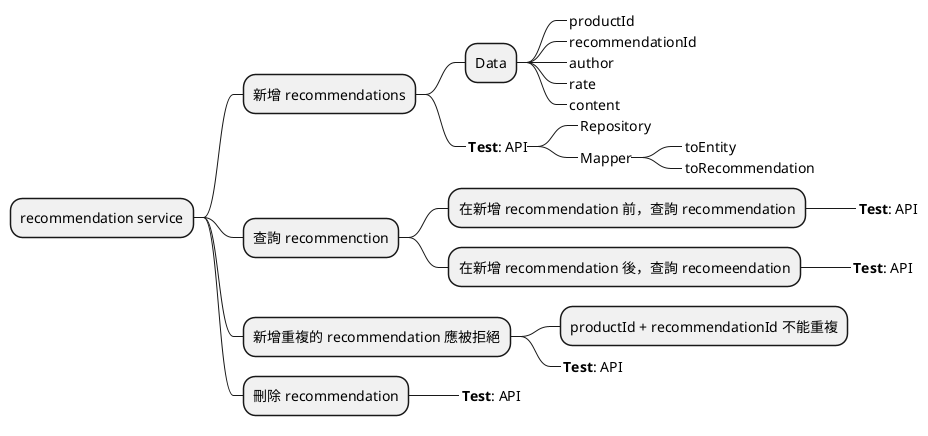
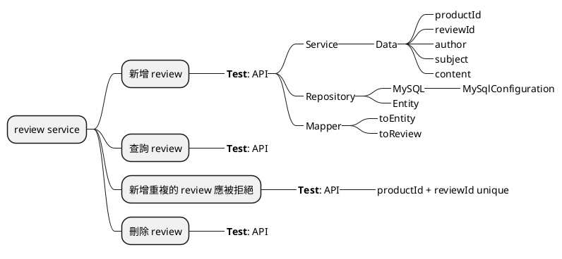

`product` 和 `recommendation` 使用 MongoDB，`review` 使用 MySQL。

```plantuml
component "Product Composite" as pc
component "Product" as p
component "Recommendation" as rd
component "Review" as r
database "MongoDB" as pm
database "MongoDB" as rdm
database "MySQL" as rm

pc --> p
pc --> rd
pc --> r
p --> pm
rd --> rdm
r --> rm
```

## Product Service

### 功能: 新增 Product

#### 測試: Reopsitory 新增 Product

```kotlin
@DataMongoTest
@Import(MongoDbConfiguration::class)
@TestMethodOrder(OrderAnnotation::class)
class ProductRepositoryTest {
    @Autowired
    private lateinit var productRepository: ProductRepository

    @Test
    @Order(1)
    fun `add product`() {
        val entity = productRepository.save(ProductEntity(productId = 1, name = "product-1", weight = 100))
        productRepository.existsById(entity.id!!) shouldBe true
    }
}
```

- 新增 String Data MongoDB 相依

    ???tip

        在 build.gradle.kts 的 dependencies 區塊中 ++cmd+n++ > Add Starters... > String Data MongoDB > 勾選 > OK > ++cmd+i++

- 新增 String testcontainers 相依

    ???tip

        在 build.gradle.kts 的 dependencies 區塊中 ++cmd+n++ > Add Starters... > Testcontainers > 勾選 > OK > ++cmd+i++

- 實作 `MongoDbConfiguration`

    ???tip

        ```kotlin title="MongoDbConfiguration.kt"
        @TestConfiguration
        class MongoDbConfiguration {
            @Bean
            @ServiceConnection
            fun container(): MongoDBContainer {
                return MongoDBContainer("mongo:6.0.4")
            }
        }
        ```

- 實作 `ProductRepository`, `ProductEntity`

    ???tip

        ```kotlin title="ProductRepository.kt"
        interface ProductRepository : MongoRepository<ProductEntity, String>
        ```

        ```kotlin title="ProductEntity.kt"
        import org.springframework.data.annotation.Id
        import org.springframework.data.annotation.Version
        import org.springframework.data.mongodb.core.mapping.Document

        @Document("product")
        data class ProductEntity(
            @Id
            val id: String? = null,
            @Version
            val version: Long = 0,
            @Indexed(unique = true)
            val productId: Int,
            val name: String,
            val weight: Int,
        )
        ```

        ```properties title="application.properties"
        spring.data.mongodb.auto-index-creation=true
        ```
#### 測試: Repository 新增重複的 Product

```kotlin
@Test
@Order(2)
fun `add duplicate product`() {
    shouldThrow<DuplicateKeyException> {
        productRepository.save(ProductEntity(productId = 1, name = "product-1", weight = 100))
    }
}
```

#### 測試: Mapper 將 CreateProductrequest 轉換成 ProductEntity

```kotlin
@SpringBootTest
class ProductMapperTest {
    @Autowired
    lateinit var productMapper: ProductMapper

    @Test
    fun toEntity() {
        productMapper.toEntity(CreateProductRequest(productId = 1, name = "product-1", weight = 100)) should {
            it.id shouldBe null
            it.version shouldBe 0
            it.productId shouldBe 1
            it.name shouldBe "product-1"
            it.weight shouldBe 100
        }
    }
}
```

- 新增 mapstruct dependencies

    ???tip

        ```kotin title="build.gradle.kts"
        plugins {
            kotlin("kapt") version "1.9.25"
        }

        dependencies {
            implementation("org.mapstruct:mapstruct:1.6.3")
            kapt("org.mapstruct:mapstruct-processor:1.6.3")
        }

        kapt {
            arguments {
                arg("mapstruct.defaultComponentModel", "spring")
            }
        }
        ```

- 實作 Mapper

    ???tip

        ```kotlin title="ProductMapper.kt"
        import org.example.productservice.persistence.ProductEntity
        import org.mapstruct.Mapper

        @Mapper
        interface ProductMapper {
            fun toEntity(createProductRequest: CreateProductRequest): ProductEntity
        }
        ```

#### 測試: Mapper 將 ProductEntity 轉換成 Product

```kotlin
@Test
fun toProduct() {
    productMapper.toProduct(ProductEntity(id = "1", version = 1, productId = 1, name = "product-1", weight = 100)) should {
        it.productId shouldBe 1
        it.name shouldBe "product-1"
        it.weight shouldBe 100
    }
}
```

- 實作 toProduct

    ??? tip

        ```kotlin
        @Mappings(
            Mapping(target = "serviceAddress", constant = "")
        )
        fun toProduct(productEntity: ProductEntity): Product
        ```

#### 測試: API 實作新增 Product

```kotlin
@SpringBootTest(webEnvironment = SpringBootTest.WebEnvironment.RANDOM_PORT)
@TestMethodOrder(OrderAnnotation::class)
@Import(MongoDbConfiguration::class)
class ProductServiceImplApplicationTests {

    @Test
    @Order(2) // (1)!
    fun `create product`() {
        client.post()
            .uri("/product")
            .accept(APPLICATION_JSON)
            .bodyValue(CreateProductRequest(productId = 1, name = "product-1", weight = 100))
            .exchange()
            .expectStatus().isOk()
            .expectHeader().contentType(APPLICATION_JSON)
            .expectBody()
            .jsonPath("$.productId").isEqualTo(1)
            .jsonPath("$.name").isEqualTo("product-1")
            .jsonPath("$.weight").isEqualTo(100)
    }

    // ...
}
```

1. 這裡 `@Order` 給 2，後面會需要在前面測試不存在的 case

- 在 `ProductService` 新增 `createProduct` 方法
- 如果需要，調整 `CreateProductRequest` 所放的 module
- 在 `ProductServiceImpl` 中實作 `createProduct` 的 API
- 搭配 `ProductMapper`, `ProductRepository` 實作 `createProduct`

    ???tip

        ```kotlin title="ProductServiceImpl.kt"
        @PostMapping("/product")
        override fun createProduct(@RequestBody request: CreateProductRequest): Product {
            return productRepository.save(request.toEntity()).toProduct()
        }

        private fun CreateProductRequest.toEntity(): ProductEntity {
            return productMapper.toEntity(this)
        }

        private fun ProductEntity.toProduct(): Product {
            return productMapper.toProduct(this).copy(serviceAddress = serviceUtil.getServiceAddress())
        }
        ```

#### 測試: API 實作新增重複 Product ID

```kotlin
@Test
@Order(3)
fun `duplicate error`() {
    client.post()
        .uri("/product")
        .accept(APPLICATION_JSON)
        .bodyValue(CreateProductRequest(productId = 1, name = "product-1", weight = 100))
        .exchange()
        .expectStatus().isEqualTo(HttpStatus.UNPROCESSABLE_ENTITY)
        .expectHeader().contentType(APPLICATION_JSON)
        .expectBody()
        .jsonPath("$.path").isEqualTo("/product")
        .jsonPath("$.message").isEqualTo("Duplicate key, Product Id: 1")
}
```

- 捕捉 `DuplicateKeyException` 拋出 `InvalidInputException`

### 功能: 查詢 Product

#### 測試: Repository 查詢 Product by productId

```kotlin title="ProdcutRepository.kt"
@Test
@Order(3)
fun `get product`() {
    productRepository.findByProductId(savedEntity.productId).get() should {
        it.productId shouldBe 1
        it.name shouldBe "product-1"
        it.weight shouldBe 100
    }
}
```

- 在 `ProductRepository` 新增 `findByProductId` 的方法

#### 測試: API 實作查詢 Product

```kotlin title="ProductServiceImplApplicationTests.kt"
class ProductServiceImplApplicationTests {
    @Test
    @Order(1) // (1)!
    fun `get product not exist`() {
        client.get()
            .uri("/product/1")
            .accept(APPLICATION_JSON)
            .exchange()
            .expectStatus().isNotFound()
            .expectHeader().contentType(APPLICATION_JSON)
            .expectBody()
            .jsonPath("$.path").isEqualTo("/product/1")
            .jsonPath("$.message").isEqualTo("Product with productId=1 not found")
    }

    // ...

    @Test
    @Order(3) // (2)!
    fun `get product by productId`() {
        // ...
    }
}
```

1. 在新增 Product 前，測試 Product 不存在
2. 原本查詢的測試，放在新增 Product 後執行

<!-- 避免下面受上面的影響，將下面的條列式內容被當作程式碼的註解，所以這裡做一個隔開的作用 -->

- 調整 `getProduct` 的實作
- 刪除 `productId == 13` 回傳找不到 Product 的判斷。

    ???tip

        ```kotlin hl_lines="6-8" title="ProductServiceImpl.kt"
        @GetMapping("/product/{productId}")
        override fun getProduct(@PathVariable productId: Int): Product {
            if (productId < 1) {
                throw InvalidInputException("Invalid productId: $productId")
            }
            return productRepository.findByProductId(productId).orElseThrow {
                NotFoundException("Product with productId=$productId not found")
            }.toProduct()
        }
        ```

### 功能: 刪除 Product

#### 測試: Repository 刪除 Product

```kotlin
@Test
@Order(3)
fun `delete product`() {
    productRepository.deleteByProductId(savedEntity.productId)
    productRepository.existsById(savedEntity.id!!) shouldBe false
}
```

#### 測試: API 刪除 Product

```kotlin
@Test
@Order(4)
fun `delete product`() {
    client.delete()
        .uri("/product/1")
        .exchange()
        .expectStatus().isOk()
}

@Test
@Order(5)
fun `deleted product is not exist`() {
    client.get()
        .uri("/product/1")
        .accept(APPLICATION_JSON)
        .exchange()
        .expectStatus().isNotFound()
}
```

## Recommendation Service



### 測試: 新增 Recommendation

```kotlin
@SpringBootTest(webEnvironment = SpringBootTest.WebEnvironment.RANDOM_PORT)
@TestMethodOrder(OrderAnnotation::class)
@Import(MongoDbConfiguration::class)
class RecommendationServiceImplApplicationTests {

    @Test
    @Order(2)
    fun `create recommendations`() {
        createRecommendationAndCheck(productId = 1, recommendationId = 1, author = "Andy", rate = 5, content = "recommendation 1")
        createRecommendationAndCheck(productId = 1, recommendationId = 2, author = "Bob", rate = 4, content = "recommendation 2")
        createRecommendationAndCheck(productId = 1, recommendationId = 3, author = "Cindy", rate = 3, content = "recommendation 3")
        createRecommendationAndCheck(productId = 2, recommendationId = 4, author = "Alice", rate = 3, content = "recommendation 4")
    }

    private fun createRecommendationAndCheck(productId: Int, recommendationId: Int, author: String, rate: Int, content: String) {
        client.post()
            .uri("/recommendation")
            .accept(MediaType.APPLICATION_JSON)
            .bodyValue(
                RecommendationService.CreateRecommendationRequest(
                    productId = productId,
                    recommendationId = recommendationId,
                    author = author,
                    rate = rate,
                    content = content,
                )
            )
            .exchange()
            .expectStatus().isOk()
            .expectHeader().contentType(MediaType.APPLICATION_JSON)
            .expectBody()
            .jsonPath("$.productId").isEqualTo(productId)
            .jsonPath("$.recommendationId").isEqualTo(recommendationId)
            .jsonPath("$.author").isEqualTo(author)
            .jsonPath("$.rate").isEqualTo(rate)
            .jsonPath("$.content").isEqualTo(content)
    }

    // ...
}
```

- 將 `MongoDbConfiguration` 提取到 `util` 供不同 module 共用。

    ???tip

        調整 `util` 的 build.gradle.kts

        ```kotlin title="build.gradle.kts"
        plugins {
            `java-test-fixtures`
            kotlin("plugin.spring") version "1.9.25"
        }

        dependencies {
            testFixturesImplementation("org.testcontainers:junit-jupiter")
            testFixturesImplementation("org.springframework.boot:spring-boot-testcontainers")
            testFixturesImplementation("org.testcontainers:mongodb")
            testFixturesImplementation("org.springframework.boot:spring-boot-starter-test")
        }
        ```

        將 `MongoDbConfiguration` 移動到 util 的 src/testFixtures/kotlin 下 ([參考](https://docs.gradle.org/current/userguide/java_testing.html))

        `product-service`, `recommendation-service` 的 build.gradle.kts 增加 util text fixture 的 dependencies

        ```kotlin title="build.gradle.kts"
        dependencies {
            testImplementation(testFixtures(project(":util")))
        }
        ```

### 測試: 新增前查詢 Recommendation

```kotlin
@Test
@Order(1)
fun `no recommendation`() {
    client.get()
        .uri("/recommendation?productId=1")
        .accept(MediaType.APPLICATION_JSON)
        .exchange()
        .expectStatus().isOk()
        .expectHeader().contentType(MediaType.APPLICATION_JSON)
        .expectBody()
        .jsonPath("$.length()").isEqualTo(0)
}
```

### 測試: 新增後查詢 Recommendation

在原有的查詢測試增加 `@Order(4)`

```kotlin
@Order(4)
```

### 測試: 新增重複的 recommendation 應被拒絕

```kotlin
@Test
@Order(3)
fun `duplicate recommendation should be reject`() {
    client.post()
        .uri("/recommendation")
        .accept(MediaType.APPLICATION_JSON)
        .bodyValue(
            RecommendationService.CreateRecommendationRequest(
                productId = 1,
                recommendationId = 1,
                author = "Andy",
                rate = 5,
                content = "recommendation 1",
            )
        )
        .exchange()
        .expectStatus().isEqualTo(HttpStatus.UNPROCESSABLE_ENTITY)
        .expectHeader().contentType(MediaType.APPLICATION_JSON)
        .expectBody()
        .jsonPath("$.path").isEqualTo("/recommendation")
        .jsonPath("$.message").isEqualTo("Duplicate key, ProductId: 1, RecommendationId: 1")
}
```

### 測試: 刪除 recommendation

```kotlin
@Test
@Order(5)
fun `delete recommendation`() {
    recommendationRepository.existsByProductId(1) shouldBe true
    client.delete()
        .uri("/recommendation?productId=1")
        .accept(MediaType.APPLICATION_JSON)
        .exchange()
        .expectStatus().isOk()
    recommendationRepository.existsByProductId(1) shouldBe false
}
```

## Review Service



### 測試: 新增 review

```kotlin
@Test
@Order(2)
fun `create review`() {
    createReviewAndCheck(1, 1, "Andy", "subject 1", "content 1")
    createReviewAndCheck(1, 2, "Bob", "subject 2", "content 2")
    createReviewAndCheck(1, 3, "Cindy", "subject 3", "content 3")
}

private fun createReviewAndCheck(productId: Int, reviewId: Int, author: String, subject: String, content: String) {
    client.post()
        .uri("/review")
        .accept(MediaType.APPLICATION_JSON)
        .contentType(MediaType.APPLICATION_JSON)
        .bodyValue(
            """{
                    "productId": $productId,
                    "reviewId": $reviewId,
                    "author": "$author",
                    "subject": "$subject",
                    "content": "$content"
                }""".trimIndent()
        )
        .exchange()
        .expectStatus().isOk()
        .expectHeader().contentType(MediaType.APPLICATION_JSON)
        .expectBody()
        .jsonPath("$.productId").isEqualTo(productId)
        .jsonPath("$.reviewId").isEqualTo(reviewId)
        .jsonPath("$.subject").isEqualTo(subject)
        .jsonPath("$.content").isEqualTo(content)
}
```

- Repository

    ???tip

        ```kotlin title="ReviewRepository.kt"
        import jakarta.persistence.Entity
        import jakarta.persistence.GeneratedValue
        import jakarta.persistence.Id
        import jakarta.persistence.Table
        import jakarta.persistence.Version
        import org.springframework.data.repository.CrudRepository

        interface ReviewRepository : CrudRepository<ReviewRepository.ReviewEntity, Int> {
            @Entity
            @Table(name = "review")
            data class ReviewEntity(
                @Id
                @GeneratedValue
                val id: Int? = null,
                @Version
                val version: Int,
                val productId: Int,
                val reviewId: Int,
                val author: String,
                val subject: String,
                val content: String,
            )
        }
        ```

        ```properties title="application.perperties"
        spring.jpa.hibernate.ddl-auto=update
        ```

        ```kotlin title="build.gradle.kts"
        plugins {
            kotlin("kapt") version "1.9.25"
            kotlin("plugin.jpa") version "1.9.25"
        }

        dependencies {
            implementation("org.springframework.boot:spring-boot-starter-data-jpa")
            runtimeOnly("com.mysql:mysql-connector-j")
            testImplementation(testFixtures(project(":util")))
            // ...
        }
        ```

- Test container configuration

    ???tip

        設定在 util

        ```kotlin title="build.gradle.kts"
        dependencies {
            testFixturesImplementation("org.testcontainers:mysql")
        }
        ```

        ```kotlin title="MySqlConfiguration.kt"
        import org.springframework.boot.test.context.TestConfiguration
        import org.springframework.boot.testcontainers.service.connection.ServiceConnection
        import org.springframework.context.annotation.Bean
        import org.testcontainers.containers.MySQLContainer

        @TestConfiguration
        class MySqlConfiguration {
            @Bean
            @ServiceConnection
            fun mysqlContainer() = MySQLContainer("mysql:8.0.36")
        }
        ```

### 測試: 查詢 review

```kotlin
@Test
@Order(1)
fun `no reviews`() {
    client.get()
        .uri("/review?productId=1")
        .exchange()
        .expectStatus().isOk()
        .expectHeader().contentType(MediaType.APPLICATION_JSON)
        .expectBody()
        .jsonPath("$.length()").isEqualTo(0)
}

@Test
@Order(4)
fun `get review by productId`() {
    client.get()
        .uri("/review?productId=1")
        .accept(MediaType.APPLICATION_JSON)
        .exchange()
        .expectStatus().isOk()
        .expectHeader().contentType(MediaType.APPLICATION_JSON)
        .expectBody()
        .jsonPath("$.length()").isEqualTo(3)
        .jsonPath("$[0].productId").isEqualTo(1)
}
```

### 測試: 新增重複的 review 應被拒絕

```kotlin
@Test
@Order(3)
fun `reject if review is duplicate`() {
    client.post()
        .uri("/review")
        .accept(MediaType.APPLICATION_JSON)
        .contentType(MediaType.APPLICATION_JSON)
        .bodyValue(
            """{
                    "productId": ${1},
                    "reviewId": ${1},
                    "author": "${"Andy"}",
                    "subject": "${"subject 1"}",
                    "content": "${"content 1"}"
                }""".trimIndent()
        )
        .exchange()
        .expectStatus().isEqualTo(HttpStatus.UNPROCESSABLE_ENTITY)
        .expectHeader().contentType(MediaType.APPLICATION_JSON)
        .expectBody()
        .jsonPath("$.path").isEqualTo("/review")
        .jsonPath("$.message").isEqualTo("Duplicate key, Product Id: 1, Review Id: 1")
}
```

???tip

    ```kotlin
    @Table(name = "review", indexes = [Index(name = "reviews_unique_idx", columnList = "productId, reviewId", unique = true)])
    ```

    ```kotlin
    @PostMapping("/review")
    override fun createReview(@RequestBody request: CreateReviewRequest): Review {
        try {
            // ...
        } catch (e: DataIntegrityViolationException) {
            if (e.message?.lowercase()?.contains("duplicate entry") == true) {
                throw InvalidInputException("Duplicate key, Product Id: ${request.productId}, Review Id: ${request.reviewId}")
            }
            throw e
        }
    }
    ```

### 測試: 刪除 review

```kotlin
@Test
@Order(5)
fun `delete review`() {
    client.delete()
        .uri("/review?productId=1")
        .exchange()
        .expectStatus().isOk()
}

@Test
@Order(6) // 既有的測試，增加 @Order annotation
fun `get review not found`() {
    client.get()
        .uri("/review?productId=1") // 將查詢的 productId 改成 1
        .accept(MediaType.APPLICATION_JSON)
        .exchange()
        .expectStatus().isOk()
        .expectHeader().contentType(MediaType.APPLICATION_JSON)
        .expectBody()
        .jsonPath("$.length()").isEqualTo(0)
}
```

???tip

    ```kotlin
    interface ReviewRepository : CrudRepository<ReviewRepository.ReviewEntity, Int> {
        // ...

        @Transactional // 加 annotation
        fun deleteByProductId(productId: Int)
    }
    ```
