# Pod Topology Spread Constraints

## Skew 的計算

skew = 目前 topology 中的 Pods 數量 - topology 中最少 Pods 數量

參考: [Introducing PodTopologySpread](https://kubernetes.io/blog/2020/05/introducing-podtopologyspread/)

### 範例 1: topology key: zone

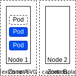
skew = 3 - 0 = 3

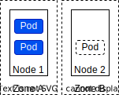
skew = 1 - 1 = 0

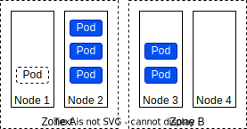
skew = 4 - 2 = 2

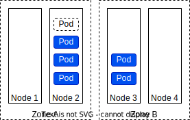
skew = 4 - 2 = 2

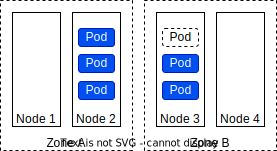
skew = 3 - 3 = 0

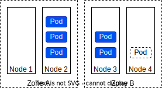
skew = 3 - 3 = 0

### 範例 2: topology key: node


skew = 1 - 0 = 1


skew = 4 - 0 = 4


skew = 3 - 0 = 3


skew = 1 - 0 = 1

## 範例 1: one topology spread constraint

Cluster 有 4 個 Node，3 個 Pod (label: `foo:bar`)，分別被部署到 Node 1, Node 2, Node 3。

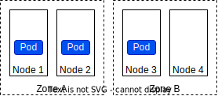

新進來的 Pod 目標要就目前的狀態，平均分散在個 Zone。可以使用以下配置。

```yaml linenums="1" hl_lines="9-10"
kind: Pod
apiVersion: v1
metadata:
  name: mypod
  labels:
    foo: bar
spec:
  topologySpreadConstraints:
  - maxSkew: 1 # (1)!
    topologyKey: zone # (2)!
    whenUnsatisfiable: DoNotSchedule # (3)!
    labelSelector:
      matchLabels:
        foo: bar # (4)!
  containers:
  - name: pause
    image: registry.k8s.io/pause:3.1
```

1. Pod 分配的數量與最少數量，最多相差 1
2. Node 以 `zone` 分群，Pod 應平均分配至各群。
3. 當新進的 Pod 無法滿足條件時，保持 pending 不要分配 Node。
4. 限制條件套用在 label `foo: bar` 的 Pod 上。

### <font color=red>✕</font> 新進來的 Pod 被分配至 Zone A

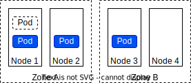
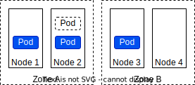
skew = 3 - 1 = 2，超過 `maxSkew: 1` (line 9-10) 的限制。

### <font color=green>✓</font> 新進來的 Pod 被分配至 Zone B

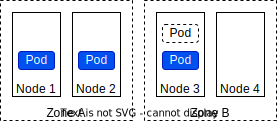
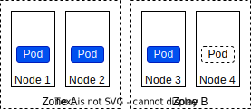
skew = 2 - 2 = 0，符合 `maxSkew: 1` (line 9-10) 的限制。

## 範例 2: multiple topology spread constraints

Cluster 有 4 個 Node，3 個 Pod (label: `foo:bar`)，分別被部署到 Node 1, Node 2, Node 3。


新進來的 Pod 目標要就目前的狀態，平均分散在個 Zone 與 Node。可以使用以下配置。

```yaml linenums="1" hl_lines="9-10 15-16"
kind: Pod
apiVersion: v1
metadata:
  name: mypod
  labels:
    foo: bar
spec:
  topologySpreadConstraints:
  - maxSkew: 1
    topologyKey: zone 
    whenUnsatisfiable: DoNotSchedule
    labelSelector:
      matchLabels:
        foo: bar
  - maxSkew: 1 # (1)!
    topologyKey: node # (2)!
    whenUnsatisfiable: DoNotSchedule # (3)!
    labelSelector:
      matchLabels:
        foo: bar # (4)!
  containers:
  - name: pause
    image: registry.k8s.io/pause:3.1
```

1. Pod 分配的最大數量與最少數量，最多相差 1
2. Node 以 `node` 分群，Pod 應平均分配至各群。
3. 當新進的 Pod 無法滿足條件時，保持 pending 不要分配 Node。
4. 限制條件套用在 label `foo: bar` 的 Pod 上。

### <font color=red>✕</font> 新進來的 Pod 被分配至 Zone A


Zone: skew = 3 - 1 = 2，超過 `maxSkew: 1` (line 9-10) 的限制。

### <font color=red>✕</font> 新進來的 Pod 被分配至 Zone B 的 Node 3


Zone: skew = 2 - 2 = 0，符合 `maxSkew: 1` (line 9-10) 的限制。
Node: skew = 2 - 0 = 2，超過 `maxSkew: 1` (line 15-16) 的限制。

### <font color=green>✓</font> 新進來的 Pod 被分配至 Zone B 的 Node 4


Zone: 2 - 2 = 0，符合 `maxSkew: 1` (line 9-10) 的限制。
Node: 1 - 1 = 0，符合 `maxSkew: 1` (line 15-16) 的限制。

## 範例 3: conflicting topology spread constraints

考慮範例 2 的設定遭遇衝突的狀況

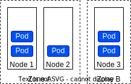

雖然目前的狀態符合設定的限制，不過新進的 Pod 沒有可能有排成可以滿足限制，故會處於 Pending 狀態。

### <font color=red>✕</font> 新進來的 Pod 被分配至 Zone A

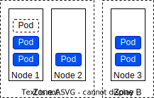
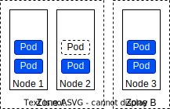
Zone: skew = 4 - 2 = 2，超過 `maxSkew: 1` (line 9-10) 的限制。

### <font color=red>✕</font> 新進來的 Pod 被分配至 Zone B

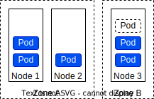

Zone: skew = 3 - 3 = 0，符合 `maxSkew: 1` (line 9-10) 的限制。
Node: skew = 3 - 1 = 2，超過 `maxSkew: 1` (line 15-16) 的限制。

### 解決方法

- 調整 `maxSkew: 2` (line 15)
- 調整 `whenUnsatisfiable: ScheduleAnyway` (line 17)

## 範例 4: topology spread constraints with node affinity

Cluster 有 5 個 Node，被部署到 Zone A, Zone B, Zone C。

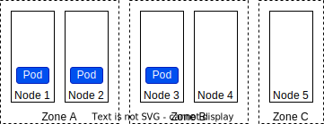

我們要排除 Zone C 不要被分配 Pod。也就是說，Pod 只會被安排到 Zone A, Zone B 的 Node 上執行。可以使用以下配置。

```yaml linenums="1" hl_lines="15-23"
kind: Pod
apiVersion: v1
metadata:
  name: mypod
  labels:
    foo: bar
spec:
  topologySpreadConstraints:
  - maxSkew: 1
    topologyKey: zone
    whenUnsatisfiable: DoNotSchedule
    labelSelector:
      matchLabels:
        foo: bar
  affinity:
    nodeAffinity:
      requiredDuringSchedulingIgnoredDuringExecution:
        nodeSelectorTerms:
        - matchExpressions:
          - key: zone
            operator: NotIn
            values:
            - zoneC
  containers:
  - name: pause
    image: registry.k8s.io/pause:3.1
```

## 參考

- [Pod Topology Spread Constraints](https://kubernetes.io/docs/concepts/scheduling-eviction/topology-spread-constraints/)
 