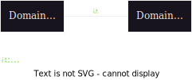

圖: 抽象的 problem diagram

- 需求的描述會落在 c, d 的描述上。
- 部分的需求描述落在 c 的屬性。(c 需要滿足什麼屬性才能使需求滿足)
- 規格描述 machine 對於 a, b 應有的行為。
- 部分的規格描述落在 d 的屬性。(machine 對於 d 的屬性應做何者相應的動作)
- 最後，需要描述該如何利用 a, c 來實現需求。

Domain flavours:

- static flavours
- dynamic flavours
- control flavours
- informal flavours
- conceptual flavours

## Static flavours

### Physical static (物理的靜態) domain

=== "原文"

    > **Package router control**
    >
    > A package router is a large mechanical device used by postal and delivery organisations to sort packages into bins according to their destinations.
    >
    > The packages carry bar-coded labels. They move along a conveyor to a reading station where their package-ids and destinations are read. They then slide by gravity down pipes fitted with sensors at top and bottom. The pipes are connected by two-position switches that the computer can flip (when no package is present between the incoming and outgoing pipes). At the leaves of the tree of pipes are destination bins, corresponding to the bar-coded destinations.
    >
    > A package cannot overtake another either in a pipe or in a switch. Also, the pipes are bent near the sensors so that the sensors are guaranteed to detect each package separately. However, packages slide at unpredicatable speeds, and may get too close together to allow a switch to be set correctly. A misrouted package may be routed to any bin, an apporpriate message being displayed. There are control buttons by which an operator can command the controlling computer to stop and start the conveyor.
    >
    > The problem is to build the controlling computer to obey the operator's commands, to route packages to their destination bins by setting the switches appropriately, and to report misrouted packages.

=== "翻譯"

    > **包裹路由控制**
    >
    > 包裹路由器(package router)是郵政和快遞組織使用的大型機械設備，根據目的地將包裹(package)分類到不同的箱子(bin)中。
    >
    > 包裹上帶有條碼標籤。它們沿著輸送帶(conveyor)移動到讀取站(reading station)，那裡讀取它們的包裹 ID 和目的地。然後它們沿著安裝有頂部和底部感應器(sensor)的管道(pipe)滑動。管道由兩個位置開關連接，計算機可以翻轉(當進出管道之間沒有包裹時)。在管道樹的末端是目的地箱子，對應於條碼目的地。
    >
    > 包裹在管道或開關中不能超越另一個包裹。此外，管道在感應器附近彎曲，以便感應器保證分別檢測每個包裹。然而，包裹以不可預測的速度滑動，可能會彼此靠得太近，以致無法正確設置開關。錯誤路由的包裹可能被路由到任何箱子，並顯示相應的訊息。作業員可以通過控制按鈕命令控制電腦停止和啟動輸送帶。
    >
    > 問題是建置控制電腦，以遵循作業員的命令，通過適當設定開關將包裹路由到目的地箱子，並報告錯誤路由的包裹。


假設現在包裹在 sw3，然後目的地是 bin 4，那麼該往左還是往右？


要回答這個問題，我們需要有 pipes, switches, bins 的配置圖，他們形成 static domain。

### Structural flavours

package router layout 是一個樹狀結構。reading station 是 root note。switches 是 interior nodes (內部節點)。bins 是 leaves。pipe 是 arc (弧) 連接兩個非 root 的 node。switch 出口只有兩個方向，因此結構為二元樹狀結構。

## Dynamic flavours

```plantuml
state "1: Shut" as shut
state "2: Open" as open

[*] -> shut
shut -> open: Push
open -> shut: Pull
```

圖為公車門的行為狀態圖 (非完整的描述)。門有兩種狀態 _Shut_ (關閉) 與 _Open_ (打開)。

圖中沒有描述的是，在 Shut 時，Pull 會怎麼樣。在 Open 時，Push 會怎麼樣。根據行為，可以分成以下三種案例: Robust (強健), Inhibiting (禁止), Fragile (脆弱)。

```plantuml
title Robust (強健)

state "1: Shut" as shut
state "2: Open" as open

[*] -> shut
shut -> open: Push
shut: Pull
open -> shut: Pull
open: Push
```

```plantuml
title Inhibiting (禁止)

state "1: Shut" as shut
state "2: Open" as open

[*] -> shut
shut -> open: Push
shut: ¿ Pull
open -> shut: Pull
open: ¿ Push
```

```plantuml
title Fragile (脆弱)

state "1: Shut" as shut
state "2: Open" as open
state "3: ?" as unknown

[*] -> shut
shut -> open: Push
shut -> unknown: Pull
open -> shut: Pull
open --> unknown: Push
```

Request/permit protocol:

Domain A 要求權限已發送 Event E，然後:
2a: Domain B 拒絕，所以 Domain A 沒有發送 Event E。
2b: Domain B 授權，所以 Domain A 發送 Event E。

我們可以鎖 Domain A 控制 event，Domain B 可以禁止它。



範例: ATM 提款，使用者發起提款的事件，但是機器可以拒絕事件。

### Discrete and continuous phenomena

=== "原文"

  > **Airport shuttle control**
  >
  > An airport is equipped with a light monorail shuttle to move passengers from the gate area to the airport concourse. TShe shuttle moves on its own fixed track between the two areas. It is quipped with a bi-directional motor and a brake. The motor has an on/off state, a direction state, and five power levels; the brake has four braking levels. A sensor device detects the position of the shuttle on the track. The value of the sensor state is an integer in the range 0-9999. When the shuttle is at its rest position in the gate area, the sensor state value is 0; when it is at its rest position in the concourse area, the value is 9999; intermediate values represent position equally spaced between the rest positions.
  >
  > The control computer has direct access to the position sensor state, and can set the motor and brake states directly. It is required to control the shuttle by computer so that it moves continually backwards and forwards between the areas, stopping for 60 seconds in each area to allow passengers to embark and disembark. The journey should be as fast as possible, subject to certain limits on the speed, acceleration and deceleration. These limits are designed to give the passengers a comfortable ride and to avoid excessive wear on the motor and brakes.

=== "翻譯"

    > **機場穿梭控制**
    >
    > 一個機場配備了一輛輕型單軌穿梭車(shuttle)，用於將乘客從登機區移動到機場大廳。穿梭車在兩個區域之間的固定軌道上移動。它配備了一個雙向馬達和一個制動器。馬達有開/關狀態、方向狀態和五個功率級別；制動器有四個制動級別。感應器設備檢測穿梭車在軌道上的位置。感應器狀態的值是 0-9999 範圍內的整數。當穿梭車在登機區的靜止位置時，感應器狀態值為 0；當它在機場大廳的靜止位置時，該值為 9999；中間值表示在靜止位置之間等距分布的位置。
    >
    > 控制電腦直接訪問位置感應器狀態，並可以直接設置馬達和制動器狀態。要求通過電腦控制穿梭車，使其在兩個區域之間持續來回移動，每個區域停留 60 秒，以便乘客登機和下車。旅程應盡可能快，但受到速度、加速度和減速度的某些限制。這些限制旨在讓乘客享受舒適的乘坐體驗，並避免對馬達和制動器造成過度磨損。

position sensor 的狀態是 discrete，他有 10,000 個整數值。3456 下一個位置是 3457，沒有中間的位址。但實際上，shuttle 在軌道上的位址是 continuous。在這個問題，需要注意處理這種模擬真實世界的位址。

在分析的時候，不要太快跳入 continuous 的模擬，應忠實的反應實際狀況。

Domain 的三個狀態:

- location = distance along track (from an arbitrary chosen fixed point)
- velocity = rate of change of location
- acceleration = rate of change of velocity
