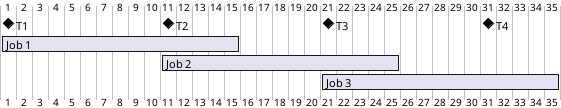
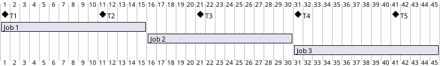
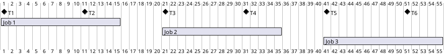

# Quartz: JDBC JobStore

## 簡單的 Job 範例

以下範例展示，在 Spring Boot 中如何設定 Quartz 使用 JDBC JobStore。如此一來，我們把 Job 放到 cluster 上執行。

在 `build.gradle.kts` 中新增 `spring-boot-starter-quartz` 相依套件。如此，程式啟動後就會有一個 Quartz Scheduler 在背景執行。

```kotlin title="build.gradle.kts"
implementation("org.springframework.boot:spring-boot-starter-quartz")
```

使用 docker compose 執行 mysql。

```yaml title="compose.yml"
version: '3.1'

services:
  database:
    image: mysql:8.4.0
    ports:
      - "3306:3306"
    environment:
      MYSQL_ALLOW_EMPTY_PASSWORD: true
      MYSQL_DATABASE: quartz
```

設定 spring boot 的 properties。

```yaml title="src/main/resources/application.yml"
spring:
  datasource: #(1)!
    name: datasource
    url: jdbc:mysql://localhost:3306/quartz
    username: root
    password:
    driver-class-name: com.mysql.cj.jdbc.Driver
  quartz:
    job-store-type: jdbc #(2)!
    jdbc:
      initialize-schema: always #(3)!
    overwrite-existing-jobs: true
    properties:
      org:
        quartz:
          scheduler:
            instanceName: scheduler
            instanceId: AUTO #(4)!
          dataSource:
            quartzDataSource: #(5)!
              driver: com.mysql.cj.jdbc.Driver
              URL: jdbc:mysql://localhost:3306/quartz
              user: root
              password:
              provider: hikaricp
          jobStore:
            class: org.quartz.impl.jdbcjobstore.JobStoreTX
            dataSource: quartzDataSource #(5)!
            isClustered: true #(6)!
```

1. `spring.quartz.jdbc.initialize-schema` 吃的 Data Source 設定。在 `spring.quartz.properties.org.quartz.dataSource` 設定的 Data Source 不支援 initialize schema。
2. 使用 JDBC JobStore。
3. 每次啟動都會初始化 schema。換句話說，我們可以不必手動新增 quartz 相關的 tables。([SQL 參考](https://github.com/quartz-scheduler/quartz/tree/main/quartz/src/main/resources/org/quartz/impl/jdbcjobstore))
4. 在 cluster 上的 pod 需要有唯一的 instance id。這裡設定 `AUTO` 即可達到需求。
5. data source 的設定。這裡的名稱會在下面設定 job store 的 dataSource 參考。
6. job store 使用的 dataSource。
7. 啟用 cluster。

新增 `Job` 實作，簡單的在畫面輸出現在的時間以及 "Hello World!"。印出時間是為了幫助我們識別這是哪個時間點所觸發的 Job。

```java title="HelloWorldJob.java"
public class HelloWorldJob implements Job {
    @Override
    public void execute(JobExecutionContext jobExecutionContext) {
        String time = LocalDateTime.now().format(DateTimeFormatter.ofPattern("hh:mm:ss"));
        System.out.println(time + " Hello World!");
    }
}
```

新增 `JobDetail` 和 `Trigger` 的 Bean 定義。這裡設定每 10 秒觸發一次 Job 在畫面上輸出 "Hello World!"。

```java
@Component
public class QuartzConfig {

    @Bean
    public JobDetail helloWorldJobDetail() {
        return JobBuilder.newJob(HelloWorldJob.class)
                         .withIdentity("helloWorldJob")
                         .storeDurably()
                         .build();
    }

    @Bean
    public Trigger helloWorldTrigger(JobDetail printHelloWorldJobDetail) {
        return TriggerBuilder.newTrigger()
                             .forJob(printHelloWorldJobDetail)
                             .withIdentity("helloWorldTrigger")
                             .withSchedule(CronScheduleBuilder.cronSchedule("*/10 * * * * ?"))
                             .build();
    }
}
```

為了可以同時執行多個 instance，我們將程式打包成 tar 檔。專案的目錄 /build/libs 應該會產生 xxx.jar 檔。

```shell
./gradlew bootJar
```

打開 3 個 terminal，分別執行以下指令執行程式: (xxx 替換成實際檔案名稱)

```shell
java -jar build/libs/xxx.jar
```

觀察每 10 秒只會有一個 terminal 輸出 "Hello World!"。這表示 Job 是在 cluster 上執行的。將輸出訊息的 terminal 關閉，可以觀察到其他 terminal 會接續執行輸出 "Hello World!" 的 Job。

!!! note "一個 trigger 一個 job instance 的設定"

    `org.quartz.scheduler.batchTriggerAcquisitionMaxCount` 預設值為 1 設定了 Trigger 的 job 一次執行一個 instance。可以設定其他數值來讓同一 trigger 同時執行多個 job。

## 探討: 執行時間超過下一次排程的時間的行為

假設我們設定每 10 秒跑一個 job。並且，每個 job 執行時間需要 15 秒。也就是說，job 的執行時間必定會覆蓋到下一次觸發的時間。在沒有特別設定的情況下，經過 30 秒後，將會有 3 個 job 被跑起來。job 與 job 的時間時間是會重疊的。



### 使用`@DisallowConcurrentExecution` 來避免重疊執行

在 Job 的宣告加上 `@DisallowConcurrentExecution` 來避免 Job 重疊執行。

```java title="HelloWorldJob.java" hl_lines="1"
@DisallowConcurrentExecution
public class HelloWorldJob implements Job {
    // ...
}
```

如此，當 Job 還在執行時，下一次的 Job 將會被延遲到上一次的 Job 執行完畢後再執行。變更後的
 3 個 Job 執行時間軸參考下圖:



### 計算排程的時間與觸發的時間差來忽略錯過的 trigger

在 `Job.execute` 開始前，檢查 job 觸發的時間與排程的時間差，如果超過一定時間，則忽略這次的 trigger。範例中是時間差超過 1000 毫秒 (1 秒) 就忽略這次的 trigger。

```java title="HelloWorldJob.java" hl_lines="5-7"
@DisallowConcurrentExecution
public class HelloWorldJob implements Job {
    @Override
    public void execute(JobExecutionContext context) {
        if (context.getFireTime().getTime() - context.getScheduledFireTime().getTime() > 1000) {
            return;  // skip this trigger
        }
        // ...
    }
}
```

如此，每一個被 trigger 的 job 都會落在排程設定的時間點上。變更後的 3 個 Job 執行時間軸參考下圖:



!!! note
    目前沒有發現官方對於此方案的解法。這裡的解法有土法煉鋼的感覺。

[// TODO]: # (## 探討: Job 執行過程發生錯誤的行為)

## 參考

- [Sprint Boot Quartz Scheduler](https://docs.spring.io/spring-boot/reference/io/quartz.html)
- [Quartz Configuration - Configure Clustering with JDBC-JobStore](https://www.quartz-scheduler.org/documentation/quartz-2.2.2/configuration/ConfigJDBCJobStoreClustering.html) 
 
 