安裝 spring boot 的指令: ([參考](https://docs.spring.io/spring-boot/installing.html#getting-started.installing.cli))

```shell
$ brew tap spring-io/tap
$ brew install spring-boot
```

## 建立 microservices 專案

我們要建立以下關係的 microservices:

```plantuml
rectangle "product" as p
note bottom of p: productId\nname\nweight

rectangle "review" as r
note bottom of r: productId\nreviewId\nauthor\nsudject\ncontent

rectangle "recommendation" as rd
note bottom of rd: productId\nrecommendationId\nauthor\nrate\ncontent

rectangle "product composition" as pc

pc -- p
pc -- r
pc -- rd
```

我們會新增 4 個 microservices，每個 services 放在自己所屬的目錄中:

```plantuml
@startsalt
{
    {T
    + microservices
    ++ product-composite-service/
    ++ product-service/
    ++ recommendation-service/
    ++ review-service/
    }
}
@endsalt
```



??? info "產生 4 個 microservices 的 spring boot 專案的具體步驟"

    先建立根目錄 microservices:

    ```shell
    $ mkdir microservices
    $ cd microservices
    ```

    接著產生 4 個 microservices 專案:

    === "透過 Spring init"

        ```shell
        $ spring init \
        --boot-version=3.3.0 \
        --type=gradle-project \
        --java-version=17 \
        --packaging=jar \
        --name=product-service \
        --package-name=se.magnus.microservices.core.product \
        --groupId=se.magnus.microservices.core.product \
        --dependencies=actuator,webflux \
        --version=1.0.0-SNAPSHOT \
        product-composite-service

        $ spring init \
        --boot-version=3.3.0 \
        --type=gradle-project \
        --java-version=17 \
        --packaging=jar \
        --name=product-service \
        --package-name=se.magnus.microservices.core.product \
        --groupId=se.magnus.microservices.core.product \
        --dependencies=actuator,webflux \
        --version=1.0.0-SNAPSHOT \
        product-service

        $ spring init \
        --boot-version=3.3.0 \
        --type=gradle-project \
        --java-version=17 \
        --packaging=jar \
        --name=product-service \
        --package-name=se.magnus.microservices.core.product \
        --groupId=se.magnus.microservices.core.product \
        --dependencies=actuator,webflux \
        --version=1.0.0-SNAPSHOT \
        recommendation-service

        $ spring init \
        --boot-version=3.3.0 \
        --type=gradle-project \
        --java-version=17 \
        --packaging=jar \
        --name=product-service \
        --package-name=se.magnus.microservices.core.product \
        --groupId=se.magnus.microservices.core.product \
        --dependencies=actuator,webflux \
        --version=1.0.0-SNAPSHOT \
        review-service
        ```

    === "透過 Spring Initializr"

        透過 [Spring Initializer](https://start.spring.io/) 產生 4 個專案，分別將專案目錄搬到到 microservices 下。

使用以下指令建置 4 個 microservices 專案:

```shell
$ cd product-composite-service; ./gradlew build; cd -; \
cd product-service;             ./gradlew build; cd -; \
cd recommendation-service;      ./gradlew build; cd -; \
cd review-service;              ./gradlew build; cd -;
```

## 簡化建置的 gradle 指令

為了建置 4 個 microservices，上面使用 4 次 gradle 指令。為了方便一個 gradle 指令建置所有 microservices 專案，進行以下的調整:

將其中一個 microservice 的 gradle 檔案複製到外層。

```shell
$ cp -r product-service/gradle .
$ cp product-service/gradlew .
$ cp product-service/gradlew.bat .
$ cp product-service/.gitignore .
```

新增 setting.gradle 檔案，引入 4 個 microservices 專案

```shell
$ cat <<EOF > settings.gradle
include ':product-service'
include ':review-service'
include ':recommendation-service'
include ':product-composite-service'
EOF
```

刪掉個別專案下的 gradle 檔案。

```shell
$ find recommendation-service product-service review-service product-composite-service -depth -name "gradle" -exec rm -rfv "{}" \;

$ find recommendation-service product-service review-service product-composite-service -depth -name "gradlew" -exec rm -fv "{}" \;

$ find recommendation-service product-service review-service product-composite-service -depth -name "gradlew.bat" -exec rm -fv "{}" \;
```

調整後的目錄結構應呈現如下:

```plantuml
@startsalt
{
    {T
    + microservices/

    ++ product-composite-service/
    +++ <del>gradle/</del>
    +++ <del>gradelew</del>
    +++ <del>gradlew.bat</del>
    +++ <del>.gigignore</del>

    ++ product-service/
    +++ <del>gradle/</del>
    +++ <del>gradelew</del>
    +++ <del>gradlew.bat</del>
    +++ <del>.gitignore</del>

    ++ recommendation-service/
    +++ <del>gradle/</del>
    +++ <del>gradelew</del>
    +++ <del>gradlew.bat</del>
    +++ <del>.gitignore</del>

    ++ review-service/
    +++ <del>gradle/</del>
    +++ <del>gradelew</del>
    +++ <del>gradlew.bat</del>
    +++ <del>.gitignore</del>

    ++ <color:red>gradle/</color>
    ++ <color:red>gradelew</color>
    ++ <color:red>gradlew.bat</color>
    ++ <color:red>.gitignore</color>
    ++ <color:red>setting.gradle</color>
    }
}
@endsalt
```



!!! info "以 DevOps 的角度而言，包含多個專案的 Gradle 設定可能不是首要選項。相反的，我們會希望每個 service 都各自的建置和發布週期。"

!!! tip "以上的操作，在需要將 monolithic project 拆解出 microservice 時，可以參考。"

現在使用單一指令就可以建置 4 個 microservices。

```shell
$ ./gradlew --console=verbose build
```

## 參考

- Microservices with Spring Boot 3 and Spring Cloud - Third Edition, by Magnus Larsson
