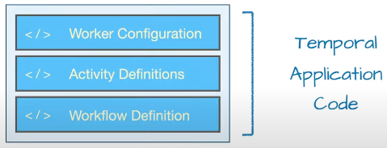
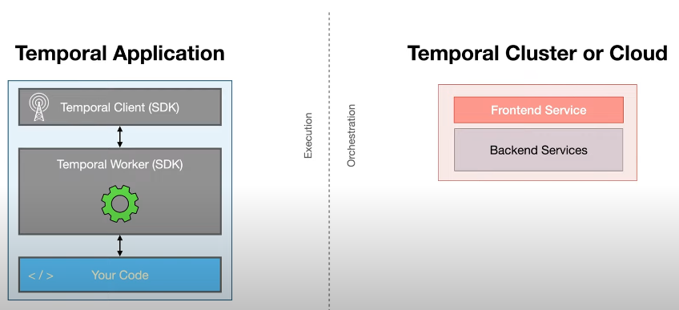

# Temporal 核心概念

## Temporal 應用架構

### 核心元件

- **Workflow**：Temporal 的核心抽象概念
    - 代表業務邏輯的執行步驟序列
    - 必須是**確定性的** (deterministic)
    - 在 Java SDK 中定義為方法

- **Activity**：封裝不可靠或非確定性的程式碼
    - 失敗時自動重試
    - 適合處理 I/O、外部 API 呼叫等

- **Worker**：執行 Workflow 和 Activity 的程式
    - 輪詢 Temporal Cluster 的 Task Queue
    - 由 SDK 提供實作，應用程式負責配置

### 架構圖解





## 錯誤處理機制

### Activity 錯誤處理

#### Activity 失敗與重試機制

- Activity 拋出 Exception 時，Temporal 會根據 Retry Policy 自動重試
- 預設使用指數退避策略：1秒、2秒、4秒...，最多等待 100 秒
- 重試會持續直到：成功執行、明確取消或逾時

自訂重試策略：

```java
// 設定重試次數或例外不重試
RetryOptions criticalRetry = RetryOptions.newBuilder()
    .setMaximumAttempts(10)
    .setDoNotRetry("com.example.DatabaseCorruptionException")
    .build();
```

#### Activity 設計原則

**冪等性要求**：

- Activity 可能被執行多次，必須設計為冪等操作
- 相同輸入多次執行應產生相同結果
- 避免重複效果 (如重複扣款、重複寄信)

**自動恢復機制**：

- 暫時性錯誤 (網路中斷)：重試後自動恢復
- 程式碼錯誤 (語法錯誤)：修正並重新部署後自動恢復

### Workflow 錯誤處理

#### Workflow vs Activity 錯誤處理

| 特性 | Activity | Workflow |
| ---- | -------- | -------- |
| 預設重試機制 | 有預設重試策略<br>(指數退避) | 無預設重試策略<br>(依例外類型處理) |
| 例外處理方式 | 透過 RetryPolicy 設定重試次數和間隔 | 一般 Exception 重試整個 Task<br>TemporalFailure 直接標記失敗 |

#### Exception 分類與行為

- **Workflow Task Failure**：一般 Java Exception
    - 結果：Temporal 重試整個 Workflow Task

- **Workflow Execution Failure**：`TemporalFailure` 或 `ApplicationFailure.newFailure()`
    - 結果：Workflow 直接標記失敗，不再重試

明確終止 Workflow 範例：

```java
if (distance.getKilometers() > 25) {
  throw ApplicationFailure.newFailure(
    "Customer lives outside the service area",
    OutOfServiceAreaException.class.getName()
  );
}
```

### 跨語言例外處理

#### 例外轉換機制

- Temporal 自動將語言特定例外轉換為通用的 `ApplicationFailure`
- 例如：Java 的 `IOException` → `ActivityFailure(ApplicationFailure(IOException))`
- 優點：支援跨語言呼叫 (如 TypeScript Workflow + Python Activity)

#### 簡化例外處理

使用 `Activity.wrap()` 處理 Checked Exception：

```java
try {
  // 可能拋出 IOException 的程式碼
} catch (IOException e) {
  throw Activity.wrap(e);  // 轉為 ActivityFailure
}
```

#### 核心設計理念

- **跨語言相容**：統一錯誤格式
- **簡化開發**：降低處理 Checked Exception 的複雜度
- **保留類型資訊**：便於準確識別錯誤來源
